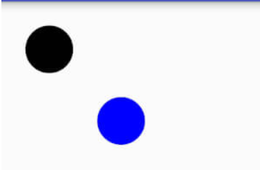
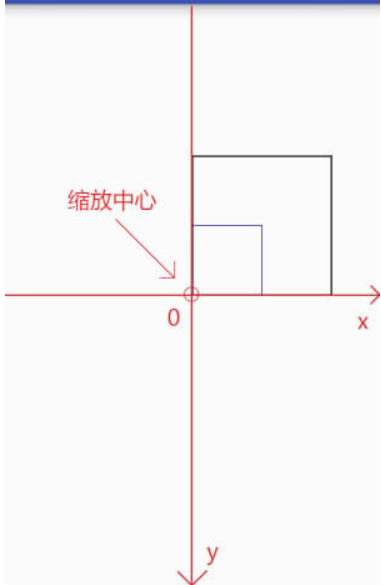
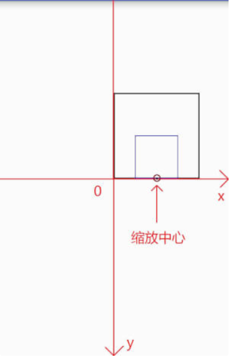
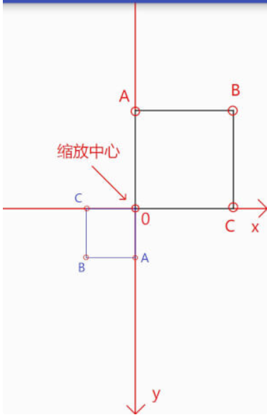
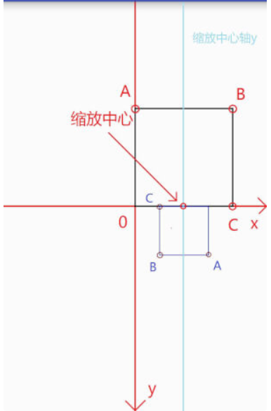
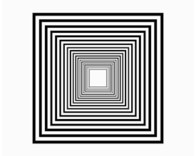

### Canvas之画布操作

#### Canvas基本操作

##### 1.画布操作

<font color = red> 为什么要有画布操作</font>?

画布操作可以帮助我们用更加容易理解的方式制作图形

例如：从坐标原点为起点，绘制一个长度20dp，与水平线夹角为30度的线段怎么做？

按照我们通常的想法，就是先使用三角函数计算出线段结束点的坐标，然后调用drawLine即可。但是是否被禁锢了？

假设我们先绘制一长度为20dp的水平线，然后将这条水平线旋转30度，则最终看起来效果是相同的，而且不用进行三角函数计算，这样是否更加简单一点了呢？

<font size = 4>**合理的使用画布操作可以帮助我们用给更加容易理解的方式创作想要的效果，这也是画布操作存在的原因 **</font>

> 所有的画布操作都只影响后续的绘制，对之前已经绘制过的内容没有影响

------

1）位移（translate）

translate是坐标系的移动，可以为图形绘制选择一个<font color= red size = 5>合适的坐标系</font>。请注意，**位移是基于当前位置移动，而不是基于屏幕左上角的（0，0）点移动**，如下：

> 画笔默认是从（0，0）开始

```java
// 省略了创建画笔的代码

// 在坐标原点绘制一个黑色圆形
mPaint.setColor(Color.BLACK);
canvas.translate(200,200);
canvas.drawCircle(0,0,100,mPaint);

// 在坐标原点绘制一个蓝色圆形
mPaint.setColor(Color.BLUE);
canvas.translate(200,200);
canvas.drawCircle(0,0,100,mPaint);
```



我们首先将坐标系移动一段距离绘制一个圆形，之后再移动一段距离绘制一个圆形，两次移动是可叠加的

------

2）缩放（scale)

缩放提供了两个方法，如下：

```java
public void scale (float sx, float sy)

public final void scale (float sx, float sy, float px, float py)
```

这两个方法中前两个参数是相同的：分别为x轴和y轴的缩放比例。第二种方法比前一种多了两个参数，用来控制缩放中心位置的

缩放比例（sx,sy)取值范围详解：

| 取值范围       | 说明                                           |
| -------------- | ---------------------------------------------- |
| (负无穷，-1)   | 先根据缩放中心点放大n倍，再根据中心轴进行翻转  |
| -1             | 根据缩放中心进行翻转                           |
| （-1，0）      | 先根据缩放中心缩小到n，再根据中心轴进行翻转    |
| 0              | 不会显示，若sx为0，则宽度为0，不会显示，sy同理 |
| （0，1）       | 根据缩放中心缩小到n                            |
| 1              | 没有变化                                       |
| （1， 正无穷） | 根据缩放中心放大n倍                            |

如果在缩放时稍微注意一下就会发现**缩放的中心默认为坐标原点，而缩放中心轴就是坐标轴 ，如下所示：

```java
// 将坐标系原点移动到画布正中心
canvas.translate(mWidth / 2, mHeight / 2);

RectF rect = new RectF(0,-400,400,0);   // 矩形区域

mPaint.setColor(Color.BLACK);           // 绘制黑色矩形
canvas.drawRect(rect,mPaint);

canvas.scale(0.5f,0.5f);                // 画布缩放

mPaint.setColor(Color.BLUE);            // 绘制蓝色矩形
canvas.drawRect(rect,mPaint);
```



> 缩放中心为原点

接下来根据第二种的方法让**缩放中心**位置稍微的进行变化，如下所示：

```java
// 将坐标系原点移动到画布正中心
canvas.translate(mWidth / 2, mHeight / 2);

RectF rect = new RectF(0,-400,400,0);   // 矩形区域

mPaint.setColor(Color.BLACK);           // 绘制黑色矩形
canvas.drawRect(rect,mPaint);

canvas.scale(0.5f,0.5f,200,0);          // 画布缩放  <-- 缩放中心向右偏移了200个单位

mPaint.setColor(Color.BLUE);            // 绘制蓝色矩形
canvas.drawRect(rect,mPaint);
```



> 图中箭头所指的就是缩放中心

按照表格中的说明，**当缩放比例为负数的时候会根据缩放中心轴进行翻转**，如下所示：

```java
// 将坐标系原点移动到画布正中心
canvas.translate(mWidth / 2, mHeight / 2);

RectF rect = new RectF(0,-400,400,0);   // 矩形区域

mPaint.setColor(Color.BLACK);           // 绘制黑色矩形
canvas.drawRect(rect,mPaint);


canvas.scale(-0.5f,-0.5f);          // 画布缩放

mPaint.setColor(Color.BLUE);            // 绘制蓝色矩形
canvas.drawRect(rect,mPaint);
```



> 为了显示效果，添加了坐标系，并且对矩形中几个重要的点进行了标注

由于未对缩放中心进行偏移，所有的默认的缩放中心就是原点，中心轴就是x轴和y轴

本次缩放可以看作是先根据缩放中心缩放到原理的0.5倍，然后分别按照x轴和y轴进行翻转

```java
// 将坐标系原点移动到画布正中心
canvas.translate(mWidth / 2, mHeight / 2);

RectF rect = new RectF(0,-400,400,0);   // 矩形区域

mPaint.setColor(Color.BLACK);           // 绘制黑色矩形
canvas.drawRect(rect,mPaint);

canvas.scale(-0.5f,-0.5f,200,0);          // 画布缩放  <-- 缩放中心向右偏移了200个单位

mPaint.setColor(Color.BLUE);            // 绘制蓝色矩形
canvas.drawRect(rect,mPaint);
```



本次对缩放中心Y轴坐标进行了偏移，故中心轴也向右偏移了

> 和位移（translate）是一样的，缩放也是可以叠加的

```
canvas.scale(0.5f,0.5f);
canvas.scale(0.5f,0.1f);
```

调用两次缩放，则X轴实际缩放0.5 * 0.5=0.25，y轴实际缩放0.5 * 0.1 = 0.05

下面制作一个有趣的图形：

```java
// 将坐标系原点移动到画布正中心  填充模式为描边
canvas.translate(mWidth / 2, mHeight / 2);

RectF rect = new RectF(-400,-400,400,400);   // 矩形区域

for (int i=0; i<=20; i++)
{
	canvas.scale(0.9f,0.9f);
	canvas.drawRect(rect,mPaint);
}
```



------

3)旋转（rotate)