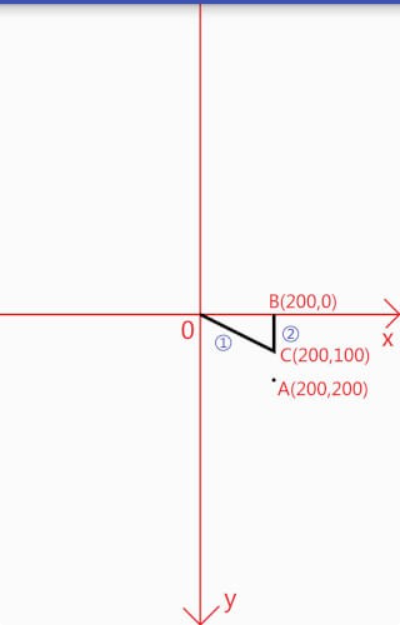
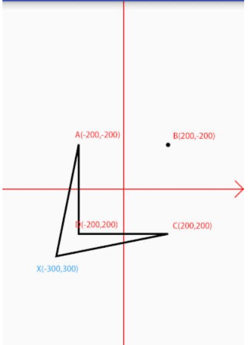

## **一.Path常用方法**

| 作用            | 相关方法                                                     | 备注                                                         |
| --------------- | ------------------------------------------------------------ | ------------------------------------------------------------ |
| 移动起点        | moveTo                                                       | 移动下一次操作的起点位置                                     |
| 设置终点        | setLastPoint                                                 | 重置当前path中最后一个点位置，如果在绘制之前调用，效果和moveTo相同 |
| 连接直线        | lineTo                                                       | 添加上一个点到当前点之间的直线到Path                         |
| 闭合路径        | close                                                        | 连接第一个点连接到最后一个点，形成一个闭合区域               |
| 添加内容        | addRect, addRoundRect, addOval, addCircle, addPath, addArc, arcTo | 添加(矩形， 圆角矩形， 椭圆， 圆， 路径， 圆弧) 到当前Path (注意addArc和arcTo的区别) |
| 是否为空        | isEmpty                                                      | 判断Path是否为空                                             |
| 是否为矩形      | isRect                                                       | 判断path是否是一个矩形                                       |
| 替换路径        | set                                                          | 用新的路径替换到当前路径所有内容                             |
| 偏移路径        | offset                                                       | 对当前路径之前的操作进行偏移(不会影响之后的操作)             |
| 贝塞尔曲线      | quadTo, cubicTo                                              | 分别为二次和三次贝塞尔曲线的方法                             |
| rXxx方法        | rMoveTo, rLineTo, rQuadTo, rCubicTo                          | **不带r的方法是基于原点的坐标系(偏移量)， rXxx方法是基于当前点坐标系(偏移量)** |
| 填充模式        | setFillType, getFillType, isInverseFillType, toggleInverseFillType | 设置,获取,判断和切换填充模式                                 |
| 提示方法        | incReserve                                                   | 提示Path还有多少个点等待加入**(这个方法貌似会让Path优化存储结构)** |
| 布尔操作(API19) | op                                                           | 对两个Path进行布尔运算(即取交集、并集等操作)                 |
| 计算边界        | computeBounds                                                | 计算Path的边界                                               |
| 重置路径        | reset, rewind                                                | 清除Path中的内容 **reset不保留内部数据结构，但会保留FillType.** **rewind会保留内部的数据结构，但不保留FillType** |
| 矩阵操作        | transform                                                    | 矩阵变换                                                     |

## 二、Path详解

##### Path作用

Path在2D绘图中是一个很重要的东西

前面学习的都是一些比较简单的图形，对于那些比较复杂一点的图形则没办法进行绘制（如心形、正多边形、 五角星）。使用path不仅可以绘制简单的图形，也可以绘制这些比较复杂的图形。另外，根据路径绘制文本和裁剪画布都会用到path。

### Path含义

```java
The Path class encapsulates(概括 压缩) compound（复合物） (multiple contour) geometric（几何的） paths consisting of straight line segments, quadratic curves, and cubic curves（二次和三次贝塞尔曲线）. It can be drawn with canvas.drawPath(path, paint), either filled or stroked (based on the paint’s Style), or it can be used for clipping（裁剪） or to draw text on a path.
```

另外路径有开放和封闭的区别：

| 图像                                                         | 名称     | 备注                       |
| ------------------------------------------------------------ | -------- | -------------------------- |
|  | 封闭路径 | 首尾相接形成了一个封闭区域 |
|  | 开放路径 | 没有首尾相接形成封闭区域   |

### Path使用方法详解：

第一组：MoveTo、setLastPoint、LineTo和Close

首先创建画笔：

```java
Paint mPaint = new Paint();             // 创建画笔
mPaint.setColor(Color.BLACK);           // 画笔颜色 - 黑色
mPaint.setStyle(Paint.Style.STROKE);    // 填充模式 - 描边
mPaint.setStrokeWidth(10);              // 边框宽度 - 10
```

lineTo:方法预览

```java
public void lineTo (float x, float y)
```

指从某个点到参数坐标点之间连一条线：

前面提到过说Path可以来描述一个图像的轮廓，图像的轮廓通常都是一条线构成的，所以这里的某个点就是上次操作的结束的点，如果没有进行过操作则默认操作点为坐标原点。

那么来试一下：

```java
canvas.translate(mWidth / 2, mHeight / 2);  // 移动坐标系到屏幕中心(宽高数据在onSizeChanged中获取)

Path path = new Path();                     // 创建Path

path.lineTo(200, 200);                      // lineTo
path.lineTo(200,0);

canvas.drawPath(path, mPaint);              // 绘制Path
```


moveTo和setLastPoint：方法预览

```java
// moveTo
public void moveTo (float x, float y)

// setLastPoint
public void setLastPoint (float dx, float dy)
```

这两个方法虽然在作用上有相似之处，但实际上却是两个不同的东西，具体参考下面：

| 方法名       | 简介                         | 是否影响之前的操作 | 是否影响之后操作 |
| ------------ | ---------------------------- | ------------------ | ---------------- |
| moveTo       | 移动下一次操作的起点位置     | 否                 | 是               |
| setLastPoint | 设置之前操作的最后一个点位置 | 是                 | 是               |

上代码：

```java
canvas.translate(mWidth / 2, mHeight / 2);  // 移动坐标系到屏幕中心

Path path = new Path();                     // 创建Path

path.lineTo(200, 200);                      // lineTo

path.moveTo(200,100);                       // moveTo

path.lineTo(200,0);                         // lineTo

canvas.drawPath(path, mPaint);              // 绘制Path
```


下面是setlastpoint的示例：

```java
canvas.translate(mWidth / 2, mHeight / 2);  // 移动坐标系到屏幕中心

Path path = new Path();                     // 创建Path

path.lineTo(200, 200);                      // lineTo

path.setLastPoint(200,100);                 // setLastPoint

path.lineTo(200,0);                         // lineTo

canvas.drawPath(path, mPaint);              // 绘制Path
```



**Close**

方法预览：

```
public void close ()
```

close方法用来连接当前最后一个点和最初一个点（如果两个点不重合的话），最终形成一个封闭的图形。

```java
canvas.translate(mWidth / 2, mHeight / 2);  // 移动坐标系到屏幕中心

Path path = new Path();                     // 创建Path

path.lineTo(200, 200);                      // lineTo

path.lineTo(200,0);                         // lineTo

path.close();                               // close

canvas.drawPath(path, mPaint);              // 绘制Path
```


注意：close的作用的是封闭路径，与连接当前最后一个点和第一个点并不等价，如果连接了最后一个点和第一个点仍然无法形成封闭图形，则close什么也不做

## 第二组：addXXX与arcTo

#### 第一类（基本形状）

方法预览：

```java
// 第一类(基本形状)

// 圆形
public void addCircle (float x, float y, float radius, Path.Direction dir)
// 椭圆
public void addOval (RectF oval, Path.Direction dir)
// 矩形
public void addRect (float left, float top, float right, float bottom, Path.Direction dir)
public void addRect (RectF rect, Path.Direction dir)
// 圆角矩形
public void addRoundRect (RectF rect, float[] radii, Path.Direction dir)
public void addRoundRect (RectF rect, float rx, float ry, Path.Direction dir)
```

这一类是在path中添加一个基本形状，基本形状部分和前面所讲的绘制基本形状没有太大差别

观察方法，最后都有一个Path.Direction，这是什么？

Direction是方向。点进去看一下发现是一个枚举类型，里面有两个枚举常量，如下：

| 类型 | 解释              | 翻译   |
| ---- | ----------------- | ------ |
| CW   | clockwise         | 顺时针 |
| CCW  | counter-clockwise | 逆时针 |

看一下这个顺时针和逆时针的作用：

| 序号 | 作用                                             |
| ---- | ------------------------------------------------ |
| 1    | 在添加图形时确定闭合顺序(各个点的记录顺序)       |
| 2    | 对图形的渲染结果有影响(是判断图形渲染的重要条件) |

先确认闭合顺序，添加一个矩形看看：

```java
canvas.translate(mWidth / 2, mHeight / 2);  // 移动坐标系到屏幕中心

Path path = new Path();

path.addRect(-200,-200,200,200, Path.Direction.CW);

canvas.drawPath(path,mPaint);
```


将CW修改为CCW然后再运行一次。会发现运行结果是一样的：

这个时候，用到刚才的setlastpoint就很有用（重置当前最后一个点）

```java
canvas.translate(mWidth / 2, mHeight / 2);  // 移动坐标系到屏幕中心

Path path = new Path();

path.addRect(-200,-200,200,200, Path.Direction.CW);

path.setLastPoint(-300,300);                // <-- 重置最后一个点的位置

canvas.drawPath(path,mPaint);
```


可以看到，图形发生了变化，先分析一下，绘制一个矩形，实际上只需要进行四次LineTo就可以了，也就是说，只需要知道4个点的坐标，然后使用moveTo到第一个点，之后一次lineTo就可以了。

为什么要这么做呢？确定一个矩形最少需要两个点，根据这两个点坐标直接就可以画出来四条边，不用计算四个点的坐标，之后再连直线呢？

这就设计到一些path的存储了，Path是封装了由直线和曲线(二次、三次贝塞尔曲线)构成的几何路径。其中曲线部分用的是贝塞尔曲线。然后就是直线了，对于直线的存储最简单的就是记录坐标点，然后直接连接各个点就可以了。虽然记录矩形只需要两个点，但是只用两个点的话，就需要额外增加一个标记为来记录这是一个矩形，显然对于存储和解析都是一个很不划算的事情，将矩形转换为直线，为的是存储记录方便。

**逆时针和顺时针的作用是什么呢？**

对于上面的图形来说，采用顺时针记录的点的顺序就是A B C D,最后一个点为D，我们这里使用setLastPoint来改变最后一个点的位置实际是改变了D的位置。

理解了上面的原理之后，设想我们如果将顺时针修改为逆时针，则记录的点的顺序就发生了变化，再使用setlastPoint则发生改变的就是B的位置，则我们试试看结果和我们猜想的是否一致：

```java
canvas.translate(mWidth / 2, mHeight / 2);  // 移动坐标系到屏幕中心

Path path = new Path();

path.addRect(-200,-200,200,200, Path.Direction.CCW);

path.setLastPoint(-300,300);                // <-- 重置最后一个点的位置

canvas.drawPath(path,mPaint);
```



经过验证，我们的猜想是对的。

#### 第二类（path):

方法预览：

```java
// 第二类(Path)
// path
public void addPath (Path src)
public void addPath (Path src, float dx, float dy)
public void addPath (Path src, Matrix matrix)
```

这些相对比较简单，也很容易理解，就是将两个Path合并为一个。

第三个方法是将src添加到当前Path之前先使用Matrix进行变换

第二个方法比第一个方法多出来的两个参数是将src进行了移位hi后再添加到当前path之中。

示例：

```java
canvas.translate(mWidth / 2, mHeight / 2);  // 移动坐标系到屏幕中心
canvas.scale(1,-1);                         // <-- 注意 翻转y坐标轴

Path path = new Path();
Path src = new Path();

path.addRect(-200,-200,200,200, Path.Direction.CW);
src.addCircle(0,0,100, Path.Direction.CW);

path.addPath(src,0,200);

mPaint.setColor(Color.BLACK);           // 绘制合并后的路径
canvas.drawPath(path,mPaint);
```


### 第三类：（addArc和arcTo)

方法预览：

```java
// 第三类(addArc与arcTo)

// addArc
public void addArc (RectF oval, float startAngle, float sweepAngle)
// arcTo
public void arcTo (RectF oval, float startAngle, float sweepAngle)
public void arcTo (RectF oval, float startAngle, float sweepAngle, boolean forceMoveTo)
```

参数表：

| 参数        | 摘要                              |
| ----------- | --------------------------------- |
| oval        | 圆弧的外切矩形。                  |
| startAngle  | 开始角度                          |
| sweepAngle  | 扫过角度(-360 <= sweepAngle <360) |
| forceMoveTo | 是否强制使用MoveTo                |

> sweepAngle取值范围是[-360,360)，不包含360，当>= 360或者<-360时不会绘制任何内容，对于360，你可以用一个接近的值代替，例如：359.99

从名字就可以看出，这两个方法都是和圆弧相关的，作用都是添加一个圆弧到path中：

| 名称   | 作用               | 区别                                                         |
| ------ | ------------------ | ------------------------------------------------------------ |
| addArc | 添加一个圆弧到path | 直接添加一个圆弧到path中                                     |
| arcTo  | 添加一个圆弧到path | 添加一个圆弧到path，如果圆弧的起点和上次最后一个坐标点不相同，就连接两个点 |

forceMoveTo的作用是什么？

就是说是否使用moveTo将变量移动到圆弧的起点位置，也就意味着：

| forceMoveTo | 含义                                                     | 等价方法                                                     |
| ----------- | -------------------------------------------------------- | ------------------------------------------------------------ |
| true        | 将最后一个点移动到圆弧起点，即不连接最后一个点与圆弧起点 | public void addArc (RectF oval, float startAngle, float sweepAngle) |
| false       | 不移动，而是连接最后一个点与圆弧起点                     | public void arcTo (RectF oval, float startAngle, float sweepAngle) |

示例：addArc:

```java
canvas.translate(mWidth / 2, mHeight / 2);  // 移动坐标系到屏幕中心
canvas.scale(1,-1);                         // <-- 注意 翻转y坐标轴

Path path = new Path();
path.lineTo(100,100);

RectF oval = new RectF(0,0,300,300);

path.addArc(oval,0,270);
// path.arcTo(oval,0,270,true);             // <-- 和上面一句作用等价

canvas.drawPath(path,mPaint);
```


示例（arcTo):

```java
canvas.translate(mWidth / 2, mHeight / 2);  // 移动坐标系到屏幕中心
canvas.scale(1,-1);                         // <-- 注意 翻转y坐标轴

Path path = new Path();
path.lineTo(100,100);

RectF oval = new RectF(0,0,300,300);

path.arcTo(oval,0,270);
// path.arcTo(oval,0,270,false);             // <-- 和上面一句作用等价

canvas.drawPath(path,mPaint);
```


第三组：isEmpty、isRect、isConvex、set和offset

```
isEmpty  //判断path中是否包含内容
```

```jav
Path path = new Path();
Log.e("1",path.isEmpty()+"");

path.lineTo(100,100);
Log.e("2",path.isEmpty()+"");
```

```
isRect  //判断是否为矩形，如果为矩形，会将参数放到参数Rect中
```

```
path.lineTo(0,400);
path.lineTo(400,400);
path.lineTo(400,0);
path.lineTo(0,0);

RectF rect = new RectF();
boolean b = path.isRect(rect);
Log.e("Rect","isRect:"+b+"| left:"+rect.left+"| top:"+rect.top+"| right:"+rect.right+"| bottom:"+rect.bottom);
```

#### set

方法预览：

```
public void set (Path src)
```

将新的path赋值到现有path。

```
canvas.translate(mWidth / 2, mHeight / 2);  // 移动坐标系到屏幕中心
canvas.scale(1,-1);                         // <-- 注意 翻转y坐标轴

Path path = new Path();                     // path添加一个矩形
path.addRect(-200,-200,200,200, Path.Direction.CW);

Path src = new Path();                      // src添加一个圆
src.addCircle(0,0,100, Path.Direction.CW);

path.set(src);                              // 大致相当于 path = src;

canvas.drawPath(path,mPaint);
```


#### offset

方法预览：

```
public void offset (float dx, float dy)
public void offset (float dx, float dy, Path dst)
```

这个的作用也很简单，就是对path进行一段平移，它和Canvas中的translate作用很像，但Canvas作用于整个画布，而path的offset只作用于当前path。

**但是第二个方法最后怎么会有一个path作为参数？**

其实第二个方法中最后的参数dst是存储平移后的path的。

| dst状态       | 效果                                              |
| ------------- | ------------------------------------------------- |
| dst不为空     | 将当前path平移后的状态存入dst中，不会影响当前path |
| dst为空(null) | 平移将作用于当前path，相当于第一种方法            |

示例：

```
canvas.translate(mWidth / 2, mHeight / 2);  // 移动坐标系到屏幕中心
canvas.scale(1,-1);                         // <-- 注意 翻转y坐标轴

Path path = new Path();                     // path中添加一个圆形(圆心在坐标原点)
path.addCircle(0,0,100, Path.Direction.CW);

Path dst = new Path();                      // dst中添加一个矩形
dst.addRect(-200,-200,200,200, Path.Direction.CW);

path.offset(300,0,dst);                     // 平移

canvas.drawPath(path,mPaint);               // 绘制path

mPaint.setColor(Color.BLUE);                // 更改画笔颜色

canvas.drawPath(dst,mPaint);                // 绘制dst
```


从运行效果图可以看出，虽然我们在dst中添加了一个矩形，但是并没有表现出来，所以，当dst中存在内容时，dst中原有的内容会被清空，而存放平移后的path。

# 练习小项目：

[雷达图绘制学习](https://blog.csdn.net/crazy__chen/article/details/50163693)

