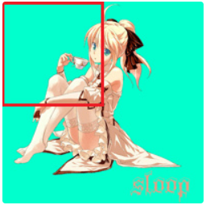
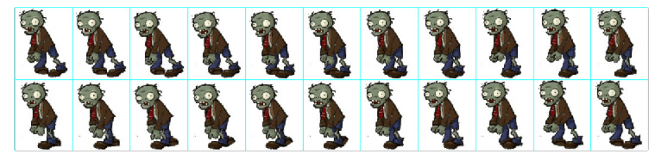

### 1、绘制图片

绘制图片有两种方法，drawPicture(矢量图)和drawBitMap(位图)，接下来我们一一了解。

1）drawPicture

使用drawPicture之前请关闭硬加速

**在AndroidMenifest文件中application节点下添加 android:hardwareAcclerated="false"以关闭整个应用的硬件加速**

首先看下官方文档对Picture的解释：

> *A Picture records drawing calls (via the canvas returned by beginRecording) and can then play them back into Canvas (via draw(Canvas) or drawPicture(Picture)).For most content (e.g. text, lines, rectangles), drawing a sequence from a picture can be faster than the equivalent API calls, since the picture performs its playback without incurring any method-call overhead.*

我们把Canvas绘制的点、线、矩形等诸多操作用Picture记录下来，下次需要的时候拿来就能用，使用Picture相比于再次调用绘图API，开销是比较小的，就是对于重复的操作更加的省时省力

> 可以把Picture看作是一个录制Canvas操作的录像机

了解一下Picture的相关方法：

| 相关方法                                                    | 简介                                                         |
| ----------------------------------------------------------- | ------------------------------------------------------------ |
| public int getWidth ()                                      | 获取宽度                                                     |
| public int getHeight ()                                     | 获取高度                                                     |
| public Canvas beginRecording (int width, int height)        | 开始录制 (返回一个Canvas，在Canvas中所有的绘制都会存储在Picture中) |
| public void endRecording ()                                 | 结束录制                                                     |
| public void draw (Canvas canvas)                            | 将Picture中内容绘制到Canvas中                                |
| public static Picture createFromStream (InputStream stream) | (已废弃)通过输入流创建一个Picture                            |
| public void writeToStream (OutputStream stream)             | (已废弃)将Picture中内容写出到输出流中**                      |

**很明显，beginRecording 和 endRecording是成对使用的，一个开始录制，一个是结束录制，两者之前的操作将会存储在Picture中**。

使用用例：

**准备工作**：

录制内容，即将一些Canvas操作用Picture存储起来，录制的内容是不会直接显示在屏幕上的，知识存储起来了而已。

```java
// 1.创建Picture
private Picture mPicture = new Picture();

---------------------------------------------------------------

// 2.录制内容方法
private void recording() {
    // 开始录制 (接收返回值Canvas)
    Canvas canvas = mPicture.beginRecording(500, 500);
    // 创建一个画笔
    Paint paint = new Paint();
    paint.setColor(Color.BLUE);
    paint.setStyle(Paint.Style.FILL);

    // 在Canvas中具体操作
    // 位移
    canvas.translate(250,250);
    // 绘制一个圆
    canvas.drawCircle(0,0,100,paint);

    mPicture.endRecording();
}

---------------------------------------------------------------

// 3.在使用前调用(我在构造函数中调用了)
  public Canvas3(Context context, AttributeSet attrs) {
    super(context, attrs);
    
    recording();    // 调用录制
}
```

**具体使用**：

Picture虽然方法就那么几个，但是具体使用起来还是分很多情况的，由于录制的内容不会直接显示，就像存储的视频不点击不会自动播放一样，同样，想要将Picture中的内容显示出来就需要手动调用播放（绘制），将Picture中的内容绘制出来可以有一下几种方法：

| 序号 | 简介                                                         |
| ---- | ------------------------------------------------------------ |
| 1    | 使用Picture提供的draw方法绘制                                |
| 2    | 使用Canvas提供的drawPicture方法绘制                          |
| 3    | 将Picture包装成为PictureDrawable,使用PictureDrawable的draw方法绘制 |

以上几种方法主要区别：

| 主要区别           | 分类                         | 简介                                                 |
| ------------------ | ---------------------------- | ---------------------------------------------------- |
| 是否对Canvas有影响 | 1、有影响   2 3不影响        | 此处绘制完成后是否会影响Canvas的状态（matrix clip)等 |
| 可操作性强弱       | 1 可操作性较弱 2 3可操作性强 | 此处的可操作性可以简单理解为对绘制结果可控程度       |

1、使用Picture提供的draw方法

```java
// 将Picture中的内容绘制在Canvas上
mPicture.draw(canvas);  
```

> 这种方法在低版本上面绘制可能会影响Canvas状态，所以这种方法一般不会使用

2、使用Canvas提供的drawPirture方法绘制

drawPicture有三种方法

```java
public void drawPicture (Picture picture)

public void drawPicture (Picture picture, Rect dst)

public void drawPicture (Picture picture, RectF dst)
```

和使用Picture提供的draw方法不同，Canvas的drawPicture不会影响Canvas的状态

简单示例：

```java
canvas.drawPicture(mPicture,new RectF(0,0,mPicture.getWidth(),200));
```

3.将Picture封装为PictureDrawable，使用PictureDrawable的draw方法绘制

```java
// 包装成为Drawable
PictureDrawable drawable = new PictureDrawable(mPicture);
// 设置绘制区域 -- 注意此处所绘制的实际内容不会缩放
drawable.setBounds(0,0,250,mPicture.getHeight());
// 绘制
drawable.draw(canvas);
```

> setBounds是设置在画布上的绘制区域，并非根据该区域进行缩放，也不是裁剪Picture。每次都从Picture的左上角开始绘制

2）drawBitmap

首先，如何获取一个Bitmap：

| 序号 | 获取方式               | 备注                                                         |
| ---- | ---------------------- | ------------------------------------------------------------ |
| 1    | 通过Bitmap创建         | 复制一个已有的Bitmap（新Bitmap状态和原有的一致）或者创建一个空白的bitmap) |
| 2    | 通过BitmapDrawable获取 | 从资源文件 内存卡 网络等地方获取一张图片并转换为内容不可变的Bitmap |
| 3    | 通过BitmapFactory获取  | 从资源文件 内存卡 网络等地方获取一张图片并转换为内容不可变的Bitmap |

**通常来说，我们绘制Bitmap都是读取已有的图片转换为Bitmap绘制到Canvas上**

很明显，第一种方式不能满足我们的要求，暂时排除

第二种虽然也可以满足我们的需求，但是不推荐使用这种方式

第三种方法我们会比较详细的说明一下如何从各个位置获取图片

通过BitmapFactory从不同位置获取Bitmap:

**资源文件（drawable/mipmap/raw)**

```java
Bitmap bitmap = BitmapFactory.decodeResource(mContext.getResources(),R.raw.bitmap);
```

**资源文件（assets)**

```java
Bitmap bitmap=null;
try {
    InputStream is = mContext.getAssets().open("bitmap.png");
    bitmap = BitmapFactory.decodeStream(is);
    is.close();
} catch (IOException e) {
    e.printStackTrace();
}
```

**内存卡文件：**

```java
Bitmap bitmap = BitmapFactory.decodeFile("/sdcard/bitmap.png");
```

**网络文件 **

```java
// 此处省略了获取网络输入流的代码
Bitmap bitmap = BitmapFactory.decodeStream(is);
is.close();
```

既然已经得到了Bitmap，那么就开始本文的重点了，将Bitmap绘制到画布上。

绘制Bitmap：

依照惯例先预览一下drawBitmap的常用方法：

```java
// 第一种
public void drawBitmap (Bitmap bitmap, Matrix matrix, Paint paint)

// 第二种
public void drawBitmap (Bitmap bitmap, float left, float top, Paint paint)

// 第三种
public void drawBitmap (Bitmap bitmap, Rect src, Rect dst, Paint paint)
public void drawBitmap (Bitmap bitmap, Rect src, RectF dst, Paint paint)
```

第一种方法后两个参数（matirx,paint)是在绘制的时候对图片进行一些改变，如果只是需要将图片内容绘制出来只需要如下操作就可以了：

```
canvas.drawBitmap(bitmap,new Matrix(),new Paint());
```

> 图片左上角位置默认为坐标原点

第二种方法就是在绘制时指定了图片左上角的坐标（距离坐标原点的距离）

> 注意：此处指定的是与坐标原点的距离，并非是与屏幕顶部与左侧的距离，虽然默认状态下两者是重合的，但是也请注意分别两者的不同

第三种方法比较有意思，上面多了两个矩形区域（src,dst)，这两个矩形选区是干什么的呢？

| 名称                  | 作用                               |
| --------------------- | ---------------------------------- |
| Rect src              | 指定绘制图片的区域                 |
| Rect dst or RectF dst | 指定图片在屏幕上显示（绘制）的区域 |

示例：

```java
// 将画布坐标系移动到画布中央
canvas.translate(mWidth/2,mHeight/2);

// 指定图片绘制区域(左上角的四分之一)
Rect src = new Rect(0,0,bitmap.getWidth()/2,bitmap.getHeight()/2);

// 指定图片在屏幕上显示的区域
Rect dst = new Rect(0,0,200,400);

// 绘制图片
canvas.drawBitmap(bitmap,src,dst,null);
```

用src指定图片绘制部分的区域，即下图中红色方框标注的区域。



从上面可知，第三种方法可以绘制图片的一部分到画布上，有什么用呢？

如果你看过某些游戏文件的资源文件，你可能会看到如下的图片：



用一张图片包含了大量的素材，在绘制的时候每次只截取一部分进行绘制，这样可以大大的减少素材数量，而且管理素材也方便

当我们需要制作一些炫酷的效果，这些效果太复杂了用代码很难实现或者渲染效率不高。这时候很多会想到帧动画，将动画分解为一张一张的图片然后用帧动画制作出来，将动画效果的所有资源整理到一张图片上，会大大的减少**资源文件数量，方便管理**,同时也节省了图片文件头、文件结束块以及调色板等占用的空间

下面是利用drawBitmap第三种方法制作的一个简单示例：


2、绘制文字

依旧预览一下相关常用方法：

```java
// 第一类
public void drawText (String text, float x, float y, Paint paint)
public void drawText (String text, int start, int end, float x, float y, Paint paint)
public void drawText (CharSequence text, int start, int end, float x, float y, Paint paint)
public void drawText (char[] text, int index, int count, float x, float y, Paint paint)

// 第二类
public void drawPosText (String text, float[] pos, Paint paint)
public void drawPosText (char[] text, int index, int count, float[] pos, Paint paint)

// 第三类
public void drawTextOnPath (String text, Path path, float hOffset, float vOffset, Paint paint)
public void drawTextOnPath (char[] text, int index, int count, Path path, float hOffset, float vOffset, Paint paint)
```

> CharSequence和String的区别这里不进行讲解

绘制文字部分大致可以分为三类：

第一类只能指定文本基线位置（基线x默认在字符串左侧，基线y默认在字符串下方）

第二类可以分别指定每个文字的位置

第三类是指定一个路径，根据路径绘制文字

通过上面常用方法的参数可以看出，绘制文字也是需要画笔的，而且文字的大小、颜色、字体、对齐方式都是由画笔控制的。

**Paint文字相关常用方法表 **

| 标题 | 相关方法                  | 备注                                                |
| ---- | ------------------------- | --------------------------------------------------- |
| 色彩 | setColor setARGB setAlpha | 设置颜色，透明度                                    |
| 大小 | setTextSize               | 设置文本字体大小                                    |
| 字体 | setTypeface               | 设置或清除字体样式                                  |
| 样式 | setStyle                  | 填充(FILL),描边(STROKE),填充加描边(FILL_AND_STROKE) |
| 对齐 | setTextAlign              | 左对齐(LEFT),居中对齐(CENTER),右对齐(RIGHT)         |
| 测量 | measureText               | 测量文本大小(注意，请在设置完文本各项参数后调用)    |

为了绘制文本，我们先创建一个文本画笔：

```java
Paint textPaint = new Paint();          // 创建画笔
textPaint.setColor(Color.BLACK);        // 设置颜色
textPaint.setStyle(Paint.Style.FILL);   // 设置样式
textPaint.setTextSize(50);              // 设置字体大小
```

**第一类（draw text)**

第一类可以指定文本开始的位置，可以截取文本中部分内容进行绘制

其中 x  y两个参数是指定文本绘制两个基线，示例：

```java
// 文本(要绘制的内容)
String str = "ABCDEFG";

// 参数分别为 (文本 基线x 基线y 画笔)
canvas.drawText(str,200,500,textPaint);
```

当然啦，除了能指定绘制文本的起始位置，还能只取出文本中的一部分内容进行绘制。

截取文本中的一部分，对于string和charSequence来说只指定字符串下标start和end位置（注意： 0 <= start <end <str.length())

一般来说，**使用start和end指定的区间都是前闭后开的，即包含start指定的下标，而不包含end指定的下标**，故[1,3)最后获取到的下标只有下标1和下标2的字符。

**第二类（draePosText)**

通过和第一类比较，我们发现，第二类中没有指定x ,y 的坐标的参数，而是出现了这样一个参数float[] pos。

这个名为pos的浮点数数组就是指定坐标的。

示例：

```
String str = "SLOOP";

canvas.drawPosText(str,new float[]{
      100,100,    // 第一个字符位置
      200,200,    // 第二个字符位置
      300,300,    // ...
      400,400,
      500,500
},textPaint);
```

关于第二类的第二种方法：

```java
public void drawPosText (char[] text, int index, int count, float[] pos, Paint paint)
```

和上面一样，就是从字符数组中切出来一段进行绘制。

**第三类（drawTextOnPath)**

第三类要用到path这个大杀器

