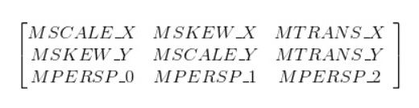

# Matrix简介

**Matrix是一个矩阵，主要功能是坐标映射，数值转换**

它看起来大概是下面这样：



**Matrix作用就是坐标映射，那么为什么需要Matirx呢？**

我们的手机屏幕作为物理设备，其物理坐标系是从左上角开始的，但是我们在开发的时候通常不会使用这个坐标系，而是使用内容区的坐标系。

以下图为例，我们的内容区和屏幕坐标系还相差一个通知栏加标题栏的距离，所以两者是不重合的，我们的内容区的坐标系中的内容最终在绘制的时候肯定要转换为实际的物理坐标系来进行绘制，Matrix在此处的作用就是转换这些数值。

> 假设通知栏高度为20dp，导航栏的高度为40像素，那么我们在内容区的（0，0）位置绘制一个点，最终就要转换为实际坐标系中的（0，60）位置绘制一个点


以上只是一个简单的示例，实际上不论是2D还是3D,我们要将图形显示在屏幕上，都离不开Matrix，所以说Matrix是一个在背后辛勤工作的劳模

#### Matrix特点

- 作用范围更广，Matrix在View，图片，动画效果等各个方面均有运用，相比之前讲解等画布操作应用范围更广
- 更加灵活，画布操作是对Matrix的封装，Matrix作为更接近底层的东西，必然要比画布操作更加灵活
- 封装很好，Matrix本身对各个方法就做了很好的封装，让开发者可以很方便的操作Matrix
- 难以深入理解，很难理解其中各个数值的含义，以及操作规律，如果不了解规律，不了解矩阵，也很难理解前乘法、后乘法。

**常见误解**

**1.认为Matrix最下面的一行的三个参数(MPERSP_0、MPERSP_1、MPERSP_2)没有什么太大的作用，在这里只是为了凑数。**

实际上最后一行参数在3D变换中有着至关重要的作用，这一点会在后面中Camera一文中详细介绍。

**2.最后一个参数MPERSP_2被解释为scale**

的确，更改MPERSP_2的值能够达到类似缩放的效果，但这是因为齐次坐标的缘故，并非这个参数的实际功能。

# Matrix基本原理

matrix是一个矩阵，最根本的作用就是坐标转换，下面我们就看看几种常见的变换的原理：

基本变换有4种：平移（translate)、缩放（scale)、旋转（rotate）、错切（skew)

下面我们看一下四种变换都是都哪些参数控制的：


**从上图可以看到最后三个参数是控制透视的，这三个参数主要在3D效果中运用，通常为(0, 0, 1)，不在本篇讨论范围内，暂不过多叙述，会在之后对文章中详述其作用。**

### 1、缩放（Scale)

x = K1X0 y = K2Y0

图例：


### 2.错切(Skew)

错切存在两种特殊错切，水平错切(平行X轴)和垂直错切(平行Y轴)。

#### 水平错切

$$
x = x0 + ky0
$$

$$
y = y0
$$

$$
\left[
\matrix{
  x\\
  y\\
  1
}
\right] = \left[
\matrix{
   1 & k & 0\\
   0 & 1 & 0\\
   0 & 0 & 1
}
\right]
\left[
\matrix{
   x0\\
   y0\\
   1
}
\right]
$$

图例：


**垂直错切**
$$
x = x0
$$
`
$$
y = kx0 + y0
$$
用矩阵表示：
$$
\left[
\matrix{
  x\\
  y\\
  1
}
\right] = \left[
\matrix{
   1 & 0 & 0\\
   k & 1 & 0\\
   0 & 0 & 1
}
\right]
\left[
\matrix{
   x0\\
   y0\\
   1
}
\right]
$$
图例：


**复合错切**

> 水平错切和垂直错切的复合

$$
x = x0 + k1y0
$$

$$
y = y0 + k2x0
$$


## 3.旋转（Rotate)

假定一个点A（x0,y0),距离原点的距离为r，与水平轴夹角为α 度，绕原点旋转θ 度，旋转后的点为B（x,y)如下：


用矩阵表示
$$
\left[
\matrix{
  x\\
  y\\
  1
}
\right] = \left[
\matrix{
   cos(θ) & -sin(θ) & 0\\
   sin(θ) & cos(θ) & 0\\
   0 & 0 & 1
}
\right]
\left[
\matrix{
   x0\\
   y0\\
   1
}
\right]
$$
图例：


## 4.平移（Translate)

> 此处也是使用齐次坐标的优点之一，实际上前面的三个操作使用2X2的矩阵也可以满足需求，但是使用2X2的矩阵，无法将平移操作加入其中，而将坐标扩展为齐次坐标之后，将矩阵扩展为3X3就可以将算法统一，四种算法均可以使用矩阵乘法完成

$$
x = x0 + \Delta x
$$

$$
y = y0 + \Delta y
$$

# Matrix复合原理

Matrix的多种复合操作都是使用矩阵乘法来实现的，从原理上很简单，但是，使用矩阵乘法也有其弱点，后面的操作可能会影响前面的操作，所以在构造matrix时顺序很重要

我们的常用四大变换操作，每一种在Matrix均由三类，前乘（pre),后乘（post)和设置（set)，由于矩阵乘法不满足交换律，所以前乘（pre),后乘（post)和设置（set)的区别还是由很大区别的。

### 前乘（pre)

前乘相当于矩阵的右乘：
$$
M' = M . S
$$

> 这表示一个矩阵与一个特殊矩阵前乘后构造出来的结果矩阵

### 后乘（post)

后乘相当于矩阵的左乘：
$$
M' = S . M
$$

> 这表示一个矩阵与一个特殊矩阵后乘构造出来的结果矩阵

### 设置（set)

设置使用的不是矩阵乘法，而是直接覆盖掉原来的数值，所以，**使用设置可能会导致之前的操作失效**

# 组合

## 如何理解和使用pre和post？

```
pre  : 右乘， M‘ = M*A
post : 左乘， M’ = A*M
```

**那么如何使用？**

正确使用方式就是先构造正常的Matrix乘法顺序，之后根据情况使用pre和post来把这个顺序实现。

用一个最简单的例子理解，假设需要围绕某一点旋转。

可以使用`xxxRotate(angle,pivotX,pivotY)`,由于我们这里需要组合构造一个Matrix，这里不是用

首先，有两条定理：

- 所有的操作（旋转 平移 缩放 错切）默认都是以原点为基准点的
- 之前操作的坐标系状态都会保留，并且影响到后续的状态

基于这两条基本定理，我们可以推算出基于某一个点进行旋转需要的如下步骤：

```
1、先将坐标系原点移动到指定的位置，使用平移T
2、对坐标系进行旋转，使用旋转S（围绕原点旋转）
3、再将坐标系平移回原位置，使用平移-T
```

具体公式如下：

> M为原始矩阵，是一个单位矩阵，M'为结果矩阵，T为平移，R为旋转

$$
M' = M * T * R * -T = T * R * -T
$$

按照公式写出来的伪代码如下：

```java
Matrix matrix = new Matrix();
matrix.preTranslate(pivotX,pivotY);
matrix.preRotate(angle);
matrix.preTranslate(-pivotX, -pivotY);
```

```
// 使用pre， M' = M*T*S = T*S
Matrix m ＝ new Matrix();
m.reset();  //得到一个单位矩阵
m.preTranslate(tx, ty); 
m.preScale(sx, sy);
```

