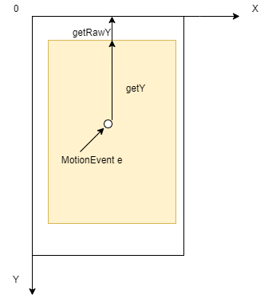

### 屏幕坐标系和数学坐标系的区别

由于移动设备一般定义屏幕左上角为坐标原点，向右为x轴增大方向，向下为y轴增大方向，所以在手机屏幕上的坐标系与数学中常见的坐标系是稍微有点差别的，详情如下：


### View的坐标系

注意：View的坐标系是相对于父控件而言的。

```java
getTop()  //获取子View左上角距父View顶部的距离
getLeft()  //获取子View左上角距父View左侧的距离
getBottom() //获取子View右下角距父View顶部的距离
getRight()  //获取子View右下角距父View左侧的距离
```


### MotionEvent中get和getRaw的区别

```java
event.getX() // 触摸点相对于其所在组件坐标系的坐标
event.getY()
event.getRawX()  //触摸点相对于屏幕默认坐标系额坐标
event.getRawY()
```

如下图所示：

