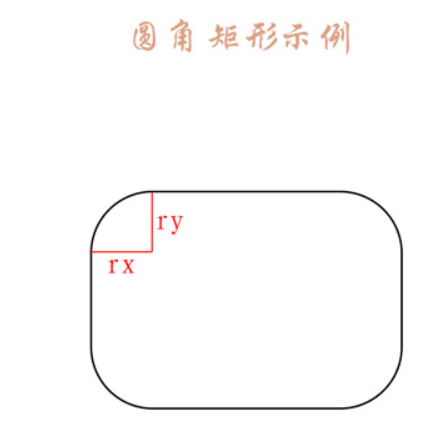

### 安卓自定义View进阶-Canvas之绘制图形

### 1.Canvas简介

Canvas可以称之为画布，能够在上面绘制各种东西，是Android平台2D图形绘制的基础。

**一般来说，比较基础的东西有两个比较大的特点**：

- 可操作性强：这是构成上层的基础，所以可操作性必然十分强大
- 比较难用：各种方法比较基础，想要完美的将这些操作组合起来有一定的难度；实现amazing 的效果也需要一定的数学知识的

本系列文章会介绍Canvas的操作方法

### 2.Canvas的常用操作速查表

| 操作类型     | 相关API                                                      | 备注                                                         |
| ------------ | ------------------------------------------------------------ | :----------------------------------------------------------- |
| 绘制颜色     | drawColor, drawRGB, drawARGB                                 | 使用单一颜色填充整个画布                                     |
| 绘制基本形状 | drawPoint, drawPoints, drawLine, drawLines, drawRect, drawRoundRect, drawOval, drawCircle, drawArc | 依次为 点、线、矩形、圆角矩形、椭圆、圆、圆弧                |
| 绘制图片     | drawBitmap, drawPicture                                      | 绘制位图和图片                                               |
| 绘制文本     | drawText, drawPosText, drawTextOnPath                        | 依次为 绘制文字、绘制文字时指定每个文字位置、根据路径绘制文字 |
| 绘制路径     | drawPath                                                     | 绘制路径，绘制贝塞尔曲线时也需要用到该函数                   |
| 顶点操作     | drawVertices, drawBitmapMesh                                 | 通过对顶点操作可以使图像形变，drawVertices直接对画布作用、 drawBitmapMesh只对绘制的Bitmap作用 |
| 画布剪裁     | clipPath, clipRect                                           | 设置画布的显示区域                                           |
| 画布快照     | save, restore, saveLayerXxx, restoreToCount, getSaveCount    | 依次为 保存当前状态、 回滚到上一次保存的状态、 保存图层状态、 回滚到指定状态、 获取保存次数 |
| 画布变换     | translate, scale, rotate, skew                               | 依次为 位移、缩放、 旋转、错切                               |
| Matrix(矩阵) | getMatrix, setMatrix, concat                                 | 实际上画布的位移，缩放等操作的都是图像矩阵Matrix， 只不过Matrix比较难以理解和使用，故封装了一些常用的方法。 |

> PS:Canvas常用方法在上面表格中已经给了出来，当然还存在一些其他的方法没有给出来，具体参考官方文档

### 3.Canvas详解

#### 绘制颜色：

绘制颜色是填充整个画布，常用于绘制底色

```java
canvas.drawColor(Color.BLUE); //绘制蓝色
```

#### 创建画笔：

想要绘制内容，首先需要创建一个画笔，如下：

```java
// 1.创建一个画笔
private Paint mPaint = new Paint();

// 2.初始化画笔
private void initPaint() {
	mPaint.setColor(Color.BLACK);       //设置画笔颜色
	mPaint.setStyle(Paint.Style.FILL);  //设置画笔模式为填充
	mPaint.setStrokeWidth(10f);         //设置画笔宽度为10px
}

// 3.在构造函数中初始化
public SloopView(Context context, AttributeSet attrs) {
   super(context, attrs);
   initPaint();
}
```

创建完画笔之后，就可以在Canvas中绘制各种内容了

------

### 绘制点：

可以绘制一个点，也可以绘制一组点，如下：

```java
canvas.drawPoint(200, 200, mPaint);     //在坐标(200,200)位置绘制一个点
canvas.drawPoints(new float[]{          //绘制一组点，坐标位置由float数组指定
      500,500,
      500,600,
      500,700
},mPaint);
```

------

#### 绘制直线：

绘制直线需要两个点，初始点和结束点，同样绘制直线也可以绘制一条或者一组：

```java
canvas.drawPoint(200, 200, mPaint);     //在坐标(200,200)位置绘制一个点
canvas.drawPoints(new float[]{          //绘制一组点，坐标位置由float数组指定
      500,500,
      500,600,
      500,700
},mPaint);
```

------

#### 绘制矩形：

我们都知道，确定一个矩形至少需要四个数据，**就是对角线的两个点**的坐标值，这里一般采用**左上角**和**右下角**的两个点的坐标。

关于矩形绘制，Canvas提供了三种重载方法，第一种就是提供**四个数值（矩形左上角和右下角两个点的坐标）来确定一个矩形**进行绘制。其余两种是先将矩形封装为Rect或RectF(实际上仍然是用两个坐标点来确定的矩形)，然后传递给Canvas进行绘制，如下：

```java
// 第一种
canvas.drawRect(100,100,800,400,mPaint);

// 第二种
Rect rect = new Rect(100,100,800,400);
canvas.drawRect(rect,mPaint);

// 第三种
RectF rectF = new RectF(100,100,800,400);
canvas.drawRect(rectF,mPaint);
```

为什么会有Rect和RectF两种？两者的区别是什么？

答案就是两者的精度不同，Rect是整形的，RectF是float（单精度浮点型）的，此外，两种提供的方法也稍微存在差别，具体见官方文档

------

#### 绘制圆角矩形：

绘制圆角矩形也提供了两种重载方式，如下：

```java
// 第一种
RectF rectF = new RectF(100,100,800,400);
canvas.drawRoundRect(rectF,30,30,mPaint);

// 第二种
canvas.drawRoundRect(100,100,800,400,30,30,mPaint);
```

下面解析一下一个圆角矩形的几个必要的参数的意思：

与矩形相比，圆角矩形多出来了两个参数rx,ry,这两个参数是干什么的呢？

既然是圆角矩形，它的角肯定是圆弧，我们一般用什么来确定一个圆形呢？

答案就是**圆心和半径**，其中**圆心**用于确定位置，**半径用于确定大小**

由于矩形的位置已经确定，所以其边角位置也是确定的，那么确定位置的参数就可以忽略，只需要使用半径就能描述一个圆弧了。

但是半径只需要一个参数，为什么需要两个呢？

**这里圆角矩形的角实际上不是一个正圆的圆弧。而是椭圆的圆弧，这里的两个参数实际上是椭圆的两个半径，如下图：



**红线标注的rx和ry就是两个半径，也就是相比绘制矩形多出来的两个参数**

在了解了原理之后，通过计算可知我们上次绘制的矩形宽度为700，高度为300，当你让rx大于350（宽度的一半时，rx大于150（高度的一半）时，奇迹就出现了，你会发现圆角矩形变成了一个椭圆，他们呢会出来就是这样的：

```java
// 矩形
RectF rectF = new RectF(100,100,800,400);  

// 绘制背景矩形
mPaint.setColor(Color.GRAY);
canvas.drawRect(rectF,mPaint);

// 绘制圆角矩形
mPaint.setColor(Color.BLUE);
canvas.drawRoundRect(rectF,700,400,mPaint);
```


实际上在rx为宽度的一半，ry为高度的一半时，刚好是一个椭圆，通过上面的原理可以计算到，当rx大于宽度的一半，ry大于高度的一半，实际是无法计算出来圆弧的，所以drawRoundRect对大于该数值的参数进行了限制，凡是大于一半的参数全部按照一半进行处理

------

### 绘制椭圆：

相对于绘制圆角矩形，绘制椭圆就简单的多了，因为它只需要一个矩形作为参数：

```java
// 第一种
RectF rectF = new RectF(100,100,800,400);
canvas.drawOval(rectF,mPaint);

// 第二种
canvas.drawOval(100,100,800,400,mPaint);
```

以上两种方法产生的效果都一样，但是一半使用前者

绘制椭圆其实就是在绘制一个矩形的内切图形。

> PS:如果传递进来的是一个正方形，那么绘制出来的就是一个圆形

------

### 绘制圆形

绘制圆形也比较简单，如下：

```java
canvas.drawCircle(500,500,400,mPaint);  // 绘制一个圆心坐标在(500,500)，半径为400 的圆
```

绘制圆形有四个参数，前两个为圆心坐标，第三个为半径，最后一个是画笔

------

### 绘制圆弧：

绘制圆弧就比较神奇，为了理解这个，先看一下它需要的几个参数：

```java
// 第一种
public void drawArc(@NonNull RectF oval, float startAngle, float sweepAngle, boolean 		useCenter, @NonNull Paint paint){}
    
// 第二种
public void drawArc(float left, float top, float right, float bottom, float startAngle,
    float sweepAngle, boolean useCenter, @NonNull Paint paint) {}
```

从上面可以看出，相比于绘制椭圆，绘制圆弧还多了三个参数：

```
startAngle  // 开始角度
sweepAngle  // 扫过角度
useCenter   // 是否使用中心
```

通过字面意思我们基本能猜测出来前两个参数（startAngle, sweepAngel)的作用，就是确定角度的起始位置和扫过角度，不过第三个参数是干嘛的？试一下吧

```java
RectF rectF = new RectF(100,100,800,400);
// 绘制背景矩形
mPaint.setColor(Color.GRAY);
canvas.drawRect(rectF,mPaint);

// 绘制圆弧
mPaint.setColor(Color.BLUE);
canvas.drawArc(rectF,0,90,false,mPaint);

//-------------------------------------

RectF rectF2 = new RectF(100,600,800,900);
// 绘制背景矩形
mPaint.setColor(Color.GRAY);
canvas.drawRect(rectF2,mPaint);

// 绘制圆弧
mPaint.setColor(Color.BLUE);
canvas.drawArc(rectF2,0,90,true,mPaint);
```


上面的代码实际上是绘制了一个起始角度为0度，扫过角度为90度的圆弧，两者的区别就是是否使用了中心点。

可以发现使用了中心点之后绘制出来类似于一个扇形，而不是使用中心点则是圆弧七十点和结束点之前的连线街上圆弧围城的图形。这个中心点的作用就很明显了。

相比于使用椭圆，使用正圆的场景还是比较多的，使用正圆如下所示：

```java
RectF rectF = new RectF(100,100,600,600);
// 绘制背景矩形
mPaint.setColor(Color.GRAY);
canvas.drawRect(rectF,mPaint);

// 绘制圆弧
mPaint.setColor(Color.BLUE);
canvas.drawArc(rectF,0,90,false,mPaint);

//-------------------------------------

RectF rectF2 = new RectF(100,700,600,1200);
// 绘制背景矩形
mPaint.setColor(Color.GRAY);
canvas.drawRect(rectF2,mPaint);

// 绘制圆弧
mPaint.setColor(Color.BLUE);
canvas.drawArc(rectF2,0,90,true,mPaint);
```

------

### 简要介绍Paint

绘制的**基本形状由Canvas确定**，但是绘制出来的**颜色，具体效果则由paint**确定。

我们在设定画笔样式的时候是这样的：

```java
mPaint.setStyle(Paint.Style.FILL);  //设置画笔模式为填充
```

为了展示方便，容易看出效果，之前使用的模式一直是填充模式，实际上画笔由三种模式：

```java
STROKE                //描边
FILL                  //填充
FILL_AND_STROKE       //描边加填充
```

为了区分三者的区别，我们做了如下实验：

```java
Paint paint = new Paint();
paint.setColor(Color.BLUE);
paint.setStrokeWidth(40);     //为了实验效果明显，特地设置描边宽度非常大

// 描边
paint.setStyle(Paint.Style.STROKE);
canvas.drawCircle(200,200,100,paint);

// 填充
paint.setStyle(Paint.Style.FILL);
canvas.drawCircle(200,500,100,paint);

// 描边加填充
paint.setStyle(Paint.Style.FILL_AND_STROKE);
canvas.drawCircle(200, 800, 100, paint);
```


这样三者的区别一下子就可以看出来了，如果只需要边缘不需要填充内容的话只需要设置模式为STROKE即可

------


### 小示例

简要介绍画布的操作：

| 相关操作  | 简要介绍               |
| --------- | ---------------------- |
| save      | 保存当前画布状态       |
| restore   | 回滚到上一次保存的状态 |
| translate | 相对与当前位置位移     |
| rotate    | 旋转                   |

### 制作一个饼状图

先分析饼状图的构成，非常明显，饼状图就是一个又一个的扇形构成的，每个扇形有不同的颜色，对应的名字、数据和百分比。

饼状图的最基本数据应该包括：**名字 数据值 百分比 对应的角度 颜色**

> 用户关心的数据 ：名字 数据值 百分比
>
> 需要程序计算的数据：百分比 对应的角度

### 封装数据：

```java
public class PieData {
    // 用户关心数据
    private String name;        // 名字
    private float value;        // 数值
    private float percentage;   // 百分比
    
    // 非用户关心数据
    private int color = 0;      // 颜色
    private float angle = 0;    // 角度

    public PieData(@NonNull String name, @NonNull float value) {
        this.name = name;
        this.value = value;
    }
}
```

### 自定义View：

先按照自定义view流程梳理一遍：

| 步骤 | 关键字        | 作用                               |
| ---- | ------------- | ---------------------------------- |
| 1    | 构造函数      | 初始化（初始化画笔Paint)           |
| 2    | onMeasure     | 测量View的大小                     |
| 3    | onSizeChanged | 确定View大小（记录当前View的宽高） |
| 4    | onLayout      | 确定子View布局                     |
| 5    | onDraw        | 实际绘制内容（绘制饼状图）         |
| 6    | 提供接口      | 提供接口（提供设置数据的接口）     |

代码如下：

```java
public class PieView extends View {
    // 颜色表 (注意: 此处定义颜色使用的是ARGB，带Alpha通道的)
    private int[] mColors = {0xFFCCFF00, 0xFF6495ED, 0xFFE32636, 0xFF800000, 0xFF808000, 0xFFFF8C69, 0xFF808080,
            0xFFE6B800, 0xFF7CFC00};
    // 饼状图初始绘制角度
    private float mStartAngle = 0;
    // 数据
    private ArrayList<PieData> mData;
    // 宽高
    private int mWidth, mHeight;
    // 画笔
    private Paint mPaint = new Paint();

    public PieView(Context context) {
        this(context, null);
    }

    public PieView(Context context, AttributeSet attrs) {
        super(context, attrs);
        mPaint.setStyle(Paint.Style.FILL);
        mPaint.setAntiAlias(true);
    }

    @Override
    protected void onSizeChanged(int w, int h, int oldw, int oldh) {
        super.onSizeChanged(w, h, oldw, oldh);
        mWidth = w;
        mHeight = h;
    }

    @Override
    protected void onDraw(Canvas canvas) {
        super.onDraw(canvas);
        if (null == mData)
            return;
        float currentStartAngle = mStartAngle;                    // 当前起始角度
        canvas.translate(mWidth / 2, mHeight / 2);                // 将画布坐标原点移动到中心位置
        float r = (float) (Math.min(mWidth, mHeight) / 2 * 0.8);  // 饼状图半径
        RectF rect = new RectF(-r, -r, r, r);                     // 饼状图绘制区域

        for (int i = 0; i < mData.size(); i++) {
            PieData pie = mData.get(i);
            mPaint.setColor(pie.getColor());
            canvas.drawArc(rect, currentStartAngle, pie.getAngle(), true, mPaint);
            currentStartAngle += pie.getAngle();
        }

    }

    // 设置起始角度
    public void setStartAngle(int mStartAngle) {
        this.mStartAngle = mStartAngle;
        invalidate();   // 刷新
    }

    // 设置数据
    public void setData(ArrayList<PieData> mData) {
        this.mData = mData;
        initData(mData);
        invalidate();   // 刷新
    }

    // 初始化数据
    private void initData(ArrayList<PieData> mData) {
        if (null == mData || mData.size() == 0)   // 数据有问题 直接返回
            return;

        float sumValue = 0;
        for (int i = 0; i < mData.size(); i++) {
            PieData pie = mData.get(i);

            sumValue += pie.getValue();       //计算数值和

            int j = i % mColors.length;       //设置颜色
            pie.setColor(mColors[j]);
        }

        float sumAngle = 0;
        for (int i = 0; i < mData.size(); i++) {
            PieData pie = mData.get(i);

            float percentage = pie.getValue() / sumValue;   // 百分比
            float angle = percentage * 360;                 // 对应的角度

            pie.setPercentage(percentage);                  // 记录百分比
            pie.setAngle(angle);                            // 记录角度大小
            sumAngle += angle;

            Log.i("angle", "" + pie.getAngle());
        }
    }
}
```

