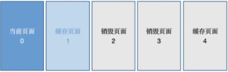

## ViewPager

### ViewPager 简单介绍

1、ViewPager使用一个键对象来关联每一页，而不是管理view。这个键用于追踪和唯一标识在 adapter 中独立位置的一页。调用方法 startUpdate(ViewGroup)表明ViewGroup 中的内容需要修改。

2、通过调用一次或者多次调用 instantiateItem(ViewGroup，int) 来构造页面内容

3、调用 destroyItem(ViewGroup, int, Object)来取消 ViewPager 关联的页面视图

4、最后，当一次更新(添加或移除)完成之后将会调用 finishUpdate(ViewGroup) 使用回调的方式来通知 PagerAdapter 来管理其中的页面

5、一个非常简单的方式就是使用每页视图作为 key 来关联它们自己，在方法 instantiateItem(ViewGroup,int) 中创建和添加他们到 viewGroup 之后，返回该页视图。与之相匹配的方法 destroyItem(ViewGroup,int,Object) 实现从 ViewGroup 中移除视图。当然必须在 isViewFromObject(View, Object) 中这样实现：return view == object；

6、PagerAdapter 支持数据改变时刷新界面，数据改变必须在主线程中调用，并在数据改变完成后调用方法 notifyDataSetChanged()，和 AdapterView 中派生自 BaseAdapter 相似。一次数据的改变可能关联着页面的添加、移除或改变位置。ViewPager 将根据 adapter 中实现 getItemPosition(Object) 方法返回的结果，来判断是否保留当前已经构造的活动页面（即重用，而不是完全自行构造）。

### ViewPager 弊端分析

​	普通的 viewpager 如果你不使用 setOffscreenPageLimit(int limit) 这个方法去设置默认加载数量的话是会默认加载页面的左右两页的，也就是说当你进入 viewPager 第一页的时候第二页和第一页是会被一起加载的，这样同时加载就会造成一些问题，试想如果设置了 setOffscreenPageLimit 为 3 的话，那么进入 viewPager 以后就会加载4 个 fragment，像我们平时的项目中在这些 fragment 中一般都是会发送网络请求的，也就是说我们有 4 个 fragment 同时发送网络请求去获取数据，这样的结果显而易见给用户的体验是不好的。（如：造成用户流量，卡顿等等）

​	懒加载的实现弊端

- 概念：当需要的时候才加载，加载之后一直保持该对象

- 而关于 Fragment 实现的 PagerAdapter 都没有完全保存其引用和状态

  FragmentPageAdapter 需要重建视图，FragmentStatePageAdapter 使用状态恢复。View 都被销毁，但是恢复的方式不同，而通常我们想得到的结果是，Fragment 一旦被加载，其视图也不会被销毁，即不会再重新走一遍生命周期；而且，ViewPager 为了实现滑动效果，都是预加载左右两侧的页面。

- 我们通常想要实现的两种效果：不提供滑动，需要时才构造，并且只走一遍生命周期，避免在 Fragment 中做过多的状态保存和恢复

### ViewPager 预加载

ViewPager 的预加载机制。那么，我们可不可以设置 ViewPager 的预加载为 0，不就解决问题了吗？也就是代码这样操作：

```
setOffscreenPageLimit(0)
```

然后看一下源码

- 即使你设置为0，那么还是会在里面判断后设为默认值为1，所以这个行不通。

  ```
  public void setOffscreenPageLimit(int limit) {
      if (limit < 1) {
          Log.w("ViewPager", "Requested offscreen page limit " + limit + " too small; defaulting to " + 1);
          limit = 1;
      }
      if (limit != this.mOffscreenPageLimit) {
          this.mOffscreenPageLimit = limit;
          this.populate();
      }
  }
  ```

- ViewPager 默认情况下的加载，当切换到当前页面的时候，会默认预加载左右两侧的布局到 ViewPager 中，尽管两侧的 View 并不可见，我们称这种情况叫预加载；由于 ViewPager 对 offScreenPageLimit 设置了限制，页面的预加载是不可避免

- 初始化缓存 mOffScreenPageLimit == 1

  - 当初始化时，当前显示界面是第 0 页；mOffscreenPageLimit 为 1，所以预加载页面为第一页，再往后的页面就不需要加载了

#### 

中间页面缓存（mOffscreenPageLimit == 1)

当向右滑动到第二页时，左右分别需要缓存一页，第0页就需要销毁掉，第3页需要预加载，第4页不需要加载：


### ViewPager 部分源码

- ViewPager.setAdapter 方法
  - 销毁旧的 Adapter 数据，用新的 Adapter 更新 ＵＩ
  - 销毁旧的 adapter，对已加载的 item 调用 destroyItem
  - 将自身滚动到初始位置 `this.scrollTo(0,0)`
  - 设置 PageObserver:`mAdapter.setViewPagerObserver(mObserver)`
  - 调用 populate 方法计算并初始化 view
  - 如果设置了 OnAdapterChangeListener，进行回调
- ViewPager.populate(int newCurrentItem)
  - 该方法是 ViewPager 非常重要的方法，主要根据参数 newCurrentItem 和 mOffscreenPageLimit 计算出需要初始化的页面和需要销毁页面，然后通过调用 Adapter 的 instantiateItem 和 destroyItem 两个方法初始化新界面和销毁不需要的页面
  - 根据 newCurrentItem 和 mOffscreenPageLimit 计算出要加载的 page 页面，计算出 startPos 和 endPos
  - 根据 startPos 和 endPos 初始化页面 itemInfo，先从缓存里面获取，如果没有就调用 addNewItem 方法，实际调用 mAdapter.instantiateItem
  - 将不需要的 itemInfo 移除：`mItems.remove(itemIndex)`，并调用` mAdapter.destroyItem` 方法
  - 设置 LayoutParams 参数（包括 position 和 widthFactor），根据 position 排序待绘制的 View 列表：mDrawingOrderedChildren,重写了 getChildDrawingOrder 方法
  - 最后一步获取当前显示 View 的焦点：`currView.requestFocus(View.FOCUS_FORWARD)
- ViewPager.dataSetChanged()
  - 当调用 Adapter 的 notifyDataSetChanged 时，会触发这个方法，该方法会重新计算当前页的 position；移除需要销毁的页面的itemInfo 对象，然后再调用 populate 方法刷新页面
  - 循环 mItems (每个 page 对应的 itemInfo 对象)，调用 int newPos = mAdapter.getItemPosition 方法
  - 当 newPos 等于 PagerAdapter.POSITION_UNCHANGED 表示当前页面不需要更新，不用销毁，当 newPos 等于 PagerAdapter.POSITION_NONE 时，需要更新，移除 item，调用 mAdapter.destroyItem
  - 循环完成后，最后计算出显示页面的 newCurrItem，调用 setCurrentItemInternal(newCurrItem, false, true) 方法更新 UI（实际调用 populate 方法重新计算页面信息）
- ViewPager.scrollToItem(int item, boolean smoothScroll, int velocity, boolean dispatchSelected)
  - 滑动到指定页面，内部会触发 `onPageChangeListener`
- ViewPager.calculatePageOffsets(ItemInfo curItem, int curIndex, ItemInfo oldCurInfo)
  - 这个方法主要用于计算每个页面对应 ItemInfo 的 offset 变量，这个变量用于记录当前 view 在所有缓存 View 中的索引，用于布局的时候计算该 view 应该放在哪个位置
  - 在 populate 方法中更新完页面数据后，会调用该方法计算所有页面的 offset

### 懒加载出现问题

- 发现 Fragment 中有一个 setUserVisibleHilt(isVisibleToUser)，这个方法就是告诉用户，UI 是否对用户可见，可以做懒加载初始化操作
  - 因为 ViewPager 会加载好多 Fragment，为了节省内存会在 Fragment 不可见的某个时候调用 onDestroyView 将用户界面销毁掉但是 Fragment 的实例还在，所以可能第一次加载没有问题，但是再次回到第一个 Fragment 再去加载的时候就会出现对用户可见但是视图还没有初始化
- 懒加载需要处理的几个问题
  - 预加载，虽然没有显示在界面上，但是当前页面的上一页和下一页的 Fragment 已经执行了一个 Fragment 能够显示在界面上的所有生命周期方法，但是我们想在跳转到该页时才真正构造数据视图和请求数据。那么我们可以使用一个占位视图，那么可以想到使用 ViewStub，当真正跳转到该页时，执行 ViewStub.inflate 方法，加载真正的数据视图和请求数据。
- 视图保存
  - 当某一页超出可视范围和预加载范围，那么它将被销毁，FragmentStatePagerAdapter 销毁整个 Fragment，我们可以自己保存该 Fragment，或使用 FragmentPagerAdapter 让 FragmentTransition 来保存 Fragment 的引用。虽然这样，但是它的生命周期已经走完，那么我们只能手动的保存 Fragment 根 view 的引用，当再次重新进入新的生命周期方法时，返回原来的 view
- 是否已经被用户所看到
  - 其实本身而言，FragmentManger 并没有提供为 Fragment 被用户所看到的回调方法，而是在 FragmentPagerAdapter 和 FragmentStatePagerAdapter 中，调用了 Fragment.setUserVisibleHint()来表明 Fragment 是否已经被作为 primaryFragment，所以这个方法可以被认为是一个回调方法

### 如何实现预加载机制

​	主要的方法是 Fragment 中的 setUserVisibleHint，此方法会在 onCreateView 之前执行，当 viewPager 中 Fragment 改变可见状态时也会调用，当 Fragment 从不可见到可见或者相反，都会调用此方法，使用 getUserVisibleHint 可以返回 fragment 是否可见

​	在 BaseLazyFragment 中需要在 onActivityCreated 及 setUserVisibleHint 方法中都调用一次 lazyLoad 方法。如果仅仅在 setUserVisibleHint 调用，当默认首页首先加载时会导致 ViewPager 的首页第一次展示的时候没有数据展示，切换一下才会有数据。因为首页 Fragment 的 setUserVisible 在 onActivityCreated 之前调用，此时 isPrepared 为 false 导致首页 fragment 没能调用 onLazyLoad 方法加载数据。

```
/**
 *    懒加载时机：onCreateView()方法执行完毕 + setUserVisibleHint()方法返回true
 */
public abstract class BaseLazyFragment extends BaseFragment {

    /*
     * 预加载页面回调的生命周期流程：
     * setUserVisibleHint() -->onAttach() --> onCreate()-->onCreateView()-->
     *              onActivityCreate() --> onStart() --> onResume()
     */

    /**
     * 懒加载过
     */
    protected boolean isLazyLoaded = false;
    /**
     * Fragment的View加载完毕的标记
     */
    private boolean isPrepared = false;

    /**
     * 第一步,改变isPrepared标记
     * 当onViewCreated()方法执行时,表明View已经加载完毕,此时改变isPrepared标记为true,并调用lazyLoad()方法
     */
    @Override
    public void onActivityCreated(@Nullable Bundle savedInstanceState) {
        super.onActivityCreated(savedInstanceState);
        isPrepared = true;
        //只有Fragment onCreateView好了
        //另外这里调用一次lazyLoad(）
        lazyLoad();
    }


    /**
     * 第二步
     * 此方法会在onCreateView(）之前执行
     * 当viewPager中fragment改变可见状态时也会调用
     * 当fragment 从可见到不见，或者从不可见切换到可见，都会调用此方法
     * true表示当前页面可见，false表示不可见
     */
    @Override
    public void setUserVisibleHint(boolean isVisibleToUser) {
        super.setUserVisibleHint(isVisibleToUser);
        LogUtil.d("setUserVisibleHint---"+isVisibleToUser);
        //只有当fragment可见时，才进行加载数据
        if (isVisibleToUser){
            lazyLoad();
        }
    }

    /**
     * 调用懒加载
     * 第三步:在lazyLoad()方法中进行双重标记判断,通过后即可进行数据加载
     */
    private void lazyLoad() {
        if (getUserVisibleHint() && isPrepared && !isLazyLoaded) {
            showFirstLoading();
            onLazyLoad();
            isLazyLoaded = true;
        } else {
            //当视图已经对用户不可见并且加载过数据，如果需要在切换到其他页面时停止加载数据，可以覆写此方法
            if (isLazyLoaded) {
                stopLoad();
            }
        }
    }

    /**
     * 视图销毁的时候讲Fragment是否初始化的状态变为false
     */
    @Override
    public void onDestroyView() {
        super.onDestroyView();
        isLazyLoaded = false;
        isPrepared = false;
    }

    /**
     * 第一次可见时，操作该方法，可以用于showLoading操作，注意这个是全局加载loading
     */
    protected void showFirstLoading() {
        LogUtil.i("第一次可见时show全局loading");
    }

    /**
     * 停止加载
     * 当视图已经对用户不可见并且加载过数据，但是没有加载完，而只是加载loading。
     * 如果需要在切换到其他页面时停止加载数据，可以覆写此方法。
     * 存在问题，如何停止加载网络
     */
    protected void stopLoad(){

    }

    /**
     * 第四步:定义抽象方法onLazyLoad(),具体加载数据的工作,交给子类去完成
     */
    @UiThread
    protected abstract void onLazyLoad();
}
```

​	onLazyLoad 加载数据条件

- getUserVisibleHint 会返回是否可见状态，这是 fragment 实现懒加载的关键，只有 fragment 可见才会调用 onLazyLoad 加载数据
- isPrepared 参数在系统调用 onActivityCreated 时设置为 true，这时 onCreateView 方法已调用完毕，确保 onLazyLoad 方法不会报空指针
- isLazyLoaded 确保 ViewPager 来回却换时 BaseFragment 的 initData 方法不会被重复调用，onLazyLoad 在该 fragment 的整个生命周期只调用一次，第一次调用 onLazyLoad 方法后马上执行 isLazyLoaded = true
- 然后再继承这个 BaseLazyFragment 实现 onLazyLoad 方法就行，他会自动控制当 fragment 展示出来时，才会加载数据

### 懒加载配合状态管理器

> 什么是状态管理器？

- 一般再需要用户等待的场景，显示一个 Loading 动画可以让用户知道 App 正在加载数据，而不是程序卡死，从而给用户较好的使用体验。
- 当加载的数据为空时显示一个数据为空的视图、在加载数据失败时显示加载失败对应的UI 并支持点击重试会比白屏的用户体验好一些
- 加载中、加载失败、空数据的UI 风格，一般来说在 App 内的所有页面中需要保持一致，也就是需要做到全局统一

> 如何降低耦合和入侵性

- 让 view 状态的切换和 Activity 彻底分离开，必须把这些状态 view 都封装到一个管理类中，然后暴露出几个方法来实现 view 之间的切换。在不同的项目中可以需要的 view 也不一样，所以可以考虑把管理类设计成 builder 模式来自由的添加需要的状态 view

  ```
  public abstract class BaseStateFragment extends BaseLazyFragment {
  
      protected StateLayoutManager statusLayoutManager;
      private View view;
  
      @Nullable
      @Override
      public View onCreateView(@NonNull LayoutInflater inflater, @Nullable ViewGroup container,
                               @Nullable Bundle savedInstanceState) {
          if(view==null){
              view = inflater.inflate(R.layout.base_state_view, container , false);
              initStatusLayout();
              initBaseView(view);
          }
          return view;
      }
  
      @Override
      public void onViewCreated(@NonNull View view, @Nullable Bundle savedInstanceState) {
          super.onViewCreated(view, savedInstanceState);
          initView(view);
          initListener();
      }
  
      @Override
      public void onActivityCreated(@Nullable Bundle savedInstanceState) {
          super.onActivityCreated(savedInstanceState);
      }
  
      /**
       * 获取到子布局
       * @param view              view
       */
      private void initBaseView(View view) {
          LinearLayout llStateView = view.findViewById(R.id.ll_state_view);
          llStateView.addView(statusLayoutManager.getRootLayout());
      }
  
  
      /**
       * 初始化状态管理器相关操作
       */
      protected abstract void initStatusLayout();
  
      /**
       * 初始化View的代码写在这个方法中
       * @param view              view
       */
      public abstract void initView(View view);
  
      /**
       * 初始化监听器的代码写在这个方法中
       */
      public abstract void initListener();
  
      /**
       * 第一次可见状态时，showLoading操作，注意下拉刷新操作时不要用该全局loading
       */
      @Override
      protected void showFirstLoading() {
          super.showFirstLoading();
          showLoading();
      }
  
      /*protected void initStatusLayout() {
          statusLayoutManager = StateLayoutManager.newBuilder(activity)
                  .contentView(R.layout.common_fragment_list)
                  .emptyDataView(R.layout.view_custom_empty_data)
                  .errorView(R.layout.view_custom_data_error)
                  .loadingView(R.layout.view_custom_loading_data)
                  .netWorkErrorView(R.layout.view_custom_network_error)
                  .build();
      }*/
  
  
      /*---------------------------------下面是状态切换方法-----------------------------------------*/
  
  
      /**
       * 加载成功
       */
      protected void showContent() {
          if (statusLayoutManager!=null){
              statusLayoutManager.showContent();
          }
      }
  
      /**
       * 加载无数据
       */
      protected void showEmptyData() {
          if (statusLayoutManager!=null){
              statusLayoutManager.showEmptyData();
          }
      }
  
      /**
       * 加载异常
       */
      protected void showError() {
          if (statusLayoutManager!=null){
              statusLayoutManager.showError();
          }
      }
  
      /**
       * 加载网络异常
       */
      protected void showNetWorkError() {
          if (statusLayoutManager!=null){
              statusLayoutManager.showNetWorkError();
          }
      }
  
      /**
       * 加载loading
       */
      protected void showLoading() {
          if (statusLayoutManager!=null){
              statusLayoutManager.showLoading();
          }
      }
  }
  
  //如何切换状态呢？
  showContent();
  showEmptyData();
  showError();
  showLoading();
  showNetWorkError();
  
  //或者这样操作也可以
  statusLayoutManager.showLoading();
  statusLayoutManager.showContent();
  ```

  > 状态管理器的设计思路

  - StateFrameLayout 是继承 FrameLayout 自定义布局，主要存放不同的视图，以及隐藏和展示视图操作
  - StateLayoutManager 是状态管理器，主要是让开发者设置不同状态视图的 view，以及切换视图状态操作
    - 几种异常状态要用 viewstub，因为在界面状态切换中 loading 和 内容 view 都是一直需要加载显示的，但是其他的3个只有在没数据或者网络异常的情况下才会加载显示，所以用 ViewStub 来加载他们可以提高性能
  - onRetryListener，为接口，主要是重试接口。比如加载失败了，点击视图需要重新刷新接口，可以用这个。