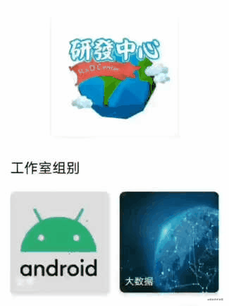
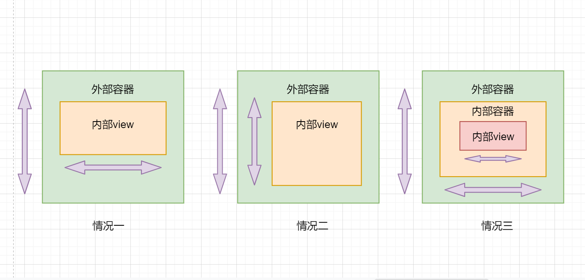
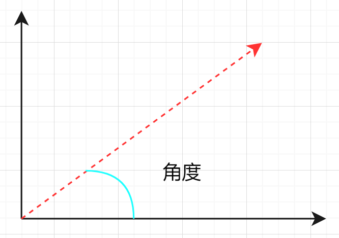
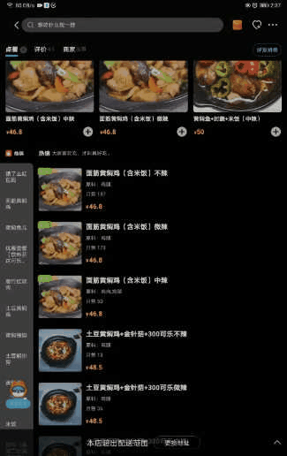
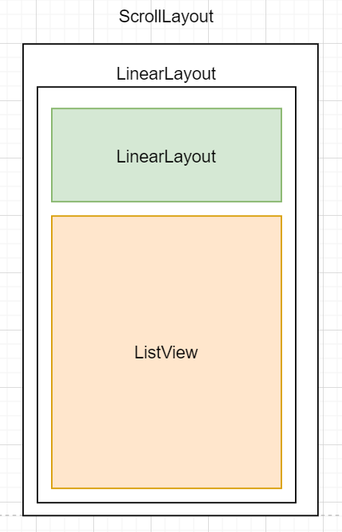

## Android 事件分发机制：学了事件分发有什么用？

Android 中的 view 一般由两个重要部分组成：绘制和触摸反馈。如何精准的针对用户的操作给出正确的反馈，是我们学习事件分发的最终目标。

运用事件分发一般由两个场景：给 view 设置监听器和自定义 view。接下来就针对这两方面展开分析。

## 监听器

触摸事件监听器可以说是我们接触 Android 事件体系的第一步。监听器通常有：

- onClickListener: 单击事件监听器
- onLongClickListener: 长按事件监听器
- onTouchListener: 触摸事件监听器

这些是我们使用的最频繁的监听器，他们之间的关系是：

```java
if (mOnTouchListener!=null && mTouchListener.onTouch(event)){
    return true;
}else{
    if (单击事件){
        mOnClickListener.onClick(view);
    }else if(长按事件){
        mOnLongClickListener.onLongClick(view);
    }
}
```

上面的伪代码可以很明显的发现：**onTouchListener 是直接把 MotionEvent 对象直接接管给自己处理且会优先调用，而其他的两个监听器是 view 判断点击类型之后再分别调用**

除此之外，另一个很常见的监听器是双击监听器，但这种监听器并不是 view 默认支持的，需要我们自己去实现。双击监听器的实现思路可以参考view 实现长按监听器的思路来实现：

> 当我们接收到点击事件时，可以发送一个单击延时任务。如果在延时事件到还没有收到另一个单击事件，那么这就是一个单击事件；如果在延时事件内收到另外一个点击事件，说明这是一个双击事件，并取消延时任务。

我们可以实现 `view.onClickListener` 接口来完成以上逻辑，核心代码如下：

```kotlin
// 实现onClickListener接口
class MyClickListener() : View.OnClickListener{
    private var isClicking = false
    private var singleClickListener : View.OnClickListener? = null
    private var doubleClickListener : View.OnClickListener? = null
    private var delayTime = 1000L
    private var clickCallBack : Runnable? = null
    private var handler : Handler = Handler(Looper.getMainLooper())

    override fun onClick(v: View?) {
        // 创建一个单击延迟任务，延迟时间到了之后触发单击事件
        clickCallBack = clickCallBack?: Runnable {
            singleClickListener?.onClick(v)
            isClicking = false
        }
		// 如果已经点击过一次，在延迟时间内再次接受到点击
        // 意味着这是个双击事件
        if (isClicking){
            // 移除延迟任务，回调双击监听器
            handler.removeCallbacks(clickCallBack!!)
            doubleClickListener?.onClick(v)
            isClicking = false
        }else{
            // 第一次点击，发送延迟任务
            isClicking = true
            handler.postDelayed(clickCallBack!!,delayTime)
        }
    }
...
}
```

代码中实现了创建了一个 view.onclickListener 接口实现类，并在类型实现单击和双击的逻辑判断。我们可以如下使用这个类：

```java
val c = MyClickListener()
// 设置单击监听事件
c.setSingleClickListener(View.OnClickListener {
    Log.d(TAG, "button: 单击事件")
})
// 设置双击监听事件
c.setDoubleClickListener(View.OnClickListener {
    Log.d(TAG, "button: 双击事件")
})
// 把监听器设置给按钮
button.setOnClickListener(c)
```

这样就实现了按钮的双击监听了。

其他类型的监听器如：三击、双击长按等等，都可以通过基于这种思路来实现监听器接口。

## 自定义 view

在自定义 view 中，我们可以更加灵活的运用事件分发来解决实际的需求。举几个例子：

滑动嵌套问题：

外层是viewpager,里层是 recyclerView,要实现左右滑动切换viewpager，上下滑动 recyclerView。这也就是著名的滑动冲突问题。类似的还有外层 viewPager，里层也是可以左右滑动的 recyclerView。实时触摸反馈问题：如设计一个按钮，要让他按下的时候缩小降低高度，放开的时候恢复到原来的大小和高度，而且如果在一个可滑动的容器中，按下之后滑动不会触发点击事件而是把事件交给外层可滑动容器。

我们可以发现，基本上都是基于实际的开发需求来灵活运用事件分发。具体到代码实现，都是围绕三个关键方法展开：`dispatchTouchEvent`、`onIntercepterTouchEvent`、`onTouchEvent`。这三个方法在 view 和 viewGroup 中已经有了默认的实现，而我们需要基于默认实现来完成我们的需求。下面是几种常见的需求场景：

**实现方块按下缩小**

我们先来看下具体的实现效果：



方块按下之后，会缩小高度变低透明度增加，释放又恢复

这个需求可以通过结合属性动画来实现。按钮块本身又高度、有圆角。我们可以考虑继承 cardView 来实现，重写 cardView 的 dispatchTouchEvent 方法，在按下的时候，也就是接收到 down 事件的时候缩小，在接收到 up 和 cancel 事件的时候恢复。**注意，这里可能会忽视 cancel 事件，导致按钮块的状态无法恢复，一定要加以考虑 cancel 事件**。然后来看下代码实现：

```java
public class NewCardView extends CardView {

    //点击事件到来的时候进行判断处理
    @Override
    public boolean dispatchTouchEvent(MotionEvent ev) {
        // 获取事件类型
        int actionMarked = ev.getActionMasked();
        // 根据时间类型判断调用哪个方法来展示动画
        switch (actionMarked){
            case MotionEvent.ACTION_DOWN :{
                clickEvent();
                break;
            }
            case MotionEvent.ACTION_CANCEL:
            case MotionEvent.ACTION_UP:
                upEvent();
                break;
            default: break;
        }
        // 最后回调默认的事件分发方法即可
        return super.dispatchTouchEvent(ev);
    }

    //手指按下的时候触发的事件;大小高度变小，透明度减少
    private void clickEvent(){
        setCardElevation(4);
        AnimatorSet set = new AnimatorSet();
        set.playTogether(
                ObjectAnimator.ofFloat(this,"scaleX",1,0.97f),
                ObjectAnimator.ofFloat(this,"scaleY",1,0.97f),
                ObjectAnimator.ofFloat(this,"alpha",1,0.9f)
        );
        set.setDuration(100).start();
    }

    //手指抬起的时候触发的事件；大小高度恢复，透明度恢复
    private void upEvent(){
        setCardElevation(getCardElevation());
        AnimatorSet set = new AnimatorSet();
        set.playTogether(
                ObjectAnimator.ofFloat(this,"scaleX",0.97f,1),
                ObjectAnimator.ofFloat(this,"scaleY",0.97f,1),
                ObjectAnimator.ofFloat(this,"alpha",0.9f,1)
        );
        set.setDuration(100).start();
    }
}
```

可以看到我们只是给 cardView 设置了动画效果，监听事件我们可以设置给 cardView 内部的 ImageView 或者直接设置给 CardView。需要注意的是，如果设置给cardView 需要重写 cardView 的 `interceptTOuchEvent` 方法永远返回 true，防止事件被 子 view 消费而无法触发监听事件。

**解决滑动冲突**

滑动冲突是事件分发运用最频繁的场景，也是一个重难点。滑动冲突的基本场景有以下三种：



- 情况一：内外 view 的滑动方向不同，例如 view Pager 嵌套 ListView
- 情况二：内外 view 的滑动方向相同，例如 viewPager 嵌套水平滑动的 recyclerView
- 情况三：情况一和情况二的组合

解决这种问题一般有两个步骤：确定最终实现效果、代码实现。

滑动冲突的解决需要结合具体的实现需求，而不是一套解决方案可以解决一切的滑动冲突问题，这不现实。因此在解决这类问题时，需要先确定好最终的实现效果，然后再根据这个效果去思考代码实现。这里主要讨论情况一和情况二。

**情况一**

情况一是内外滑动方向不一致。这种情况通常的解决方案是：根据手指滑动直线与水平线的角度来判断是左右滑动还是上下滑动：



如果这个角度小于45 度，可以认为是在左右滑动，如果大于 45 度，则认为是上下滑动。那么现在确定好解决方法，接下来就思考如何实现代码。

滑动角度可以通过两个连续的 MotionEvent 对象的坐标计算出来，之后我们再根据角度的情况选择把事件交给外部容器还是内部 view。这里根据事件处理的位置可分为 **内部拦截法和外部拦截法**。

- 外部拦截法：在viewGroup 中判断滑动的角度，如果符合自身滑动方向消费则拦截事件
- 内部拦截法：在内部 view 中判断滑动的角度，如果是符合自身滑动方向则继续消费事件，否则请求外部 viewGroup 拦截事件处理

从实现的复杂度来看，外部拦截法会更加优秀，不需要里外 view 去配合，只需要 viewGroup 自身做好事件拦截处理即可。两者的区别就在于主动权在谁的手上。如果 view 需要做更多的判断可以采用内部拦截法，而一般情况下才用外部拦截法会更加简单。

接下来思考一下这两种方法的代码实现。

------

外部拦截法中，重点在于是否拦截事件，那么我们的重心就放在了 `onInterceptTouchEvent` 方法中。在这个方法中计算滑动角度并判断是否要进行拦截。这里以 ScrollView 为例子（外部是垂直滑动，内部是水平滑动），代码如下：

```java
public class MyScrollView extends ScrollView {
    // 记录上一次事件的坐标
    float lastX = 0;
    float lastY = 0;

    @Override
    public boolean onInterceptTouchEvent(MotionEvent ev) {
        int actionMasked = ev.getActionMasked();
        // 不能拦截down事件，否则子view永远无法获取到事件
        // 不能拦截up事件，否则子view的点击事件无法被触发
        if (actionMasked == MotionEvent.ACTION_DOWN || actionMasked == MotionEvent.ACTION_UP){
            lastX = ev.getX();
            lastY = ev.getY();
            return false;
        }   

        // 获取斜率并判断
        float x = ev.getX();
        float y = ev.getY();
        return Math.abs(lastX - x) < Math.abs(lastY - y);
    }
}
```

代码的实现思路很简单，记录两次触控点的位置，然后计算出斜率来判断是垂直滑动还是水平滑动。代码中有两个需要注意的点：viewGroup 不能拦截 up 事件 和 down 事件。如果拦截了 down 事件那么子 view 将永远接收不到事件信息；如果拦截了 up 事件那么子 view 将永远无法触发点击事件。

------

内部拦截法的思路和外部拦截的思路很像，只是判断的位置放到了内部 view 中。内部拦截法意味着内部 view 必须要有控制事件流走向的能力，才能对事件进行处理。这里就运用到了内部 view 一个重要的方法：`requestDisallowInterceptTouchEvent`。

这个方法可以强制外层 viewGroup 不拦截事件。因此，我们可以让 viewGroup 默认拦截除了 down 事件以外的所有事件。当子 view 需要处理事件时，只需要调用此方法即可获得事件；而当想要把事件交给 viewGroup 处理时，那么只需要取消这个标志，外层 viewGroup 就会拦截所有事件。从而达到内部 view 控制事件流走向的目的。

代码实现需要分两步走，首先是设置外部 viewGroup 拦截除了 down 事件以外的所有事件（这里用 viewPager 和 ListView 来进行代码展示）：

```java
public class MyViewPager extends ViewPager {
    public boolean onInterceptTouchEvent(MotionEvent ev) {
        if (ev.getActionMasked()==MotionEvent.ACTION_DOWN){
            return false;
        }
        return true;
    }
}
```

接下来需要重写内部 view 的 dispatchTouchEvent 方法：

```java
public class MyListView extends ListView {
    float lastX = 0;
    float lastY = 0;

    @Override
    public boolean dispatchTouchEvent(MotionEvent ev) {
        int actionMarked = ev.getActionMasked();
        switch (actionMarked){
            // down事件，必须请求不拦截，否则拿不到move事件无法进行判断
            case MotionEvent.ACTION_DOWN:{
                requestDisallowInterceptTouchEvent(true);
                break;
            }
            // move事件，进行判断是否处理事件
            case MotionEvent.ACTION_MOVE:{
                float x = ev.getX();
                float y = ev.getY();
                // 如果滑动角度大于90度自己处理事件
                if (Math.abs(lastY-y)<Math.abs(lastX-x)){
                    requestDisallowInterceptTouchEvent(false);
                }
                break;
            }
            default:break;
        }
        // 保存本次触控点的坐标
        lastX = ev.getX();
        lastY = ev.getY();
        // 调用ListView的dispatchTouchEvent方法来处理事件
        return super.dispatchTouchEvent(ev);
    }
}
```

**情况二**

第二种情况是里外容器的滑动方向是一致的，这种情况的主流解决方法有两种，一种是外容器先滑动，外容器滑动到边界之后再滑动内部 view，例如京东 app（注意向下滑动时的情况）：


第二种情况的内部 view 先滑动，等内部 view 滑动到边界之后再滑动外部 viewGroup，例如 饿了么 app(注意向下滑动时的情况)：



这两种方案没有孰好孰坏，而是需要根据具体的业务需求来确定具体的解决方案。下面就上述的第二种方案展开分析，第一种方案雷同。

首先分析一下具体的效果：外层 viewGroup 与内层 view 的滑动方向是一致的，都是垂直滑动或者水平滑动；向上滑动时，先滑动 viewGroup 到顶部，再滑动内部 view；向下滑动时，先滑动内部 view 到顶部后再滑动外层 viewGroup。

这里我们采用外部拦截法来实现。首先我们先确定好我们的布局：



最外层时一个 ScrollView，内部首先是一个 LinearLayout，因为 ScrollView 只能有一个 view。内部顶部是一个 LinearLayout可以放置顶部布局，下面是一个 ListView。现在需要确定 ScrollView 的拦截规则：

1、当 ScrollView 没有滑动到底部时，直接给 ScrollView 处理

2、当 ScrollView 滑动到底部时：

- 如果 LinearLayout 没有滑动到顶部，则交给 ListView处理
- 如果 Linearlayout 滑动到顶部：
  - 如果是向上滑动，则交给 listView 处理
  - 如果是向下滑动，则交给 ScrollView 处理

接下来就可以确定我们的代码了：

```java
public class MyScrollView extends ScrollView {
	...
    float lastY = 0;
    boolean isScrollToBottom = false;
    @Override
    public boolean onInterceptTouchEvent(MotionEvent ev) {
        boolean intercept = false;
        int actionMarked = ev.getActionMasked();
        switch (actionMarked){
            case MotionEvent.ACTION_DOWN:
            case MotionEvent.ACTION_UP:
            case MotionEvent.ACTION_CANCEL:{
                // 这三种事件默认不拦截，必须给子view处理
                break;
            }
            case MotionEvent.ACTION_MOVE:{
                LinearLayout layout = (LinearLayout) getChildAt(0);
                ListView listView = (ListView)layout.getChildAt(1);
                // 如果没有滑动到底部，由ScrollView处理，进行拦截
                if (!isScrollToBottom){
                    intercept = true;
                    // 如果滑动到底部且listView还没滑动到顶部，不拦截
                }else if (!ifTop(listView)){
                    intercept = false;
                }else{
                    // 否则判断是否是向下滑
                    intercept = ev.getY() > lastY;
                }
                break;
            }
            default:break;
        }
        // 最后记录位置信息
        lastY = ev.getY();
        // 调用父类的拦截方法，ScrollView需要做一些处理，不然可能会造成无法滑动
        super.onInterceptTouchEvent(ev);
        return intercept;
    }
    ...
}
```

代码中我还增加了如果了 listView 下面还有 view 的情况，判断是否滑动到底部。判断 listView 滑动情况和 scrollView 滑动情况的代码如下：

```java
{
    if (Build.VERSION.SDK_INT >= Build.VERSION_CODES.M) {
        // 设置滑动监听
        setOnScrollChangeListener((v, scrollX, scrollY, oldScrollX, oldScrollY) -> {
            ViewGroup viewGroup = (ViewGroup)v;
            isScrollToBottom = v.getHeight() + scrollY >= viewGroup.getChildAt(0).getHeight();
        });
    }
}
// 判断listView是否到达顶部
private boolean ifTop(ListView listView){
    if (listView.getFirstVisiblePosition()==0){
        View view = listView.getChildAt(0);
        return view != null && view.getTop() >= 0;
    }
    return false;
}
```


