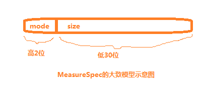

## Android 自定义 view篇（1）View 绘制流程

### 一、View 绘制的三个流程

我们知道，在自定义 view 的时候一般需要重写父类的 onMeasure()、onLayout()、onDraw()三个方法，来完成视图的展示过程。当然，这三个暴露给开发者重写的方法只不过是整个绘制流程的冰山一角，更多复杂的幕后工作，都让系统给代劳了。一个完整的绘制流程包括 measure、Layout、draw 三个步骤，其中：

- measure：测量。系统会先根据 xml 布局文件和代码中对控件属性的设置，来获取或者计算出每个 view 和 viewGroup 的尺寸，并将这些尺寸保存下来
- Layout：布局。根据测量出来的结果以及对应的参数，来确定每一个控件应该显示的位置
- draw：绘制。确定好位置之后，将将这些控件绘制到屏幕上。

### 二、Android 视图层次结构简介

在介绍 view 绘制流程之前，先简单介绍一下  Android 视图层次结构以及 DecorView，因为 view 的绘制流程的入口和 DecorView 有着密切的联系。


咱们平时看到的视图，其实存在如上的嵌套关系。上图是针对比较老的 Android 系统版本中制作的，新的版本中会略有出入，还有一个状态栏，但整体上没有变。我们平时在 Activity 中 setContentView(...)中对应的 Layout 内容，对应的是上图中 ViewGroup 的树状结构，实际上添加到系统中时，会再裹上一层FrameLayout，就是上图中最里面的浅蓝色部分了。

这里通过一个实例来继续查看。Android Studio 工具中提供了一个布局查看器工具，通过 Tools> Android>Layout.Inspector 可以查看具体某个 Activity 的布局情况。下图中，左边的树状结构对应了右边的视图，可见 DecorView 是整个界面的根视图，对应右边的红色框，是整个屏幕的大小。黄色边框为状态栏部分；那个绿色边框中有两个部分，一个是白框中的 Actionbar,对应了上图中紫色部分的 TitileActionBar 部分，即标题栏，平时咱们可以在 Activity 中将其隐藏掉；另一个是蓝色部分，对应上图中最里面的蓝色部分，即 ContentView 部分。下图中左边有两个蓝色框，上图那个有个”contain_layout"，这个就是 Activity 中 setContentView 设置的 Layout.xml 布局文件中的最外层布局，咱们能通过Layout 布局文件直接完全操控的也是这一块，当其被 add 到视图系统中时，会被系统裹上 ContentFrameLayout（显然是FrameLayout的子类），这也是为什么添加 Layout.xml 视图的方法叫做 setContentView() 而不是叫做 setView 的原因。


三、故事开始的地方

如果对 Activity 的启动流程有一定的了解的话，应该知道这个启动过程会在 ActivityThread.java 类中完成，在启动 Activity 的过程中，会调用到 handleResumeActivity(...)方法，关于视图的绘制过程最初就是从这个方法开始的。

1、View绘制起源 UML 时序图

整个调用链如下图所示，直到 ViewRootImpl 类中的 performTraversals() 中，才开始正式绘制流程了，所以一般都是以该方法作为正式绘制的源头。


2、handleResumeActivity 方法

在这咱们先大致看看 ActivityThread 类中的 handleResumeActivity 方法，咱们这里只贴出关键代码：

```java
//===========ActivityThread.java==========
final void handleResumeActivity(...) {
    ......
    //跟踪代码后发现其初始赋值为mWindow = new PhoneWindow(this, window, activityConfigCallback);
    r.window = r.activity.getWindow();
       //从PhoneWindow实例中获取DecorView
    View decor = r.window.getDecorView();
    ......
    //跟踪代码后发现，vm值为上述PhoneWindow实例中获取的WindowManager。
    ViewManager wm = a.getWindowManager();
    ......
    //当前window的属性，从代码跟踪来看是PhoneWindow窗口的属性
    WindowManager.LayoutParams l = r.window.getAttributes();
    ......
    wm.addView(decor, l);
    ......
}
```

上面代码第8行，ViewManager是一个接口，addView 是其中定义的一个空方法，WindowManager 是其子类，WIndowManagerImpl 是 WindowManager 的实现类。第4行代码中的 r.window 的值可以根据 Activity.java 的如下代码得知，其值为 PhoneWindow 实例。

```java
//===============Activity.java=============
private Window mWindow;
public Window getWindow() {
   return mWindow;
}

final void attach(...){
   ......
   mWindow = new PhoneWindow(this, window, activityConfigCallback);
   ......
}
```

3、两个重要参数分析

之所以要在这里特意分析 handleResumeActivity() 方法，除了它是整个绘制流程的最初源头外，还有就是 addView 的两个参数比较重要，它们是经过一层一层传递后进入到 ViewRootImpl 中，在后面分析绘制中要用到。这里看下这两个参数的相关信息：

1）参数 decor

```java
//==========PhoneWindow.java===========
// This is the top-level view of the window, containing the window decor.
private DecorView mDecor;
......
public PhoneWindow(...){
   ......
   mDecor = (DecorView) preservedWindow.getDecorView();
   ......
}

@Override
public final View getDecorView() {
   ......
   return mDecor;
}
```

可见 decor 参数表示的是 DecorView 实例。注释中也有说明：这是 window 的顶级视图，包含了 window 的 decor。

2）参数l

```java
//===================Window.java===================
//The current window attributes.
    private final WindowManager.LayoutParams mWindowAttributes =
        new WindowManager.LayoutParams();
......
public final WindowManager.LayoutParams getAttributes() {
        return mWindowAttributes;
    }
......


//==========WindowManager.java的内部类LayoutParams extends ViewGroup.LayoutParams=============
public LayoutParams() {
            super(LayoutParams.MATCH_PARENT, LayoutParams.MATCH_PARENT);
            ......
        }


//==============ViewGroup.java内部类LayoutParams====================
public LayoutParams(int width, int height) {
            this.width = width;
            this.height = height;
        }
```

该参数表示 l 的是 PhoneWindow 的 LayoutParams 属性，其 width 和 height 值均为 LayoutParams.MATH_PARENT。

在源码中，WindowPhone 和 DecorView 通过组合方式联系在一起的，而 DecorView 是整个 view 体系的 根view。在前面 handleResumeActivity 方法代码片段中，当 Activity 启动后，就通过第 14 行的 addView 方法，来间接调用 ViewRootImpl 类的 performTraversals,从而实现视图的绘制。

### 四、主角登场

无疑，performTraversals 方法是整个过程的主教，它把控着整个绘制的流程。该方法的源码有大约800行。这里贴出来关键的代码，如下所示：

```java
// =====================ViewRootImpl.java=================
private void performTraversals() {
   ......
   int childWidthMeasureSpec = getRootMeasureSpec(mWidth, lp.width);
   int childHeightMeasureSpec = getRootMeasureSpec(mHeight, lp.height);
   ......
   // Ask host how big it wants to be
   performMeasure(childWidthMeasureSpec, childHeightMeasureSpec);
   ......
   performLayout(lp, mWidth, mHeight);
   ......
   performDraw();
}
```

上述代码中就是一个完整的绘制流程，对应上了第一节中提到的三个步骤：

1）performMesaure:从根节点向下遍历 view 树，完成所有 ViewGroup 和 view 的测量工作，计算出所有 viewGroup 和 view 显示出来需要的高度和宽度;

2）performLayout:从根节点向下遍历 view 树，完成所有 ViewGroup 和  view 的布局计算工作，根据测量出来的宽高以及自身属性，计算出来所有的 ViewGroup 和 view 显示在屏幕上的区域。

3）performDraw：从根节点向下遍历 view 树，完成所有 viewGroup 和 view 的绘制工作，根据布局过程计算出来的显示区域，将所有 view 的当前需要显示的内容画到屏幕上。

### 五、measure过程分析

这三个绘制流程中，measure是最复杂的。本节会先介绍整个流程中很重要的两个类 MesaureSpec 和 ViewGroup.LayoutParams 类，然后介绍 ViewRootImpl、View 以及 ViewGroup 中测量流程设计到的重要方法，最后简单梳理 DecorView 测量的整个流程并链接一个测量实例分析整个测量过程。

1、MeasureSpec 简介

直接上源码，通过注释和源码来进行认识。

```java
/**
     * A MeasureSpec encapsulates the layout requirements passed from parent to child.
     * Each MeasureSpec represents a requirement for either the width or the height.
     * A MeasureSpec is comprised of a size and a mode. There are three possible
     * modes:
     * <dl>
     * <dt>UNSPECIFIED</dt>
     * <dd>
     * The parent has not imposed any constraint on the child. It can be whatever size
     * it wants.
     * </dd>
     *
     * <dt>EXACTLY</dt>
     * <dd>
     * The parent has determined an exact size for the child. The child is going to be
     * given those bounds regardless of how big it wants to be.
     * </dd>
     *
     * <dt>AT_MOST</dt>
     * <dd>
     * The child can be as large as it wants up to the specified size.
     * </dd>
     * </dl>
     *
     * MeasureSpecs are implemented as ints to reduce object allocation. This class
     * is provided to pack and unpack the <size, mode> tuple into the int.
     */
    public static class MeasureSpec {
        private static final int MODE_SHIFT = 30;
        private static final int MODE_MASK  = 0x3 << MODE_SHIFT;
        ......
        /**
         * Measure specification mode: The parent has not imposed any constraint
         * on the child. It can be whatever size it wants.
         */
        public static final int UNSPECIFIED = 0 << MODE_SHIFT;

        /**
         * Measure specification mode: The parent has determined an exact size
         * for the child. The child is going to be given those bounds regardless
         * of how big it wants to be.
         */
        public static final int EXACTLY     = 1 << MODE_SHIFT;

        /**
         * Measure specification mode: The child can be as large as it wants up
         * to the specified size.
         */
        public static final int AT_MOST     = 2 << MODE_SHIFT;
        ......
       /**
         * Creates a measure specification based on the supplied size and mode.
         *......
         *@return the measure specification based on size and mode
         */
        public static int makeMeasureSpec(@IntRange(from = 0, to = (1 << MeasureSpec.MODE_SHIFT) - 1) int size,
                                          @MeasureSpecMode int mode) {
            if (sUseBrokenMakeMeasureSpec) {
                return size + mode;
            } else {
                return (size & ~MODE_MASK) | (mode & MODE_MASK);
            }
            ......

        }
        ......
        /**
         * Extracts the mode from the supplied measure specification.
         *......
         */
        @MeasureSpecMode
        public static int getMode(int measureSpec) {
            //noinspection ResourceType
            return (measureSpec & MODE_MASK);
        }

        /**
         * Extracts the size from the supplied measure specification.
         *......
         * @return the size in pixels defined in the supplied measure specification
         */
        public static int getSize(int measureSpec) {
            return (measureSpec & ~MODE_MASK);
        }
        ......
}
```

从这段代码中，咱们可以得到如下的信息：

1）MesaureSpec 概括了从父布局传递给子 view 布局要求。每一个 MeasureSpec 代表了宽度或者高度要求，它由 size 和 mode组成。

2）有三种可能的 mode：UNSPECIFIED、EXACTLY、AT_MOST

3）UNSPECIFIED：未指定尺寸模式。父布局没有对子view强加任何限制。它可以是任意想要的尺寸。（笔者注：这个在工作中极少碰到，据说一般在系统中才会用到，后续会讲得很少）

4）EXACTLY：精确值模式。父布局决定了子view的准确尺寸。子view无论想设置多大的值，都将限定在那个边界内。（笔者注：也就是layout_width属性和layout_height属性为具体的数值，如50dp，或者设置为match_parent，设置为match_parent时也就明确为和父布局有同样的尺寸，所以这里不要以为笔者搞错了。当明确为精确的尺寸后，其也就被给定了一个精确的边界）

5）AT_MOST：最大值模式。子view可以一直大到指定的值。（笔者注：也就是其宽高属性设置为wrap_content，那么它的最大值也不会超过父布局给定的值，所以称为最大值模式）

6）MeasureSpec 被实现为 int 型来减少对象分配。该类用于将 size 和 mode 元组装包和拆包到 int 中

7）分析代码可知，一个 MesaureSpec 的模式如下所示，int 长度为 32 位置，高2位表示 mode，后30位表示 size



8)UNSPECIFIED、EXACTLY、AT_MOST这三个mode的示意图如下所示：


9）makeMeasureSpec（int mode，int size）用于将mode和size打包成一个int型的MeasureSpec。

10）getSize(int measureSpec)方法用于从指定的measureSpec值中获取其size。

11）getMode(int measureSpec)方法用户从指定的measureSpec值中获取其mode。

2、ViewGroup.layoutParams 简介

该类的源码以及注释分析如下所示：

```java
//============================ViewGroup.java===============================
/**
     * LayoutParams are used by views to tell their parents how they want to be
     * laid out.
     *......
     * <p>
     * The base LayoutParams class just describes how big the view wants to be
     * for both width and height. For each dimension, it can specify one of:
     * <ul>
     * <li>FILL_PARENT (renamed MATCH_PARENT in API Level 8 and higher), which
     * means that the view wants to be as big as its parent (minus padding)
     * <li> WRAP_CONTENT, which means that the view wants to be just big enough
     * to enclose its content (plus padding)
     * <li> an exact number
     * </ul>
     * There are subclasses of LayoutParams for different subclasses of
     * ViewGroup. For example, AbsoluteLayout has its own subclass of
     * LayoutParams which adds an X and Y value.</p>
     * ......
     * @attr ref android.R.styleable#ViewGroup_Layout_layout_height
     * @attr ref android.R.styleable#ViewGroup_Layout_layout_width
     */
    public static class LayoutParams {
        ......

        /**
         * Special value for the height or width requested by a View.
         * MATCH_PARENT means that the view wants to be as big as its parent,
         * minus the parent's padding, if any. Introduced in API Level 8.
         */
        public static final int MATCH_PARENT = -1;

        /**
         * Special value for the height or width requested by a View.
         * WRAP_CONTENT means that the view wants to be just large enough to fit
         * its own internal content, taking its own padding into account.
         */
        public static final int WRAP_CONTENT = -2;

        /**
         * Information about how wide the view wants to be. Can be one of the
         * constants FILL_PARENT (replaced by MATCH_PARENT
         * in API Level 8) or WRAP_CONTENT, or an exact size.
         */
        public int width;

        /**
         * Information about how tall the view wants to be. Can be one of the
         * constants FILL_PARENT (replaced by MATCH_PARENT
         * in API Level 8) or WRAP_CONTENT, or an exact size.
         */
        public int height;
        ......
}
```

对其中的一些重要信息进行一些翻译和整理：

1）LayoutParms 被 view 用于告诉他们的父布局他们想要怎么被布局。

2）该 LayoutParams 基类仅仅描述了 view 希望宽高有多大。对于每一个宽或者高，可以指定为一下三种值中的一个：MATCH_PARENT,WRAP_CONTENT,an exact number

3）MATCH_PARENT：意味着该view希望和父布局尺寸一样大，如果父布局有padding，则要减去该padding值。4）WRAP_CONTENT：意味着该view希望其大小为仅仅足够包裹住其内容即可，如果自己有padding，则要加上该padding值。

5）对ViewGroup不同的子类，也有相应的LayoutParams子类。 

6）其width和height属性对应着layout_width和layout_height属性。

3、View 测量的基本流程以及重要方法分析

View 体系的测量是从 DecorView  这个根 View 开始遍历的，而这个 View 体系树中包含了众多的叶子view 和 viewGroup 的子类容器。这一节会从 ViewRootImpl.performMeasure 开始，分析测量的基本流程。

1） ViewRootImpl.performMesaure() 方法

跟踪源码，进入到 performMesaure 方法分析，这里仅贴出关键流程代码。

```java
    private void performMeasure(int childWidthMeasureSpec, int childHeightMeasureSpec) {
        if (mView == null) {
            return;
        }
        Trace.traceBegin(Trace.TRACE_TAG_VIEW, "measure");
        try {
            mView.measure(childWidthMeasureSpec, childHeightMeasureSpec);
        } finally {
            Trace.traceEnd(Trace.TRACE_TAG_VIEW);
        }
    }
```

这个 mView 是谁呢？跟踪代码可以找到给他赋值的地方：

```java
//========================ViewRootImpl.java======================
public void setView(View view, WindowManager.LayoutParams attrs, View panelParentView) {
      ......
      mView = view;
      ......

      mWindowAttributes.copyFrom(attrs);
      ......
}
```

看到这里，是不是有些似曾相似呢？在第二节的绘制流程中提到过，这里 setView 的参数 view 和 attrs 是 ActivityThread 类中的 addView 方法传递过来的，所以咱们这里可以确定 mView 指的是 decorView 了。上述performMeasure中，其实就是 DecorView 在执行 measure操作，DecorView extends FrameLayout extends ViewGroup extends View，通过这个继承链可以看到，DecorView 是一个容器，但 ViewGroup 也是 view 的子类，View 是所有空间的基类，所以这里 View 类型的 mView 指代 DecorView 是没毛病的。

2）View.measure 方法。

尽管 mView 就是 DecorView,但是由于 measure 方法是 final 型的，View 子类都不能重写该方法，所以这里追踪 measure 的时候就直接进入到 view  类中了，这里贴出关键流程代码：

```java
//===========================View.java===============================
/**
     * <p>
     * This is called to find out how big a view should be. The parent
     * supplies constraint information in the width and height parameters.
     * </p>
     *
     * <p>
     * The actual measurement work of a view is performed in
     * {@link #onMeasure(int, int)}, called by this method. Therefore, only
     * {@link #onMeasure(int, int)} can and must be overridden by subclasses.
     * </p>
     *
     *
     * @param widthMeasureSpec Horizontal space requirements as imposed by the
     *        parent
     * @param heightMeasureSpec Vertical space requirements as imposed by the
     *        parent
     *
     * @see #onMeasure(int, int)
     */
public final void measure(int widthMeasureSpec, int heightMeasureSpec) {
      ......
      // measure ourselves, this should set the measured dimension flag back
      onMeasure(widthMeasureSpec, heightMeasureSpec);
      ......
}
```

这里注释提供了很多的信息，这里简单翻译一下：

1）该方法被调用，用于找出 view 应该多大。父布局在 width 和 height 参数中提供了限制信息。

2）一个 view  的实际测量工作是在本方法所调用的 onMeasure(int int)方法中实现的。所以，只有 onMeasure 可以并且被子类重写（这里应该是 ViewGroup 的子类必须重写该方法，才可以绘制该容器内的 子 view。如果是自定义一个子控件，extends view，那么并不是必须重写该方法。

3）参数 widthMeasureSpec：父布局加入的水平空间要求。参数 heightMeasureSpec：父布局加入的垂直空间要求。

系统将其定义为一个 final 方法，可见系统不希望整个测量流程框架被修改。

3）View.onMeasure 方法

在上述方法体内看到 onMeasure 方法时，是否有一丝丝的慰藉呢？终于看到咱们最熟悉的身影了，编写自定义 view  的时候，基本上都会重写的方法！咱们看看其源码：

```java
//===========================View.java===============================
/**
     * <p>
     * Measure the view and its content to determine the measured width and the
     * measured height. This method is invoked by {@link #measure(int, int)} and
     * should be overridden by subclasses to provide accurate and efficient
     * measurement of their contents.
     * </p>
     *
     * <p>
     * <strong>CONTRACT:</strong> When overriding this method, you
     * <em>must</em> call {@link #setMeasuredDimension(int, int)} to store the
     * measured width and height of this view. Failure to do so will trigger an
     * <code>IllegalStateException</code>, thrown by
     * {@link #measure(int, int)}. Calling the superclass'
     * {@link #onMeasure(int, int)} is a valid use.
     * </p>
     *
     * <p>
     * The base class implementation of measure defaults to the background size,
     * unless a larger size is allowed by the MeasureSpec. Subclasses should
     * override {@link #onMeasure(int, int)} to provide better measurements of
     * their content.
     * </p>
     *
     * <p>
     * If this method is overridden, it is the subclass's responsibility to make
     * sure the measured height and width are at least the view's minimum height
     * and width ({@link #getSuggestedMinimumHeight()} and
     * {@link #getSuggestedMinimumWidth()}).
     * </p>
     *
     * @param widthMeasureSpec horizontal space requirements as imposed by the parent.
     *                         The requirements are encoded with
     *                         {@link android.view.View.MeasureSpec}.
     * @param heightMeasureSpec vertical space requirements as imposed by the parent.
     *                         The requirements are encoded with
     *                         {@link android.view.View.MeasureSpec}.
     *
     * @see #getMeasuredWidth()
     * @see #getMeasuredHeight()
     * @see #setMeasuredDimension(int, int)
     * @see #getSuggestedMinimumHeight()
     * @see #getSuggestedMinimumWidth()
     * @see android.view.View.MeasureSpec#getMode(int)
     * @see android.view.View.MeasureSpec#getSize(int)
     */
    protected void onMeasure(int widthMeasureSpec, int heightMeasureSpec) {
        setMeasuredDimension(getDefaultSize(getSuggestedMinimumWidth(), widthMeasureSpec),
                getDefaultSize(getSuggestedMinimumHeight(), heightMeasureSpec));
    }
```

函数体内也就一句话而已，注释却写了这么一大堆，可见这个方法的重要性了。这里翻译和整理一下这些注释：

1）测量该 view 以及它的内容来决定测量的宽度和高度。该方法被 measure 调用，并且应该被子类重写来提供准确且有效的对他们的内容的测量。

2）当重写这个方法时，您必须调用 setMeasureDimension(int int) 来存储该 view 测量出的宽和高。如果不这样做将会触发 IllegalStateException，由 measure(int int) 抛出，调用基类的 onMeasure 方法是一个有效的方法。

3）测量的基类实现默认为背景的尺寸，除非更大的尺寸被 MeasureSpec 所允许，子类应该重写 onMeasure 方法来提供对内容更好的测量

4）如果该方法被重写，子类负责确保测量的高和宽至少是该 view 的 minimum 高度和 minmum 宽度值。

注意：容器类控件都是 ViewGroup 的子类，如 FrameLayout、LinearLayout 等，都会重写 onMeasure 方法，根据自己的特性来进行测量；如果是叶子节点 view，即最里层的控件，如 textView等，也可能会重新 onMeasure 方法，所以当流程走到onMeasure 方法时，流程可能就会切到那些重写的 onMeasure 方法中去。最后通过从根 view 到叶子节点的遍历和递归，最终还是会在叶子view 中调用 setMeasureDimension 来实现最终的测量。

4）View.setMeasuredDimension 方法

继续看 setMeasuredDimension 方法：

```java
/**
     * <p>This method must be called by {@link #onMeasure(int, int)} to store the
     * measured width and measured height. Failing to do so will trigger an
     * exception at measurement time.</p>
     *
     * @param measuredWidth The measured width of this view.  May be a complex
     * bit mask as defined by {@link #MEASURED_SIZE_MASK} and
     * {@link #MEASURED_STATE_TOO_SMALL}.
     * @param measuredHeight The measured height of this view.  May be a complex
     * bit mask as defined by {@link #MEASURED_SIZE_MASK} and
     * {@link #MEASURED_STATE_TOO_SMALL}.
     */
    protected final void setMeasuredDimension(int measuredWidth, int measuredHeight) {
        ......
        setMeasuredDimensionRaw(measuredWidth, measuredHeight);
    }
```

这里需要重点关注一下：measuredWidth measuredHeight 分别是 view 被测量出的宽度值和高度值。

到这个时候才正式明确的提到宽度和高度，通过 getDefaultSize(getSuggestMinimumWidth,widthMeasureSpec),参数由 widthMeasureSpec 变成了 measuredWidth，即由“父布局加入的水平空间要求”转变为了 view 的高度，measureHeight 也是一样。咱们先继续追踪源码分析 width 的值：

```java
/**
     * Returns the suggested minimum width that the view should use. This
     * returns the maximum of the view's minimum width
     * and the background's minimum width
     *  ({@link android.graphics.drawable.Drawable#getMinimumWidth()}).
     * <p>
     * When being used in {@link #onMeasure(int, int)}, the caller should still
     * ensure the returned width is within the requirements of the parent.
     *
     * @return The suggested minimum width of the view.
     */
    protected int getSuggestedMinimumWidth() {
        return (mBackground == null) ? mMinWidth : max(mMinWidth, mBackground.getMinimumWidth());
    }
```

这个方法是干嘛用的呢？翻译如下：

1）返回建议该 view 应该使用的最小宽度值。该方法返回了 view 的最小宽度值和背景的最小宽度值

2）当在 onMeasure 使用时，调用者应该仍然确保返回的宽度值在父布局的要求之内。

3）返回值：view 的建议最小宽度值。

这其中提到的 “mininum width"指的是在 xml 布局文件中该 view 的”android:minWidth" 属性值，“background's minimum width" 值是指”android:background"的宽度。该方法的返回值就是两者之间较大的那一个值，用来作为该 view 的最小宽度值，现在应该很容易理解，当一个 view 在 layout 文件中同时设置了这两个属性时，为了两个条件都满足，自然要选择值大一点的那个了。

```java
/**
     * Utility to return a default size. Uses the supplied size if the
     * MeasureSpec imposed no constraints. Will get larger if allowed
     * by the MeasureSpec.
     *
     * @param size Default size for this view
     * @param measureSpec Constraints imposed by the parent
     * @return The size this view should be.
     */
    public static int getDefaultSize(int size, int measureSpec) {
        int result = size;
        int specMode = MeasureSpec.getMode(measureSpec);
        int specSize = MeasureSpec.getSize(measureSpec);

        switch (specMode) {
        case MeasureSpec.UNSPECIFIED:
            result = size;
            break;
        case MeasureSpec.AT_MOST:
        case MeasureSpec.EXACTLY:
            result = specSize;
            break;
        }
        return result;
    }
```

通过本节开头的介绍，您应该对 MeasureSpec 有了一个比较明确的认识了，再看看 getDefaultSize(size ,measureSpec) 方法。正如注释中所说，如果父布局没有施加任何限制，即 MeasureSpec 的 mode 为 UNSPECIFIED，那么返回值为参数中提供的 size 值。如果父布局施加了限制，则返回的默认尺寸为保存在参数 measureSpec 中的 specSize 值。所以到目前为止，需要绘制的宽和高就确定下来了。

既然宽度和高度已经确定下来了，继续看下之前的 setMeasuredDimension 方法，其内部最后调用了如下的方法：

```java
/**
     * ......
     * @param measuredWidth The measured width of this view.  May be a complex
     * bit mask as defined by {@link #MEASURED_SIZE_MASK} and
     * {@link #MEASURED_STATE_TOO_SMALL}.
     * @param measuredHeight The measured height of this view.  May be a complex
     * bit mask as defined by {@link #MEASURED_SIZE_MASK} and
     * {@link #MEASURED_STATE_TOO_SMALL}.
     */
    private void setMeasuredDimensionRaw(int measuredWidth, int measuredHeight) {
        mMeasuredWidth = measuredWidth;
        mMeasuredHeight = measuredHeight;
        ......
    }
```

到目前为止，View中的成员变量mMeasureWidth和mMeasureHeight就被赋值了，这也就意味着，View的测量就结束了。前面讲onMeasure()方法时介绍过，View子类（包括ViewGroup子类）通常会重写onMeasure()，当阅读FrameLayout、LinearLayout、TextView等重写的onMeasure()方法时，会发现它们最终都会调用setMeasuredDimension() 方法，从而完成测量。这里可以对应上前面介绍View.onMeasure()时，翻译注释的第2）点以及setMeasuredDimension()方法的注释说明

5)getMeasureWidth 方法

在 view 的 onMeasure 方法的注释中提到了该方法，这里顺便介绍一下。

```java
//==================View.java==============
public static final int MEASURED_SIZE_MASK = 0x00ffffff;
/**
 * ......
 * @return The raw measured width of this view.
 */
public final int getMeasuredWidth() {
   return mMeasuredWidth & MEASURED_SIZE_MASK;
}
```

获取原始的测量宽度值，一般会拿这个方法和 layout 执行后 getWIdth 方法进行比较。该方法需要在 setMeasureDimension 方法执行后才会生效，否则返回值为 0.

4、performMeasure 方法中 RootMeasureSpec 参数来源分析

前面讲过 getDefaultSize 方法时提到过，要找到其中 measureSpec 的来源。事实上，根据 view 的体系不断往下的遍历的和递归中，前面流程中传入 getDefaultSize 方法中的值是根据上次的值变动的，所以需要找到最初的参数值。看下这个参数的来源。先看传入 performMeasure 的 childWidthMeasureSpec 是怎么来的。

```java
int childWidthMeasureSpec = getRootMeasureSpec(mWidth, lp.width);
```

源码如下：

```java
/**
     * Figures out the measure spec for the root view in a window based on it's
     * layout params.
     *
     * @param windowSize
     *            The available width or height of the window
     *
     * @param rootDimension
     *            The layout params for one dimension (width or height) of the
     *            window.
     *
     * @return The measure spec to use to measure the root view.
     */
    private static int getRootMeasureSpec(int windowSize, int rootDimension) {
        int measureSpec;
        switch (rootDimension) {

        case ViewGroup.LayoutParams.MATCH_PARENT:
            // Window can't resize. Force root view to be windowSize.
            measureSpec = MeasureSpec.makeMeasureSpec(windowSize, MeasureSpec.EXACTLY);
            break;
        case ViewGroup.LayoutParams.WRAP_CONTENT:
            // Window can resize. Set max size for root view.
            measureSpec = MeasureSpec.makeMeasureSpec(windowSize, MeasureSpec.AT_MOST);
            break;
        default:
            // Window wants to be an exact size. Force root view to be that size.
            measureSpec = MeasureSpec.makeMeasureSpec(rootDimension, MeasureSpec.EXACTLY);
            break;
        }
        return measureSpec;
    }
```

翻译一下：

1）基于window的layout params，在window中为root view 找出measure spec。（笔者注：也就是找出DecorView的MeasureSpec，这里的window也就是PhoneWindow了）

2）参数windowSize：window的可用宽度和高度值。

3）参数rootDimension：window的宽/高的layout param值。

4）返回值：返回用于测量root view的MeasureSpec。    

如果不清楚LayoutParams类，可以看看本节开头的介绍。在getRootMeasureSpec(int,int)中，MeasureSpec.makeMeasureSpec方法在前面介绍MeasureSpec类的时候提到过，就是将size和mode组合成一个MeasureSpec值。这里我们可以看到ViewGroup.LayoutParam的width/height值和MeasureSpec的mode值存在如下的对应关系：


我们再继续看下 windowSize 和 rootDimension 的实际参数 mWidth 和 lp.width 的来历。

```java
//===========================ViewRootImpl.java=======================
......
final Rect mWinFrame; // frame given by window manager.
......
private void performTraversals() {
    ......
    Rect frame = mWinFrame;
    ......
    mWidth = frame.width();
    ......
}
```

从源码中对 mWinFrame 的注释来看，是由 WindowManager 提供的，该矩形正好是整个屏幕，WindowManagerService 服务计算 Activity 窗口的大小，并将 Activity 窗口的大小保存在成员变量 mWinFrame 中。对 Activity 窗口大小计算的详情。有兴趣的可以阅读一下大神罗升阳的博文【[Android窗口管理服务WindowManagerService计算Activity窗口大小的过程分析](https://blog.csdn.net/Luoshengyang/article/details/8479101)】。

```
//=================================ViewRootImpl.java================================
......
final WindowManager.LayoutParams mWindowAttributes = new WindowManager.LayoutParams();
......
public void setView(View view, WindowManager.LayoutParams attrs, View panelParentView) {
    ......
    mWindowAttributes.copyFrom(attrs);
    ......
}
private void performTraversals() {
     ......
     WindowManager.LayoutParams lp = mWindowAttributes;
     ......
}
```

attrs 是PhoneWindow 的 layoutParams 值，其 width和 height 属性值均为 MATCH_PARENT。结合 getRootMeasureSpec 方法，可以得出下面结果。


此时，就得到 DecorView 的 MeasureSpec 了，后面的递归操作就是在此基础上不断将测量要求从父布局传递到子 view。

5、ViewGroup 中辅助重写 onMeasure 的几个重要方法介绍

前面我们介绍的很多方法都是 view 类提供的，ViewGroup 中也提供了一些方法用于辅助 ViewGroup 子类容器的测量，这里重点介绍三个方法：measureChild、measureChildWithMargins 和 getChildMeasureSpec方法。

1）measureChild 和 measureChildWithMargins 方法

```java
//================ViewGroup.java===============
/**
     * Ask one of the children of this view to measure itself, taking into
     * account both the MeasureSpec requirements for this view and its padding.
     * The heavy lifting is done in getChildMeasureSpec.
     *
     * @param child The child to measure
     * @param parentWidthMeasureSpec The width requirements for this view
     * @param parentHeightMeasureSpec The height requirements for this view
     */
    protected void measureChild(View child, int parentWidthMeasureSpec,
            int parentHeightMeasureSpec) {
        final LayoutParams lp = child.getLayoutParams();

        final int childWidthMeasureSpec = getChildMeasureSpec(parentWidthMeasureSpec,
                mPaddingLeft + mPaddingRight, lp.width);
        final int childHeightMeasureSpec = getChildMeasureSpec(parentHeightMeasureSpec,
                mPaddingTop + mPaddingBottom, lp.height);

        child.measure(childWidthMeasureSpec, childHeightMeasureSpec);
    }
```

```java
//===================ViewGroup.java===================
/**
     * Ask one of the children of this view to measure itself, taking into
     * account both the MeasureSpec requirements for this view and its padding
     * and margins. The child must have MarginLayoutParams The heavy lifting is
     * done in getChildMeasureSpec.
     *
     * @param child The child to measure
     * @param parentWidthMeasureSpec The width requirements for this view
     * @param widthUsed Extra space that has been used up by the parent
     *        horizontally (possibly by other children of the parent)
     * @param parentHeightMeasureSpec The height requirements for this view
     * @param heightUsed Extra space that has been used up by the parent
     *        vertically (possibly by other children of the parent)
     */
    protected void measureChildWithMargins(View child,
            int parentWidthMeasureSpec, int widthUsed,
            int parentHeightMeasureSpec, int heightUsed) {
        final MarginLayoutParams lp = (MarginLayoutParams) child.getLayoutParams();

        final int childWidthMeasureSpec = getChildMeasureSpec(parentWidthMeasureSpec,
                mPaddingLeft + mPaddingRight + lp.leftMargin + lp.rightMargin
                        + widthUsed, lp.width);
        final int childHeightMeasureSpec = getChildMeasureSpec(parentHeightMeasureSpec,
                mPaddingTop + mPaddingBottom + lp.topMargin + lp.bottomMargin
                        + heightUsed, lp.height);

        child.measure(childWidthMeasureSpec, childHeightMeasureSpec);
    }
```

对比这两个可以发现，他们非常相似，从注释上来看，后者在前者的基础上增加了已经使用的宽高和 Margin 值，其实他们的功能都是一样的，最后都是生成子 view 的 MeasureSpec，并传递给子 View 继续测量，即最后一句代码 child.measure。一般根据容器自身的需要来选择其中一个，比如，在 FrameLayout 和 LinearLayout 中重写 的 onMeasure 方法中调用的就是后者，而 AbsoluteLayout 中就是间接的调用的前者，而 RelativeLayout 中，两者都没有调用，而是自己写了一套方法，不过该方法和后者方法仅略有差别，但是基本功能还是一样。

2）getChildMeasureSpec 方法

这个方法很重要，它用于将父布局传递进来的 MeasureSpec 和 其子 view  的 LayoutParams，整合为一个最有可能的子 view 的 MeasureSpec。

```java
//==================ViewGroup.java====================
 /**
     * Does the hard part of measureChildren: figuring out the MeasureSpec to
     * pass to a particular child. This method figures out the right MeasureSpec
     * for one dimension (height or width) of one child view.
     *
     * The goal is to combine information from our MeasureSpec with the
     * LayoutParams of the child to get the best possible results. For example,
     * if the this view knows its size (because its MeasureSpec has a mode of
     * EXACTLY), and the child has indicated in its LayoutParams that it wants
     * to be the same size as the parent, the parent should ask the child to
     * layout given an exact size.
     *
     * @param spec The requirements for this view
     * @param padding The padding of this view for the current dimension and
     *        margins, if applicable
     * @param childDimension How big the child wants to be in the current
     *        dimension
     * @return a MeasureSpec integer for the child
     */
    public static int getChildMeasureSpec(int spec, int padding, int childDimension) {
        int specMode = MeasureSpec.getMode(spec);
        int specSize = MeasureSpec.getSize(spec);

        int size = Math.max(0, specSize - padding);

        int resultSize = 0;
        int resultMode = 0;

        switch (specMode) {
        // Parent has imposed an exact size on us
        case MeasureSpec.EXACTLY:
            if (childDimension >= 0) {
                resultSize = childDimension;
                resultMode = MeasureSpec.EXACTLY;
            } else if (childDimension == LayoutParams.MATCH_PARENT) {
                // Child wants to be our size. So be it.
                resultSize = size;
                resultMode = MeasureSpec.EXACTLY;
            } else if (childDimension == LayoutParams.WRAP_CONTENT) {
                // Child wants to determine its own size. It can't be
                // bigger than us.
                resultSize = size;
                resultMode = MeasureSpec.AT_MOST;
            }
            break;

        // Parent has imposed a maximum size on us
        case MeasureSpec.AT_MOST:
            if (childDimension >= 0) {
                // Child wants a specific size... so be it
                resultSize = childDimension;
                resultMode = MeasureSpec.EXACTLY;
            } else if (childDimension == LayoutParams.MATCH_PARENT) {
                // Child wants to be our size, but our size is not fixed.
                // Constrain child to not be bigger than us.
                resultSize = size;
                resultMode = MeasureSpec.AT_MOST;
            } else if (childDimension == LayoutParams.WRAP_CONTENT) {
                // Child wants to determine its own size. It can't be
                // bigger than us.
                resultSize = size;
                resultMode = MeasureSpec.AT_MOST;
            }
            break;

        // Parent asked to see how big we want to be
        case MeasureSpec.UNSPECIFIED:
            if (childDimension >= 0) {
                // Child wants a specific size... let him have it
                resultSize = childDimension;
                resultMode = MeasureSpec.EXACTLY;
            } else if (childDimension == LayoutParams.MATCH_PARENT) {
                // Child wants to be our size... find out how big it should
                // be
                resultSize = View.sUseZeroUnspecifiedMeasureSpec ? 0 : size;
                resultMode = MeasureSpec.UNSPECIFIED;
            } else if (childDimension == LayoutParams.WRAP_CONTENT) {
                // Child wants to determine its own size.... find out how
                // big it should be
                resultSize = View.sUseZeroUnspecifiedMeasureSpec ? 0 : size;
                resultMode = MeasureSpec.UNSPECIFIED;
            }
            break;
        }
        //noinspection ResourceType
        return MeasureSpec.makeMeasureSpec(resultSize, resultMode);
    }
```

咱们依然先翻译和整理一下开头的注释：

​      1）处理measureChildren的困难部分：计算出Measure传递给指定的child。该方法计算出一个子view的宽或高的正确MeasureSpec。

​      2）其目的是组合来自我们MeasureSpec的信息和child的LayoutParams来得到最有可能的结果。比如：如果该view知道它的尺寸（因为它的MeasureSpec的mode为EXACTLY），并且它的child在它的LayoutParams中表示它想和父布局有一样大，那么父布局应该要求该child按照精确的尺寸进行布局。

​      3）参数spec：对该view的要求（笔者注：父布局对当前child的MeasureSpec要求）

​      4）参数padding：该view宽/高的padding和margins值，如果可应用的话。

​      5）参数childDimension：该child在宽/高上希望多大。

​      6）返回：返回该child的MeasureSpec整数。

​       如果明白了前文中对MeasureSpec的介绍后，这一部分的代码应该就容易理解了，specMode的三种值，LayoutParams的width和height的三种值，以及和layout_width、layout_height之间的关对应关系，在文章的开头已经介绍过了，不明白的可以再回头复习一下。specMode和specSize分别是父布局传下来的要求，size的值是父布局尺寸要求减去其padding值，最小不会小于0。代码最后就是将重新得到的mode和size组合生成一个新的MeasureSpec，传递给子View，一直递归下去，该方法也在前面讲过。本段代码重难点就是这里新mode和新size值的确定，specMode和childDimension各有3种值，所以最后会有9种组合。如果对这段代码看不明白的，可以看看笔者对这段代码的解释（width和height同理，这里以width为例）：

- 如果specMode的值为MeasureSpec.EXACTLY，即父布局对子view的尺寸要求是一个精确值，这有两种情况，父布局中layout_width属性值被设置为具体值，或者match_parent，它们都被定义为精确值。针对childDimension的值

​          i）childDimension也为精确值时。它是LayoutParams中width属性，是一个具体值，不包括match_parent情况，这个一定要和MeasureSpec中的精确值EXACTLY区别开来。此时resultSize为childDimension的精确值，resultMode理所当然为MeasureSpec.EXACTLY。这里不知道读者会不会又疑问，如果子View的layout_width值比父布局的大，那这个结论还成立吗？按照我们的经验，似乎不太能理解，因为子view的宽度再怎么样也不会比父布局大。事实上，我们平时经验看到的，是最后布局后绘制出来的结果，而当前步骤为测量值，是有差别的。读者可以自定义一个View，将父布局layout_width设置为100px，该自定义的子view则设置为200px，然后在子view中重写的onMeasure方法中打印出getMeasuredWidth()值看看，其值一定是200。甚至如果子view设置的值超过屏幕尺寸，其打印值也是设置的值。

​        ii）childDimension值为LayoutParams.MATCH_PARENT时。这个容易理解，它的尺寸和父布局一样，也是个精确值，所以resultSize为前面求出的size值，由父布局决定，resultMode为MeasureSpec.EXACTLY。

​        iii）childDimension值为LayoutParams.WRAP_CONTENT时。当子view的layout_width被设置为wrap_content时，即使最后我们肉眼看到屏幕上真正显示出来的控件很小，但在测量时和父布局一样的大小。这一点仍然可以通过打印getMeasuredWidth值来理解。所以一定不要被“经验”所误。所以resultSize值为size大小，resultMode为MeasureSpec.AT_MOST。

- 如果specMode值为MeasureSpec.AT_MOST。其对应于layout_width为wrap_content，此时，我们可以想象到，子View对结果的决定性很大。

​        i）childDimension为精确值时。很容易明确specSize为自身的精确值，specMode为MeasureSpec.EXACTLY。

​        ii）childDimension为LayoutParams.MATCH_PARENT时。specSize由父布局决定，为size；specMode为MeasureSpec.AT_MOST。

​        iii）childDimension为LayoutParams.WRAP_CONTENT时。specSize由父布局决定，为size；specMode为MeasureSpec.AT_MOST。

- 如果specMode值为MeasureSpec.UNSPECIFIED。前面说过，平时很少用，一般用在系统中，不过这里还是简单说明一下。这一段有个变量View.sUseZeroUnspecifiedMeasureSpec，它是用于表示当前的目标api是否低于23（对应系统版本为Android M）的，低于23则为true，否则为false。现在系统版本基本上都是Android M及以上的，所以这里该值我们当成false来处理。

​        i）childDimension为精确值时。很容易明确specSize为自身的精确值，specMode为MeasureSpec.EXACTLY。

​        ii）childDimension为LayoutParams.MATCH_PARENT时。specSize由父布局决定，为size；specMode和父布局一样，为MeasureSpec.UNSPECIFIED。

​        iii）childDimension为LayoutParams.WRAP_CONTENT时。specSize由父布局决定，为size；specMode和父布局一样，为MeasureSpec.UNSPECIFIED。

​       这个方法对理解测量时MeasureSpec的传递过程非常重要，并且需要记忆和理解的内容也不少，所以这里花的篇幅比较多。

​       通过这一节，我们介绍了ViewGroup在测量过程中要用到的方法。通过这些方法，我们更加深入理解了测量过程中ViewGroup是如何测量子View的了。

6、DecorView 测量的大致流程

前面我们提到过 DecorView 的继承链：DecorView extends FrameLayout extends ViewGroup extends View。所以在这个继承过程中一定会有子类重写 onMeasure 方法，当 DecorView 第一次调用到 measure 方法后，流程就开始切换到重写的 onMeasure 方法中了。我们按照这个继承顺序看看 measure 流程的相关源码：

```java
//=============DecorView.java=============
@Override
protected void onMeasure(int widthMeasureSpec, int heightMeasureSpec) {
       ......
    super.onMeasure(widthMeasureSpec, heightMeasureSpec);
       ......
}

//=============FrameLayout.java=============
@Override
protected void onMeasure(int widthMeasureSpec, int heightMeasureSpec) {
  int count = getChildCount();
  for (int i = 0; i < count; i++) {
       final View child = getChildAt(i);
       ......
       measureChildWithMargins(child, widthMeasureSpec, 0, heightMeasureSpec, 0);
       ......
   }
   ......
   setMeasuredDimension(......)
   ...... }
```

第16行中measureChildWithMargins()方法是ViewGroup提供的方法，前面我们介绍过了。从上述FrameLayout中重写的onMeasure方法中可以看到，是先把子view测量完成后，最后才去调用setMeasuredDimension(...)来测量自己的。事实上，整个测量过程就是从子view开始测量，然后一层层往上再测量父布局，直到DecorView为止的。

7、DecorView 视图树的简易measure 流程图

DecorView 视图树的测量就完成了。下面用流程图简单描述一下整个流程：


   在这一节的最后，推荐一篇博文，这里面有个非常详细的案例分析，如何一步一步从DecorView开始遍历，到整个View树测量完成，以及如何测量出每个view的宽高值：【[Android View的绘制流程：https://www.jianshu.com/p/5a71014e7b1b?from=singlemessage](https://www.jianshu.com/p/5a71014e7b1b?from=singlemessage)】Measure过程的第4点。认真分析完该实例，一定会对测量过程有个更深刻的认识。

### 六、layout 过程分析

当 Measure 过程完成后，接下来就会进行layout 阶段，即布局阶段。在前面 measure 的作用是测量每个 view 的尺寸，而 layout 的作用就是根据前面测量的尺寸以及设置的其他属性值，来共同确定 view 的位置。

1、performLayout 方法引出 DecorView 的布局流程

测量完成后，会在 ViewRootImpl 类的 performTraversals 方法中，开始调用 performLayout 方法：

```java
performLayout(lp, mWidth, mHeight);
```

传入该方法的参数我们在上一节中已经分析过了，lp 中 width 和 height 均为 LayoutParams.MATH_PARENT，mWidth 和 mHeight 分别为屏幕的宽高。

```java
//=====================ViewRootImpl.java===================
private void performLayout(WindowManager.LayoutParams lp, int desiredWindowWidth,
            int desiredWindowHeight) {
   ......
   final View host = mView;
   ......
   host.layout(0, 0, host.getMeasuredWidth(), host.getMeasuredHeight());
   ......
}
```

mView 的值上一节也讲过，就是 DecorView，布局流程也是从 DecorView 开始遍历和递归。

2、layout 方法正式启动布局流程

由于 DecorView 是一个容器，是 ViewGroup 子类，所以跟踪代码的时候，实际上是先进入到 ViewGroup 类中的 layout 方法中。

```java
//==================ViewGroup.java================
    @Override
    public final void layout(int l, int t, int r, int b) {
        if (!mSuppressLayout && (mTransition == null || !mTransition.isChangingLayout())) {
            if (mTransition != null) {
                mTransition.layoutChange(this);
            }
            super.layout(l, t, r, b);
        } else {
            // record the fact that we noop'd it; request layout when transition finishes
            mLayoutCalledWhileSuppressed = true;
        }
    }
```

这是一个final 方法，所以自定义的 ViewGroup 子类无法重写该方法，可见系统不希望自定义的 ViewGroup 子类破坏layout 过程。继续追踪 super.layout 方法，又跳转到了 View.layout 方法。

```java
//=================View.java================
 /**
     * Assign a size and position to a view and all of its
     * descendants
     *
     * <p>This is the second phase of the layout mechanism.
     * (The first is measuring). In this phase, each parent calls
     * layout on all of its children to position them.
     * This is typically done using the child measurements
     * that were stored in the measure pass().</p>
     *
     * <p>Derived classes should not override this method.
     * Derived classes with children should override
     * onLayout. In that method, they should
     * call layout on each of their children.</p>
     *
     * @param l Left position, relative to parent
     * @param t Top position, relative to parent
     * @param r Right position, relative to parent
     * @param b Bottom position, relative to parent
     */
    @SuppressWarnings({"unchecked"})
    public void layout(int l, int t, int r, int b) {
        ......
        boolean changed = isLayoutModeOptical(mParent) ?
                setOpticalFrame(l, t, r, b) : setFrame(l, t, r, b);
        if (changed || (mPrivateFlags & PFLAG_LAYOUT_REQUIRED) == PFLAG_LAYOUT_REQUIRED) {
            onLayout(changed, l, t, r, b);
            ......
         }
         ......
}
```

先翻译一下注释中对该方法的描述：

​      1）给view和它的所有后代分配尺寸和位置。

​      2）这是布局机制的第二个阶段（第一个阶段是测量）。在这一阶段中，每一个父布局都会对它的子view进行布局来放置它们。一般来说，该过程会使用在测量阶段存储的child测量值。

​      3）派生类不应该重写该方法。有子view的派生类（笔者注：也就是容器类，父布局）应该重写onLayout方法。在重写的onLayout方法中，它们应该为每一子view调用layout方法进行布局。

​      4）参数依次为：Left、Top、Right、Bottom四个点相对父布局的位置。

3、setFrame 方法真正执行布局任务

在上面的方法体中，我们先重点看看 setFrame 方法，至于 setOptionalFrame 方法，其中调用的也是 setFrame 方法。

```java
//=================View.java================
/**
     * Assign a size and position to this view.
     *
     * This is called from layout.
     *
     * @param left Left position, relative to parent
     * @param top Top position, relative to parent
     * @param right Right position, relative to parent
     * @param bottom Bottom position, relative to parent
     * @return true if the new size and position are different than the
     *         previous ones
     * {@hide}
     */
    protected boolean setFrame(int left, int top, int right, int bottom) {
        boolean changed = false;
        ......
        if (mLeft != left || mRight != right || mTop != top || mBottom != bottom) {
            changed = true;
            ......
            int oldWidth = mRight - mLeft;
            int oldHeight = mBottom - mTop;
            int newWidth = right - left;
            int newHeight = bottom - top;
            boolean sizeChanged = (newWidth != oldWidth) || (newHeight != oldHeight);

            // Invalidate our old position
            invalidate(sizeChanged);

            mLeft = left;
            mTop = top;
            mRight = right;
            mBottom = bottom;
            ......
        }
        return changed;
 }
```

  注释中重要的信息有：

​      1）该方法用于给该view分配尺寸和位置。（笔者注：也就是实际的布局工作是在这里完成的）

​      2）返回值：如果新的尺寸和位置和之前的不同，返回true。（笔者注：也就是该view的位置或大小发生了变化）

​       在方法体中，从第27行开始，对view的四个属性值进行了赋值，即mLeft、mTop、mRight、mBottom四条边界坐标被确定，表明这里完成了对该View的布局。

4、onLayout 方法让父布局调用对子 view 的布局

再返回到 layout 方法中，会看到如果 view 发生了改变，接下来会调用 onLayout 方法，这和 measure 调用 onMeasure 方法类似。

```java
//============View.java============
/**
     * Called from layout when this view should
     * assign a size and position to each of its children.
     *
     * Derived classes with children should override
     * this method and call layout on each of
     * their children.
     * @param changed This is a new size or position for this view
     * @param left Left position, relative to parent
     * @param top Top position, relative to parent
     * @param right Right position, relative to parent
     * @param bottom Bottom position, relative to parent
     */
    protected void onLayout(boolean changed, int left, int top, int right, int bottom) {
    }
```

先翻译一下关键注释：

​      1）当该view要分配尺寸和位置给它的每一个子view时，该方法会从layout方法中被调用。

​      2）有子view的派生类（笔者注：也就是容器，父布局）应该重写该方法并且为每一个子view调用layout。

​       我们发现这是一个空方法，因为layout过程是父布局容器布局子view的过程，onLayout方法叶子view没有意义，只有ViewGroup才有用。所以，如果当前View是一个容器，那么流程会切到被重写的onLayout方法中。我们先看ViewGroup类中的重写：

进入到ViewGroup类中发现，该方法被定义为了abstract方法，所以以后凡是直接继承自ViewGroup类的容器，就必须要重写onLayout方法。 事实上，layout流程是绘制流程中必需的过程，而前面讲过的measure流程，其实可以不要，这一点等会再说。咱们先直接进入到DecorView中查看重写的onLayout方法。

```java
 //==============DecorView.java================  
@Override
  protected void onLayout(boolean changed, int left, int top, int right, int bottom) {     super.onLayout(changed, left, top, right, bottom);
      ......
}
```

DecorView 继承自 FrameLayout，咱们继续到 FrameLayout 类中重写的 onLayout 方法看看。

```java
//================FrameLayout.java==============
    @Override
    protected void onLayout(boolean changed, int left, int top, int right, int bottom) {
        layoutChildren(left, top, right, bottom, false /* no force left gravity */);
    }

    void layoutChildren(int left, int top, int right, int bottom, boolean forceLeftGravity) {
        final int count = getChildCount();
        ......
        for (int i = 0; i < count; i++) {
             final View child = getChildAt(i);
             if (child.getVisibility() != GONE) {
                 final LayoutParams lp = (LayoutParams) child.getLayoutParams();

                 final int width = child.getMeasuredWidth();
                 final int height = child.getMeasuredHeight();
                 ......
                 child.layout(childLeft, childTop, childLeft + width, childTop + height);
            }
    }
```

这里仅贴出关键流程的代码，咱们可以看到，这里面也是对每一个child调用layout方法的。如果该child仍然是父布局，会继续递归下去；如果是叶子view，则会走到view的onLayout空方法，该叶子view布局流程走完。另外，我们看到第15行和第16行中，width和height分别来源于measure阶段存储的测量值，如果这里通过其它渠道赋给width和height值，那么measure阶段就不需要了，这也就是我前面提到的，onLayout是必需要实现的（不仅会报错，更重要的是不对子view布局的话，这些view就不会显示了），而measure过程可以不要。当然，肯定是不建议这么做的，采用其它方式很实现我们要的结果。

5、DecorView 视图树的简易布局流程


### 七、draw过程分析

当 layout 完成后，就进入到draw 阶段了，在这个阶段，会根据 layout 中确定的各个 view 的位置将他们画出来。该过程的分析思路和前两个过程类似，如果前面看懂了，那这个流程也就是很容易理解了。

1、从 performDraw 方法到 draw 方法

draw 过程，自然也是从 performTraversals 的 performDraw 方法开始的。咱们从该方法追踪。

```java
//==================ViewRootImpl.java=================
private void performDraw() {
      ......
      boolean canUseAsync = draw(fullRedrawNeeded);
      ......
}

private boolean draw(boolean fullRedrawNeeded) {
      ......
      if (!drawSoftware(surface, mAttachInfo, xOffset, yOffset,
                        scalingRequired, dirty, surfaceInsets)) {
                    return false;
                }
      ......
}

private boolean drawSoftware(......){
      ......
      mView.draw(canvas);
      ......
}
```

2、DecorView 树递归完成“画”流程

DecorView 类中完成了 draw 方法，追踪源码后进入到该部分

```java
//================DecorView.java==============
@Override
public void draw(Canvas canvas) {
     super.draw(canvas);

     if (mMenuBackground != null) {
         mMenuBackground.draw(canvas);
     }
}
```

从这段代码来看， 调用完super.draw后，还画了菜单背景，当然super.draw是咱们关注的重点，这里还做了啥咱们不用太关心。由于FrameLayout和ViewGroup都没有重写该方法，所以就直接进入都了View类中的draw方法了。

```java
//====================View.java=====================
 /**
     * Manually render this view (and all of its children) to the given Canvas.
     * The view must have already done a full layout before this function is
     * called.  When implementing a view, implement
     * {@link #onDraw(android.graphics.Canvas)} instead of overriding this method.
     * If you do need to override this method, call the superclass version.
     *
     * @param canvas The Canvas to which the View is rendered.
     */
    @CallSuper
    public void draw(Canvas canvas) {
       ......
        /*
         * Draw traversal performs several drawing steps which must be executed
         * in the appropriate order:
         *
         *      1. Draw the background
         *      2. If necessary, save the canvas' layers to prepare for fading
         *      3. Draw view's content
         *      4. Draw children
         *      5. If necessary, draw the fading edges and restore layers
         *      6. Draw decorations (scrollbars for instance)
         */

        // Step 1, draw the background, if needed
        int saveCount;

        if (!dirtyOpaque) {
            drawBackground(canvas);
        }

        // skip step 2 & 5 if possible (common case)
        ......不透明的，模糊的
        // Step 3, draw the content
        if (!dirtyOpaque) onDraw(canvas);

        // Step 4, draw the children
        dispatchDraw(canvas);
        ......
        // Step 6, draw decorations (foreground, scrollbars)
        onDrawForeground(canvas);45         ......
    }
```

​      这段代码描述了draw阶段完成的7个主要步骤，这里咱们先翻译一下其注释：

​      1）手动渲染该view（以及它的所有子view）到给定的画布上。

​      2）在该方法调用之前，该view必须已经完成了全面的布局。当正在实现一个view是，实现onDraw(android.graphics.Cavas)而不是本方法。如果您确实需要重写该方法，调用超类版本。

​      3）参数canvas：将view渲染到的画布。

​      从代码上看，这里做了很多工作，咱们简单说明一下，有助于理解这个“画”工作。

​      1）第一步：画背景。对应我我们在xml布局文件中设置的“android:background”属性，这是整个“画”过程的第一步，这一步是不重点，知道这里干了什么就行。

​      2）第二步：画内容（第2步和第5步只有有需要的时候才用到，这里就跳过）。比如TextView的文字等，这是重点，onDraw方法，后面详细介绍。

​      3）第三步：画子view。dispatchDraw方法用于帮助ViewGroup来递归画它的子view。这也是重点，后面也要详细讲到。

​      4）第四步：画装饰。这里指画滚动条和前景。其实平时的每一个view都有滚动条，只是没有显示而已。同样这也不是重点，知道做了这些事就行。

​       咱们进入onDraw方法看看

```java
//=================View.java===============
/**
     * Implement this to do your drawing.
     *
     * @param canvas the canvas on which the background will be drawn
     */
    protected void onDraw(Canvas canvas) {
    }
```

 注释中说：实现该方法来做“画”工作。也就是说，具体的view需要重写该方法，来画自己想展示的东西，如文字，线条等。DecorView中重写了该方法，所以流程会走到DecorView中重写的onDraw方法。

```java
//===============DocerView.java==============
@Override
    public void onDraw(Canvas c) {
        super.onDraw(c);
      mBackgroundFallback.draw(this, mContentRoot, c, mWindow.mContentParent,
        mStatusColorViewState.view, mNavigationColorViewState.view);
 }
```

这里调用了 onDraw 的父类方法，同时第4行还画了自己特性的东西。由于 FrameLayout 和 viewGroup 也没有重写该方法，且 view 中 onDraw 为空方法，所以 super.onDraw 方法其实是什么都没干的。DecorView 画完自己的东西，接着流程走到了 dispatchDraw 方法了。

```java
//================View.java===============
/**
     * Called by draw to draw the child views. This may be overridden
     * by derived classes to gain control just before its children are drawn
     * (but after its own view has been drawn).
     * @param canvas the canvas on which to draw the view
     */
    protected void dispatchDraw(Canvas canvas) {

    }
```

先看看注释：被draw方法调用来画子View。该方法可能会被派生类重写来获取控制，这个过程正好在该view的子view被画之前（但在它自己被画完成后）。

​       也就是说当本view被画完之后，就开始要画它的子view了。这个方法也是一个空方法，实际上对于叶子view来说，该方法没有什么意义，因为它没有子view需要画了，而对于ViewGroup来说，就需要重写该方法来画它的子view。

​       在源码中发现，像平时常用的LinearLayout、FrameLayout、RelativeLayout等常用的布局控件，都没有再重写该方法，DecorView中也一样，而是只在ViewGroup中实现了dispatchDraw方法的重写。所以当DecorView执行完onDraw方法后，流程就会切到ViewGroup中的dispatchDraw方法了。

```java
//=============ViewGroup.java============
 @Override
 protected void dispatchDraw(Canvas canvas) {
        final int childrenCount = mChildrenCount;
        final View[] children = mChildren;
        ......
        for (int i = 0; i < childrenCount; i++) {
            more |= drawChild(canvas, child, drawingTime);
            ......
        }
        ......
 }
```

从上述源码片段可以发现。这里其实就是对每一个 child 执行 drawChild 操作。

```java
/**
     * Draw one child of this View Group. This method is responsible for getting
     * the canvas in the right state. This includes clipping, translating so
     * that the child's scrolled origin is at 0, 0, and applying any animation
     * transformations.
     *
     * @param canvas The canvas on which to draw the child
     * @param child Who to draw
     * @param drawingTime The time at which draw is occurring
     * @return True if an invalidate() was issued
     */
    protected boolean drawChild(Canvas canvas, View child, long drawingTime) {
        return child.draw(canvas, this, drawingTime);
    }
```

先翻译注释的内容：

​      1）画当前ViewGroup中的某一个子view。该方法负责在正确的状态下获取画布。这包括了裁剪，移动，以便子view的滚动原点为0、0，以及提供任何动画转换。

​      2）参数drawingTime：“画”动作发生的时间点。

​       继续追踪源码，进入到如下流程。

```java
//============View.java===========
/**
     * This method is called by ViewGroup.drawChild() to have each child view draw itself.
     *
     * This is where the View specializes rendering behavior based on layer type,
     * and hardware acceleration.
     */
    boolean draw(Canvas canvas, ViewGroup parent, long drawingTime) {
      ......
      draw(canvas);
      ......
}
```

注释中说：该方法被ViewGroup.drawChild()方法调用，来让每一个子view画它自己。

​       该方法中，又回到了draw(canvas)方法中了，然后再开始画其子view，这样不断递归下去，直到画完整棵DecorView树。

3、DecorView 视图树的简易 Draw 过程


