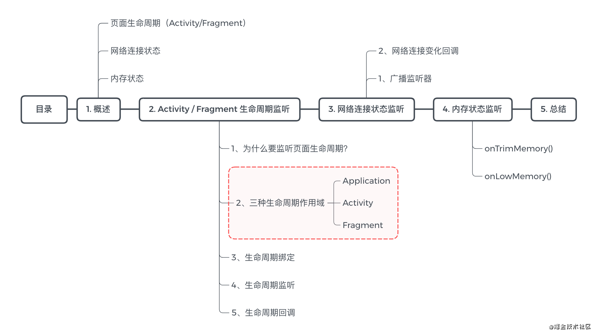
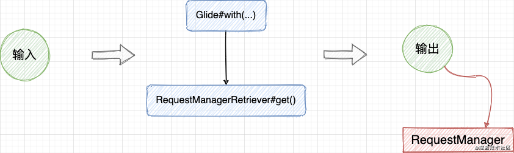
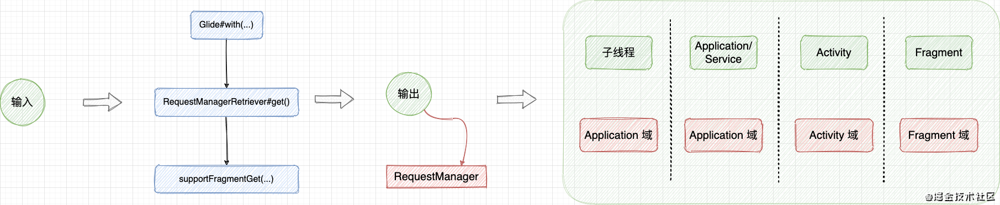
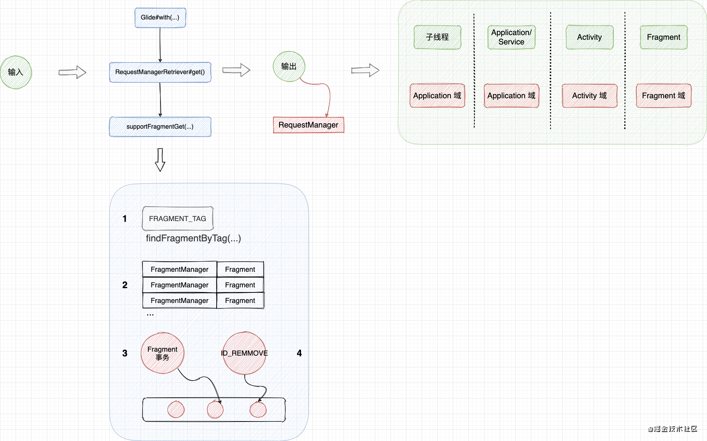
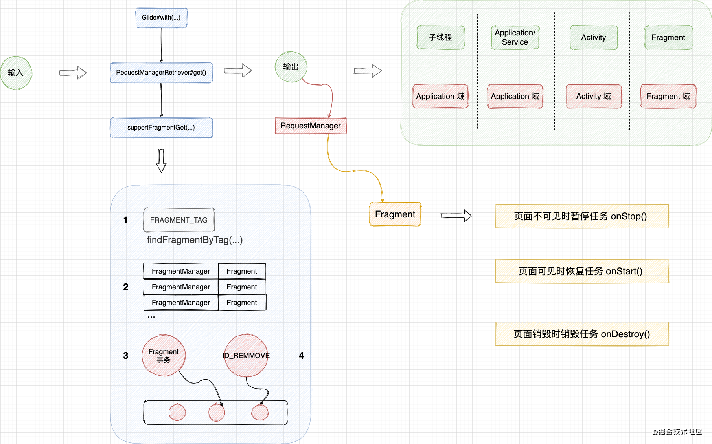

## 看 Glide 如何把生命周期安排得明明白白

### 前言

- 图片模块是 App 中非常重要的一个组件，而<font color=#8A2BE2>`[Glide]`</font>作为官方和业界认可的解决方案，其学习价值不必多言
- 在这里，我将分析一下 <font color=#8A2BE2>`[Glide生命周期]`</font>，主要分为三个层次的生命周期；<font color=#8A2BE2>`[Activity & 网络 & 内存]`</font>。

> `[提示]`本文源码基于 `Glide 4.11`

### 目录



### 1、概述

使用 Glide 加载图片非常简单，类似这样：

```java
Glide.with(activity)
    .load(url)
    .into(imageView)
```

相对的，取消加载也很简单，类似这样：

```java
Glide.with(activity).clear(imageView)
```

一般认为，应该及时取消不必要的加载请求，但这并不是必须的操作。<font color=#8A2BE2>`[因为 Glide 会在页面生命周期 / 网络变化时，自动地取消加载或重新加载]`</font>。

- 页面生命周期

  当页面不可见时暂停请求；页面可见时恢复请求；页面销毁时销毁请求。主要包括了 Activity / Fragment 两个主体。

- 网络连接状态

  如果从 URL 加载图片，Glide 会监听设备的连接状态，并在重新连接到网络时重启之前失败的请求。

- 内存状态

  Glide 会监听内存状态，并根据不同的 level 来释放内存。

### 2、Activity / Fragment 声明周期监听

#### 2.1 为什么要监听页面声明周期？

------

主要基于以下两个目的：

- 以确保优先处理前台可见的 Activity / Fragment，提高资源利用率
- 在右必要时释放资源以避免在应用在后台时被杀死，提高稳定性

> Low Memory Killer 会在合适的时机杀死进程，杀死优先级为：空进程 > 后台进程 服务进程 可见进程 前台进程

#### 2.2 三种生命周期作用域

首先，我们从 Glide 的入口方法入手：

<font color=#8A2BE2>`Glide.java`</font>

```java
private final RequestManagerRetriever requestManagerRetriever;

入口方法：
public static RequestManager with(Context context) {
    return getRetriever(context).get(context);
}

入口方法：
public static RequestManager with(Activity activity) {
    return getRetriever(activity).get(activity);
}
此处省略参数为 FragmentActivity、Fragment、View 的类似方法...

private static RequestManagerRetriever getRetriever(Context context) {
    其中，Glide.get(context) 基于 DCL 单例
    return Glide.get(context).getRequestManagerRetriever();
}

public RequestManagerRetriever getRequestManagerRetriever() {
    return requestManagerRetriever;
}
```

可以看到，with(...)方法的返回值是 RequestManager，而真正创建的地方是在 `RequestManagerRetriever#get(...)`中。



先说结论，根据传入的参数不同，将对应于<font color=#8A2BE2>`[Application & Activity & Fragment]`</font>的作用域，具体如下：

| 线程           | 参数                               | 作用域              |
| -------------- | ---------------------------------- | ------------------- |
| 子线程         | /                                  | Application         |
| 主线程（下同） | ApplicationContext/ ServiceContext | Application         |
| /              | FragmentActivity                   | Activity            |
| /              | Activity                           | Activity            |
| /              | Fragment                           | Fragment            |
| /              | View                               | Activity / Fragment |

- Application 作用域

  对于 Application 作用域的请求，它的生命周期是全局的，不与具体页面绑定。

  <font color=#8A2BE2>`RequestManagerRetriever.java`</font>

  ```java
  已简化
  Application 域请求管理
  private volatile RequestManager applicationManager;
  
  private RequestManager getApplicationManager(@NonNull Context context) {
      源码基于 DCL 单例
      return applicationManager;
  }
  
  public RequestManager get(@NonNull Context context) {
      if (Util.isOnMainThread() && !(context instanceof Application)) {
  
          2、FragmentActivity
          if (context instanceof FragmentActivity) {
              return get((FragmentActivity) context);
          } 
  
          3、Activity
          else if (context instanceof Activity) {
              return get((Activity) context);
          }
      }
      1、Application
      return getApplicationManager(context);
    }
  
  public RequestManager get(@NonNull FragmentActivity activity) {
      if (Util.isOnBackgroundThread()) {
          return get(activity.getApplicationContext());
      } else {
          见下文 ...
      }
  }
  ```

  上面的代码已经非常简化了，主要关注以下几点：

  1. Application 域对应的是 applicationManager，它是与 RequestManagerReteiever 对象绑定的。
  2. 在子线程调用 get(),或者传入参数是 ApplicationContext & ServiceContext 时，对应的请求是 Application 域。

  ### Activity 作用域

  <font color=#8A2BE2>`RequestManagerRetriever.java`</font>

  ```java
  已简化，并略去子线程的分支
  
  public RequestManager get(FragmentActivity activity) {
      FragmentManager fm = activity.getSupportFragmentManager();
      return supportFragmentGet(activity, fm, null, isActivityVisible(activity));
    }
  
  public RequestManager get(Activity activity) {
      android.app.FragmentManager fm = activity.getFragmentManager();
      return fragmentGet(activity, fm, null, isActivityVisible(activity));
  }
  ```

  可以看到，这里先获得了 FragmentActivity 的 FragmentManager，之后调用 `supportFragmentGet(...) 获得 RequestManager。Activity 分支与 FragmentActivity 分支类似，我不在重复分析了。

  ### Fragment 作用域

  <font color=#8A2BE2>`RequestManagerRetriever.java`</font>

  ```java
  已简化，并略去子线程的分支
  
  public RequestManager get(Fragment fragment) {
      FragmentManager fm = fragment.getChildFragmentManager();
      return supportFragmentGet(fragment.getContext(), fm, fragment, fragment.isVisible());
  }
  ```

  可以看到，这里先获得了 Fragment 的 FragmentManager `getChildFragmentManager`,之后调用 `supportFragmentGet`获得 RequestManager。

  

  ### 2.3 生命周期绑定

  从上一节的分析直到，Activity 域和 Fragment 域都会调用 `supportFragmentGet`来获得 RequestManager，这一节我们专门分析这个方法：

  <font color=#8A2BE2>`RequestManagerRetriever.java`</font>

  ```java
  已简化（提示：这个方法必在主线程执行）
  
  用于临时记录 FragmentManager - SupportRequestManagerFragment 的映射关系
  final Map<FragmentManager, SupportRequestManagerFragment> pendingSupportRequestManagerFragments = new HashMap<>();
  
  private RequestManager supportFragmentGet(
        Context context,
        FragmentManager fm,
        Fragment parentHint,
        boolean isParentVisible) {
      
      1、从 FragmentManager 中获取 SupportRequestManagerFragment
      SupportRequestManagerFragment current =
          getSupportRequestManagerFragment(fm, parentHint, isParentVisible);
  
      2、从该 Fragment 中获取 RequestManager
      RequestManager requestManager = current.getRequestManager();
  
      3、首次获取，则实例化 RequestManager
      if (requestManager == null) {
  
          3.1 实例化
          Glide glide = Glide.get(context);
          requestManager = factory.build(...);
  
          3.2 设置 Fragment 对应的 RequestMananger
          current.setRequestManager(requestManager);
      }
  
      return requestManager;
  }
  
  ->  1、从 FragmentManager 中获取 SupportRequestManagerFragment
  private SupportRequestManagerFragment getSupportRequestManagerFragment(FragmentManager fm, Fragment parentHint, boolean isParentVisible) {
  
      1.1 尝试获取 FRAGMENT_TAG 对应的 Fragment
      SupportRequestManagerFragment current =
          (SupportRequestManagerFragment) fm.findFragmentByTag(FRAGMENT_TAG);
  
      if (current == null) {
          1.2 尝试从临时记录中获取 Fragment
          current = pendingSupportRequestManagerFragments.get(fm);
  
          1.3 实例化 Fragment
          if (current == null) {
              
              1.3.1 创建对象
              current = new SupportRequestManagerFragment();
              current.setParentFragmentHint(parentHint);
  
              1.3.2 如果父层可见，则调用 onStart() 生命周期
              if (isParentVisible) {
                  current.getGlideLifecycle().onStart();
              }
          
              1.3.3 临时记录映射关系
              pendingSupportRequestManagerFragments.put(fm, current);
            
              1.3.4 提交 Fragment 事务
              fm.beginTransaction().add(current, FRAGMENT_TAG).commitAllowingStateLoss();
              
              1.3.5 post 一个消息
              handler.obtainMessage(ID_REMOVE_SUPPORT_FRAGMENT_MANAGER, fm).sendToTarget();
          }
      }
      return current;
  }
  
  -> 1.3.5 post 一个消息
  case ID_REMOVE_SUPPORT_FRAGMENT_MANAGER:
  
      1.3.6 移除临时记录中的映射关系
      FragmentManager supportFm = (FragmentManager) message.obj;
      key = supportFm;
      removed = pendingSupportRequestManagerFragments.remove(supportFm);
  break;
  ```

  上面的代码已经非常简化了，主要关注以下几点：

  - 从 FragmentManager 中获取 SupportRequestManagerFragment
  - 从该 Fragment 中获取 RequestManager
  - 首次获取，则实例化 RequestManager，后续从同一个 SuooprtRequestmanagerFragment 中都获取的是这个 RequestManager

  其中，获取 SuooprtRequestManagerFragment 的方法更为关键：

  - 尝试获取 FRAGMENT_TAG 对应的 Fragment
  - 尝试从临时记录中获取 Fragment
  - 实例化 Fragment
    - 创建对象
    - 如果父层可见，则调用 onStart 生命周期
    - 临时记录映射关系
    - 提交 Fragment 事务
    - post 一个消息
    - 移除临时记录中的映射关系

  其实一步步看下来，逻辑上不算复杂，只有【临时记录】比较考验源码框架理解度。即：`在提交 Fragment 事务之前，为什么需要先保存记录？】`

  这是 `为了避免 SupportRequestManagerFragment 在同一个作用域内重复创建`。因为 `commitAllowingStateLoss`是将事务 post 到消息队列的，也就是说，事务是异步处理的，而不是同步处理的。假设没有保存临时记录，一旦在事务异步等待执行时调用了 Glide.with() ，就会在该作用域中重复创建 Fragment。

  

  #### 2.4 生命周期监听

  从上面的分析我们得知，`【Glide 为每个 Activity 和 Fragment 作用域创建了一个无界面的 Fragment】`，这一节我们来分析 Glide 如何监听这个无界面 Fragment 的生命周期。

  <font color=#8A2BE2>`SupportRequestManagerFragment.java`</font>

  ```java
  private final ActivityFragmentLifecycle lifecycle;
  
  public SupportRequestManagerFragment() {
      this(new ActivityFragmentLifecycle());
  }
  
  @Override
  public void onStart() {
      super.onStart();
      lifecycle.onStart();
  }
  
  @Override
  public void onStop() {
      super.onStop();
      lifecycle.onStop();
  }
  
  @Override
  public void onDestroy() {
      super.onDestroy();
      lifecycle.onDestroy();
      unregisterFragmentWithRoot();
  }
  
  @NonNull
  ActivityFragmentLifecycle getGlideLifecycle() {
      return lifecycle;
  }
  ```

  <font color=#8A2BE2>`RequestManagerRetriever.java`</font>

  ```java
  -> 3.1 实例化 RequestManager
  Glide glide = Glide.get(context);
  requestManager = factory.build(glide, current.getGlideLifecycle(), 
      current.getRequestManagerTreeNode(), context);
  
  RequestManager 工厂接口
  public interface RequestManagerFactory {
      RequestManager build(
          Glide glide,
          Lifecycle lifecycle,
          RequestManagerTreeNode requestManagerTreeNode,
          Context context);
      }
  
  默认 RequestManager 工厂接口实现类
  private static final RequestManagerFactory DEFAULT_FACTORY = new RequestManagerFactory() {
      @Override
      public RequestManager build(
          Glide glide,
          Lifecycle lifecycle,
          RequestManagerTreeNode requestManagerTreeNode,
          Context context) {
              return new RequestManager(glide, lifecycle, requestManagerTreeNode, context);
          }
      };
  }
  ```

  <font color=#8A2BE2>`RequestManager.java`</font>

  ```java
  已简化
  
  final Lifecycle lifecycle;
  
  RequestManager(Glide glide, Lifecycle lifecycle, ...){
      ...
      this.lifecycle = lifecycle;
      
      添加监听
      lifecycle.addListener(this);
  }
  
  @Override
  public synchronized void onDestroy() {
      ...
      移除监听
      lifecycle.removeListener(this);
  }
  ```

  可以看到，实例化 RequestManager 时需要一个 `com.bumptech.glide.manager.Lifecycle`对象，这个对象是在无界面 Fragment 中创建的。当 Fragment 的生命周期变化时，就是通过这个 LifeCycle 对象将事件分发到 RequestManager。

  <font color=#8A2BE2>`ActivityFragmentLifecycle.java`</font>

  ```java
  class ActivityFragmentLifecycle implements Lifecycle {
  
      private final Set<LifecycleListener> lifecycleListeners =
        Collections.newSetFromMap(new WeakHashMap<LifecycleListener, Boolean>());
      ...
  }
  ```

  ### 2.5 生命周期回调

  现在我们来看 RequestManager 受到生命周期回调后的处理。

  <font color=#8A2BE2>`LifecycleListener.java`</font>

  ```java
  public interface LifecycleListener {
      void onStart();
      void onStop();
      void onDestroy();
  }
  ```

  <font color=#8A2BE2>`RequestManager.java`</font>

  ```java
  private final RequestTracker requestTracker;
  
  public class RequestManager
      implements ComponentCallbacks2, LifecycleListener, ... {
  
      @Override
      public synchronized void onStop() {
          1、onStop() 时暂停任务（页面不可见）
          pauseRequests();
          targetTracker.onStop();
      }
  
      @Override
      public synchronized void onStart() {
          2、onStart() 时恢复任务（页面可见）
          resumeRequests();
          targetTracker.onStart();
      }
  
      @Override
      public synchronized void onDestroy() {
          3、onDestroy() 时销毁任务（页面销毁）
          targetTracker.onDestroy();
          for (Target<?> target : targetTracker.getAll()) {
              clear(target);
          }
          targetTracker.clear();
          requestTracker.clearRequests();
          lifecycle.removeListener(this);
          lifecycle.removeListener(connectivityMonitor);
          mainHandler.removeCallbacks(addSelfToLifecycle);
          glide.unregisterRequestManager(this);
      }
      
      public synchronized void pauseRequests() {
          requestTracker.pauseRequests();
      }
  
      public synchronized void resumeRequests() {
          requestTracker.resumeRequests();
      }
  }
  ```

  主要关注以下几点：

  - 页面不可见的时候暂停请求（onStop）
  - 页面可见时恢复请求（onStart）
  - 页面销毁时销毁请求（onDestroy）

  ## 3、网络连接状态监听

  Glide 会监听网络连接状态，并在网络重新连接时重新启动失败的请求。具体分析如下：

  #### 3.1 广播监听器

  <font color=#8A2BE2>`RequestManager.java`</font>

  ```java
  private final ConnectivityMonitor connectivityMonitor;
  
  RequestManager(...){
      ...
      监听器
      connectivityMonitor = factory.build(context.getApplicationContext(), new RequestManagerConnectivityListener(requestTracker));
      ...
  }
  ```

  可以看到，在 RequestManager 的构造器中，会构建一个 `ConnectivityMonitor` 对象。其中，默认的构建工厂是：

  <font color=#8A2BE2>`DefaultConnectivityMonitorFactory.java`</font>

  ```java
  public class DefaultConnectivityMonitorFactory implements ConnectivityMonitorFactory {
  
      private static final String TAG = "ConnectivityMonitor";
      private static final String NETWORK_PERMISSION = "android.permission.ACCESS_NETWORK_STATE";
  
      @Override
      public ConnectivityMonitor build(Context context, ConnectivityMonitor.ConnectivityListener listener) {
        
          1、检查是否授予监控网络状态的权限
          int permissionResult = ContextCompat.checkSelfPermission(context, NETWORK_PERMISSION);
          boolean hasPermission = permissionResult == PackageManager.PERMISSION_GRANTED;
          
          2、实例化不同的 ConnectivityMonitor
          return hasPermission
              ? new DefaultConnectivityMonitor(context, listener)
              : new NullConnectivityMonitor();
    }
  }
  ```

  如果有网络监听权限，则实例化`DefaultConnectivityMonitor`:

  ```java
  已简化
  final class DefaultConnectivityMonitor implements ConnectivityMonitor {
  
      private final Context context;
      final ConnectivityListener listener;
  
      boolean isConnected;
      private boolean isRegistered;
  
      1、广播监听器
      private final BroadcastReceiver connectivityReceiver =
          new BroadcastReceiver() {
              @Override
              public void onReceive(Context context, Intent intent) {
                  boolean wasConnected = isConnected;
                  isConnected = isConnected(context);
  
                  5、状态变化，回调
                  if (wasConnected != isConnected) {
                      listener.onConnectivityChanged(isConnected);
                  }
              }
          };
  
      DefaultConnectivityMonitor(Context context, ConnectivityListener listener) {
          this.context = context.getApplicationContext();
          this.listener = listener;
      }
  
      private void register() {
          if (isRegistered) {
              return;
          }
  
          2、注册广播监听器
          isConnected = isConnected(context);
          context.registerReceiver(connectivityReceiver, new IntentFilter(ConnectivityManager.CONNECTIVITY_ACTION));
          isRegistered = true;
      }
  
      private void unregister() {
          if (!isRegistered) {
              return;
          }
          
          3、注销广播监听器
          context.unregisterReceiver(connectivityReceiver);
          isRegistered = false;
      }
  
      4、检查网络连通性
      boolean isConnected(Context context) {
          ConnectivityManager connectivityManager = (ConnectivityManager) context.getSystemService(Context.CONNECTIVITY_SERVICE);
          NetworkInfo networkInfo = connectivityManager.getActiveNetworkInfo();
          return networkInfo.isConnected();
      }
  
      @Override
      public void onStart() {
          页面可见时注册
          register();
      }
  
      @Override
      public void onStop() {
          页面不可见时注销
          unregister();
      }
  
      @Override
      public void onDestroy() {
          // Do nothing.
      }
  }
  ```

  可以看到，<font color=#8A2BE2>`[在页面可见时注册广播监听器，而在页面不可见时注销广播监听器。]`</font>

  #### 3.2 网络连接变化回调

  现在我们看 RequestManager 中是如何处理网络连接状态变化的。

  <font color=#8A2BE2>`RequestManager.java`</font>

  ```java
  
  private class RequestManagerConnectivityListener
        implements ConnectivityMonitor.ConnectivityListener {
      
      private final RequestTracker requestTracker;
  
      RequestManagerConnectivityListener(RequestTracker requestTracker) {
          this.requestTracker = requestTracker;
      }
  
      @Override
      public void onConnectivityChanged(boolean isConnected) {
  
          网络连接，重新开启请求
          if (isConnected) {
              synchronized (RequestManager.this) {
                  requestTracker.restartRequests();
              }
          }
      }
  }
  ```

  <font color=#8A2BE2>`小结：如果应用有监控网络状态的权限，那么 Glide 会监听网络连接状态，并在网络重新连接时重新启动失败的请求`</font>

  ### 4、内存状态监听

  这一节我们来分析 Glide 的内存状态监听模块，具体分析如下：

  <font color=#8A2BE2>`Glide.java`</font>

  ```java
  private static void initializeGlide(...) {
      ...
      applicationContext.registerComponentCallbacks(glide);
  }
  
  1、内存紧张级别
  @Override
  public void onTrimMemory(int level) {
      trimMemory(level);
  }
  
  2、低内存状态
  @Override
  public void onLowMemory() {
      clearMemory();
  }
  
  public void trimMemory(int level) {
      1.1 确保是主线程
      Util.assertMainThread();
  
      1.2 每个 RequestManager 处理内存紧张级别
      for (RequestManager manager : managers) {
          manager.onTrimMemory(level);
      }
      
      1.3 内存缓存处理内存紧张级别
      memoryCache.trimMemory(level);
      bitmapPool.trimMemory(level);
      arrayPool.trimMemory(level);
  }
  
  public void clearMemory() {
      1.2 确保是主线程
      Util.assertMainThread();
  
      1.2 内存缓存处理低内存状态
      memoryCache.clearMemory();
      bitmapPool.clearMemory();
      arrayPool.clearMemory();
  }
  ```

  <font color=#8A2BE2>`RequestManager.java`</font>

  ```java
  @Override
  public void onTrimMemory(int level) {  //Moderate 适度的，中和的，合适的
      if (level == TRIM_MEMORY_MODERATE && pauseAllRequestsOnTrimMemoryModerate) {
          暂停请求
          pauseAllRequestsRecursive();
      }
  }
  ```

  小结：在构建 Glide 时，会调用`registerComponentCallbacks()`进行全局注册, 系统在内存紧张的时候回调`onTrimMemory(level)`。而 Glide 则根据系统内存紧张级别（level）进行 memoryCache / bitmapPool / arrayPool 的回收，而 RequestManager 在 `TRIM_MEMORY_MODERATE` 级别会暂停请求。

  ### 5、总结

  - 页面生命周期

    当页面不可见时暂停请求；页面可见时恢复请求；页面销毁时销毁请求。

    

    - **网络连接状态**

    如果应用有监控网络状态的权限，那么 Glide 会监听网络连接状态，并在网络重新连接时重新启动失败的请求。

    - **内存状态**

    Glide 则根据系统内存紧张级别（level）进行 memoryCache / bitmapPool / arrayPool 的回收，而 RequestManager 在 `TRIM_MEMORY_MODERATE` 级别会暂停请求。

  

  

  

  

  

  

  

  

  

  

  

  

  

  

  

  