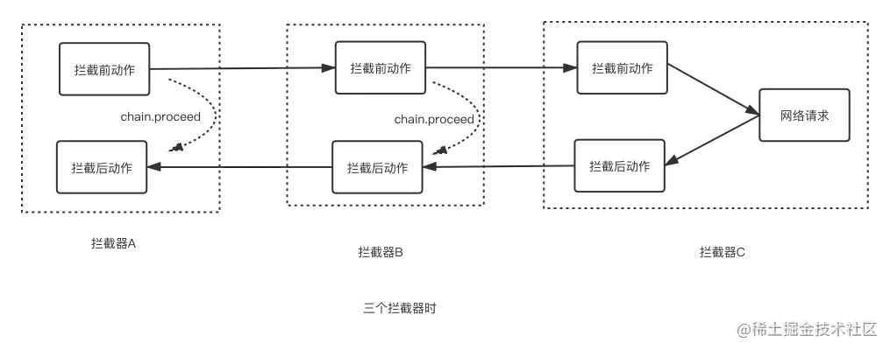
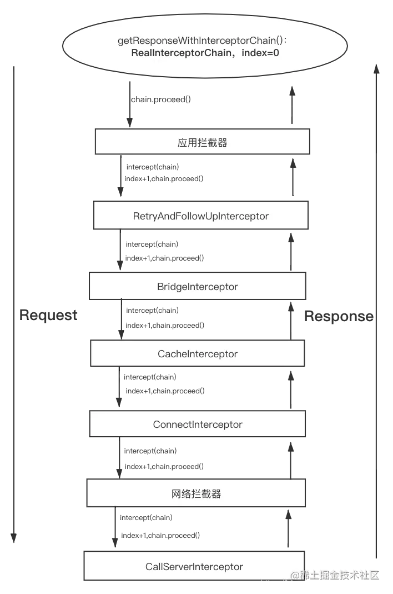
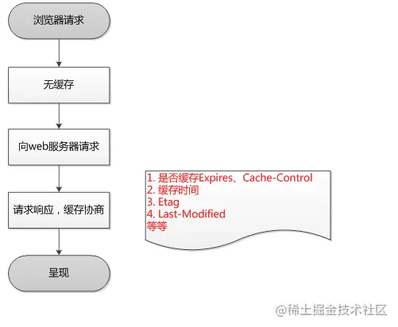
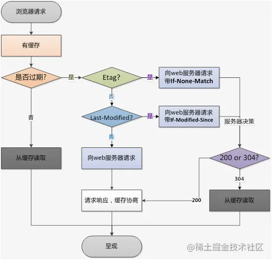
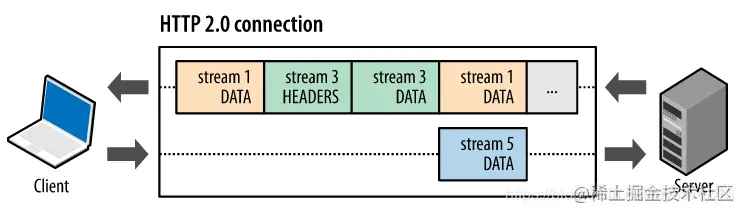
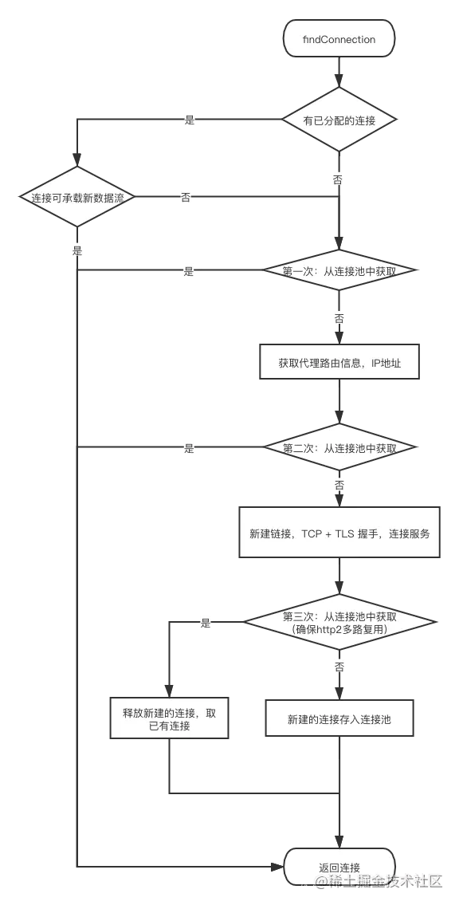
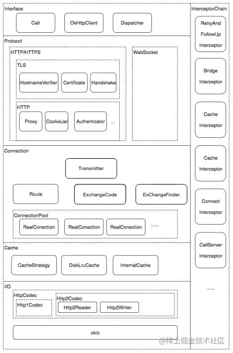

# 一、OkHttp 的基本使用

OkHttp 3 具有以下默认特性：

- 支持 HTTP2，允许所有同一个主机地址的请求共享同一个 socket 连接
- 使用连接池减少请求延时
- 透明的 GZIP 压缩减少响应数据的大小
- 缓存响应的内容，避免一些完全重复的请求
- 当网络出现问题的时候，OkHttp 会自动恢复一般的连接问题。如果你的服务有多个地址，当第一个 IP 请求失败时，OkHttp 会交替尝试你配置的其他 IP

## 一、引入

gradle 引入依赖即可。

```javascript
    implementation 'com.squareup.okhttp3:okhttp:3.14.7'
    implementation 'com.squareup.okio:okio:1.17.5'
```

3.14.X 版本以及之前的版本，采用 Java 语言编写，4.0.0 以后采用 kotlin 语言；

其中 okio 库是对 Java.io nio 的补充，以便能够更加方便、快速的访问、存储和处理你的数据。OkHttp 的底层使用该库作为支持。

另外，需要申请网络请求权限，如果还使用网络请求的缓存功能，那么还需要申请读写外存的权限。

## 二、使用方式

基本使用步骤如下

- 构建客户端对象 OkHttpClient
- 构建请求 Request
- 生成 Call 对象
- Call 发起请求（同步 异步）

### 2.1 get 请求

以百度主页为例子，进行 Get 请求：

```javascript
        OkHttpClient httpClient = new OkHttpClient();

        String url = "https://www.baidu.com/";
        Request getRequest = new Request.Builder()
                .url(url)
                .get()
                .build();

        Call call = httpClient.newCall(getRequest);

        new Thread(new Runnable() {
            @Override
            public void run() {
                try {
                    //同步请求，要放到子线程执行
                    Response response = call.execute();
                    Log.i(TAG, "okHttpGet run: response:"+ response.body().string());
                } catch (IOException e) {
                    e.printStackTrace();
                }
            }
        }).start();
```

以上请求为同步方法，所以需要在子线程中进行操作。想要主线程直接使用而不用手动进行创建子线程，需要按照下方的步骤进行操作：call.enqueue(callback) 即可：

```javascript
        call.enqueue(new Callback() {
            @Override
            public void onFailure(Call call, IOException e) {
            }

            @Override
            public void onResponse(Call call, Response response) throws IOException {
                Log.i(TAG, "okHttpGet enqueue: onResponse:"+ response.body().string());
            }
        });
```

call.enqueue 会异步执行，需要注意的是，两个回调方法都是在子线程中进行，所以如果想要执行 **UI** 操作，需要使用 handler 切换到 UI 线程。

另外，注意每一个 call 只能执行一次。

## 2.2 post 请求

### 2.2.1 post 请求提交 String、文件

post 请求和 get 请求的区别是 在构造 Request 对象的时候，需要多构造一个 RequestBody 对象，用来携带我们要提交的数据。示例如下：

```javascript
        OkHttpClient httpClient = new OkHttpClient();

        MediaType contentType = MediaType.parse("text/x-markdown; charset=utf-8");
        String content = "hello!";
        RequestBody body = RequestBody.create(contentType, content);

        Request getRequest = new Request.Builder()
                .url("https://api.github.com/markdown/raw")
                .post(body)
                .build();

        Call call = httpClient.newCall(getRequest);

        call.enqueue(new Callback() {
            @Override
            public void onFailure(Call call, IOException e) {
            }

            @Override
            public void onResponse(Call call, Response response) throws IOException {
                Log.i(TAG, "okHttpPost enqueue: \n onResponse:"+ response.toString() +"\n body:" +response.body().string());
            }
        });
```

对比 get 请求，把构建 Request 时的 get() 改成 post(body) ，并传入 RequestBody 实例。RequestBody 实例是通过 create 方法创建，需要指定请求体内容、请求内容类型。

传入其他类型的内容可以参考下面：

```javascript
// RequestBody:jsonBody，json字符串
String json = "jsonString";
RequestBody jsonBody = RequestBody.create(MediaType.parse("application/json; charset=utf-8"), json);

//RequestBody:fileBody, 上传文件
File file = new File(Environment.getExternalStorageDirectory(), "1.png");
RequestBody fileBody = RequestBody.create(MediaType.parse("image/png"), file);
```

### 2.2.2 post 请求提交表单

RequestBody 的子类 FormBody，FormBody 用于提交表单键值对，这种能满足平常开发大部分需求。

```javascript
//RequestBody:FormBody，表单键值对
RequestBody formBody = new FormBody.Builder()
        .add("username", "hfy")
        .add("password", "qaz")
        .build();
```

FormBody 是通过 FormBody.Builder 用构建者模式创建，add 键值对即可。它的 contentType 在内部已经指定了。

```javascript
  private static final MediaType CONTENT_TYPE = MediaType.get("application/x-www-form-urlencoded");
```

### 2.2.3 post 请求提交复杂请求体

RequestBody 另一个子类 MultipartBody，用于 post 请求提交复杂类型的请求体。复杂请求体可以同时包含多种类型的请求体数据。

上面介绍的 post 请求 string、文件、表单、图片，只有单一类型。考虑一种场景--注册，用户填写了姓名 电话 用户头像，这是注册接口的请求体需要包含表单 和文件，就需要 MultipartBody，完整代码如下：

```java
        OkHttpClient httpClient = new OkHttpClient();

//        MediaType contentType = MediaType.parse("text/x-markdown; charset=utf-8");
//        String content = "hello!";
//        RequestBody body = RequestBody.create(contentType, content);

        //RequestBody:fileBody,上传文件
        File file = drawableToFile(this, R.mipmap.bigpic, new File("00.jpg"));
        RequestBody fileBody = RequestBody.create(MediaType.parse("image/jpg"), file);


        //RequestBody:multipartBody, 多类型 （用户名、密码、头像）
        MultipartBody multipartBody = new MultipartBody.Builder()
                .setType(MultipartBody.FORM)
                .addFormDataPart("username", "hufeiyang")
                .addFormDataPart("phone", "123456")
                .addFormDataPart("touxiang", "00.png", fileBody)
                .build();


        Request getRequest = new Request.Builder()
                .url("http://yun918.cn/study/public/file_upload.php")
                .post(multipartBody)
                .build();

        Call call = httpClient.newCall(getRequest);

        call.enqueue(new Callback() {
            @Override
            public void onFailure(Call call, IOException e) {

                Log.i(TAG, "okHttpPost enqueue: \n onFailure:"+ call.request().toString() +"\n body:" +call.request().body().contentType()
                +"\n IOException:"+e.getMessage());
            }

            @Override
            public void onResponse(Call call, Response response) throws IOException {
                Log.i(TAG, "okHttpPost enqueue: \n onResponse:"+ response.toString() +"\n body:" +response.body().string());
            }
        });
```

## 2.4 请求配置项

------

先看几个问题：

- 如何全局设置超时时长
- 缓存位置、最大缓存大小呢？
- 考虑有这样一个需求，我要监控 App 通过 OKHTTP 发出的所有原始请求，以及整个请求所耗费的时间，如何做？

这些问题，在 OkHttp 这里很简单。把 OkHttpClient 实例的创建，换成下面的方式即可：

```java
        OkHttpClient client = new OkHttpClient.Builder()
                .connectTimeout(15, TimeUnit.SECONDS)
                .readTimeout(10, TimeUnit.SECONDS)
                .writeTimeout(10, TimeUnit.SECONDS)
                .cache(new Cache(getExternalCacheDir(),500 * 1024 * 1024))
                .addInterceptor(new Interceptor() {
                    @Override
                    public Response intercept(Chain chain) throws IOException {
                        Request request = chain.request();
                        String url = request.url().toString();
                        Log.i(TAG, "intercept: proceed start: url"+ url+ ", at "+System.currentTimeMillis());
                        Response response = chain.proceed(request);
                        ResponseBody body = response.body();
                        Log.i(TAG, "intercept: proceed end: url"+ url+ ", at "+System.currentTimeMillis());
                        return response;
                    }
                })
                .build();
```

这里通过 OkHttpClient.Builder 通过构建者模式设置了连接、读入、写入的超时时长，用 cache() 方法传入了缓存目录、缓存大小构成的 cache 实例，这样就解决了前两个问题。

并且使用了 addInterceptor 方法 添加了 Interceptor 实例，且重写了 intercept 方法。Interceptor 意为拦截器，intercept() 方法会在开始执行请求时调用。其中 chain.proceed(request) 内部是真正请求的过程，是阻塞操作，执行完成就会得到请求结果 ResponseBody，所以 chain.proceed(request) 的前后取当前时间，那么就直到整个请求所耗费的时间。上面 chain.proceed(request) 的前后分为打印的时间和日志，这样第三个问题就解决了。

> 通常，OkHttpClient 实例是全局唯一的，这样这些基本配置就是统一的，且内部维护的连接池也可以有效复用

另外单个的请求，也可以设置单独的配置。

```javascript
        Request getRequest = new Request.Builder()
                .url("http://yun918.cn/study/public/file_upload.php")
                .post(multipartBody)
                .addHeader("key","value")
                .cacheControl(CacheControl.FORCE_NETWORK)
                .build();
```

这个 Request 实例

- 使用了 addHeader 方法来添加请求头
- 使用 cacheControl FORCE_NETWORK 设置此次请求是能使用网络，不适用缓存。


# 二、OkHttp 的工作流程分析

如果我们想要进行 get 请求，那么使用少量的代码就能实现，如下所示：

```javascript
        OkHttpClient httpClient = new OkHttpClient();
        String url = "https://www.baidu.com/";
        Request getRequest = new Request.Builder()
                .url(url)
                .get()
                .build();
        Call call = httpClient.newCall(getRequest);
        call.enqueue(new Callback() {
            @Override
            public void onFailure(Call call, IOException e) {

            }
            @Override
            public void onResponse(Call call, Response response) throws IOException {

            }
        });        
```

看起来很简洁的代码，实际是 OkHttp 在背后默默执行了成吨的工作。

知其然也要知其所以然。接下来我们就来看下 OkHttp 在背后执行了多么复杂的工作。

### 请求的创建

以上面的 get 请求的代码步骤为例，先分析 OkHttpClient 实例的创建。主要有两种方式，直接实例化或者使用 Builder 建造者模式进行配置然后 build() 即可。直接创建其实就是使用了默认的配置。构造方法如下：

```java
  public OkHttpClient() {
    this(new Builder());
  }

  OkHttpClient(Builder builder) {
    this.dispatcher = builder.dispatcher;//调度器，用于控制并发的请求。内部保存同步和异步请求的call，并使用线程池处理异步请求。
    this.proxy = builder.proxy;//代理设置
    this.protocols = builder.protocols;//http协议
    this.connectionSpecs = builder.connectionSpecs;//连接配置
    this.interceptors = Util.immutableList(builder.interceptors);//全局拦截器
    this.networkInterceptors = Util.immutableList(builder.networkInterceptors);//网络拦截器
    this.eventListenerFactory = builder.eventListenerFactory;//请求的监听器的创建工厂
    this.proxySelector = builder.proxySelector;//代理选择器
    this.cookieJar = builder.cookieJar;//cookie,默认没有cookie：CookieJar.NO_COOKIES
    this.cache = builder.cache;//网络缓存设置
    this.internalCache = builder.internalCache;//内部使用的缓存接口
    this.socketFactory = builder.socketFactory;//socket工厂

    boolean isTLS = false;
    for (ConnectionSpec spec : connectionSpecs) {
      isTLS = isTLS || spec.isTls();
    }

    if (builder.sslSocketFactory != null || !isTLS) {
      this.sslSocketFactory = builder.sslSocketFactory;
      this.certificateChainCleaner = builder.certificateChainCleaner;
    } else {
      X509TrustManager trustManager = Util.platformTrustManager();
      this.sslSocketFactory = newSslSocketFactory(trustManager);
      this.certificateChainCleaner = CertificateChainCleaner.get(trustManager);
    }

    if (sslSocketFactory != null) {
      Platform.get().configureSslSocketFactory(sslSocketFactory);
    }

    this.hostnameVerifier = builder.hostnameVerifier;
    this.certificatePinner = builder.certificatePinner.withCertificateChainCleaner(
        certificateChainCleaner);
    this.proxyAuthenticator = builder.proxyAuthenticator;
    this.authenticator = builder.authenticator;//以上几个是安全相关设置
    this.connectionPool = builder.connectionPool;//连接池
    this.dns = builder.dns;//域名解析系统
    this.followSslRedirects = builder.followSslRedirects;//ssl重定向
    this.followRedirects = builder.followRedirects;//重定向
    this.retryOnConnectionFailure = builder.retryOnConnectionFailure;//连接失败时是否重试
    this.callTimeout = builder.callTimeout;
    this.connectTimeout = builder.connectTimeout;
    this.readTimeout = builder.readTimeout;
    this.writeTimeout = builder.writeTimeout;//几个超时设置
    this.pingInterval = builder.pingInterval;//ping间隔时间
	//拦截器不能是null
    if (interceptors.contains(null)) {
      throw new IllegalStateException("Null interceptor: " + interceptors);
    }
    if (networkInterceptors.contains(null)) {
      throw new IllegalStateException("Null network interceptor: " + networkInterceptors);
    }
  }

  public static final class Builder {
...
    public Builder() {
    //默认的配置
      dispatcher = new Dispatcher();
      protocols = DEFAULT_PROTOCOLS;
      connectionSpecs = DEFAULT_CONNECTION_SPECS;
      eventListenerFactory = EventListener.factory(EventListener.NONE);
      proxySelector = ProxySelector.getDefault();
      if (proxySelector == null) {
        proxySelector = new NullProxySelector();
      }
      cookieJar = CookieJar.NO_COOKIES;
      socketFactory = SocketFactory.getDefault();
      hostnameVerifier = OkHostnameVerifier.INSTANCE;
      certificatePinner = CertificatePinner.DEFAULT;
      proxyAuthenticator = Authenticator.NONE;
      authenticator = Authenticator.NONE;
      connectionPool = new ConnectionPool();
      dns = Dns.SYSTEM;
      followSslRedirects = true;
      followRedirects = true;
      retryOnConnectionFailure = true;
      callTimeout = 0;
      connectTimeout = 10_000;
      readTimeout = 10_000;
      writeTimeout = 10_000;
      pingInterval = 0;
    }
...
  }
```

直接创建 OkHttpClient 实例，配置项就是 Builder 构造方法中的默认值，可见配置项还是很多的。接着看 Request 的创建，也是使用建造者模式：

```java
    public Builder() {
      this.method = "GET";
      this.headers = new Headers.Builder();
    }

    public Builder get() {
      return method("GET", null);
    }
    
    public Builder post(RequestBody body) {
      return method("POST", body);
    }

    public Builder method(String method, @Nullable RequestBody body) {
      if (method == null) throw new NullPointerException("method == null");
      if (method.length() == 0) throw new IllegalArgumentException("method.length() == 0");
      if (body != null && !HttpMethod.permitsRequestBody(method)) {
        throw new IllegalArgumentException("method " + method + " must not have a request body.");
      }
      if (body == null && HttpMethod.requiresRequestBody(method)) {
        throw new IllegalArgumentException("method " + method + " must have a request body.");
      }
      this.method = method;
      this.body = body;
      return this;
    }

    public Builder addHeader(String name, String value) {
      headers.add(name, value);
      return this;
    }

    public Builder url(String url) {
      if (url == null) throw new NullPointerException("url == null");
      // Silently replace web socket URLs with HTTP URLs.
      if (url.regionMatches(true, 0, "ws:", 0, 3)) {
        url = "http:" + url.substring(3);
      } else if (url.regionMatches(true, 0, "wss:", 0, 4)) {
        url = "https:" + url.substring(4);
      }
      return url(HttpUrl.get(url));
    }

    public Request build() {
      if (url == null) throw new IllegalStateException("url == null");
      return new Request(this);
    }
```

注意到 get 和 post 都是对 method 方法的包装，method 方法内部对请求方法和请求体进行了校验，比如 get 不能有请求体、post 请求必须有请求体等。

接着看 HttpClient 的 newCall  方法：

```javascript
  @Override public Call newCall(Request request) {
    return RealCall.newRealCall(this, request, false /* for web socket */);
  }
```

跟进 RealCall 的 newRealCall 方法：

```javascript
  static RealCall newRealCall(OkHttpClient client, Request originalRequest, boolean forWebSocket) {
    // Safely publish the Call instance to the EventListener.
    RealCall call = new RealCall(client, originalRequest, forWebSocket);
    call.transmitter = new Transmitter(client, call);
    return call;
  }
```

可见 HttpClient 的 newCall 方法获得 Call 实际是 RealCall。RealCall 就是准备执行的请求，是对接口 call 的实现。其内部持有 OkHttpClient 实例、Request 实例。并且这里还创建了 **Transmitter** 给 RealCall 的 transimitter 赋值。

Transmitter 意为发射器，是应用层和网络层的桥梁，在进行 连接、真正发出请求和读取响应中起到很重要的作用，看下构造方法：

```javascript
  public Transmitter(OkHttpClient client, Call call) {
    this.client = client;
    this.connectionPool = Internal.instance.realConnectionPool(client.connectionPool());
    this.call = call;
    this.eventListener = client.eventListenerFactory().create(call);
    this.timeout.timeout(client.callTimeoutMillis(), MILLISECONDS);
  }
```

Transmitter 内部持有 OkHttpClient、连接池、call、事件监听器

再回头看 RealCall 实现的接口 call:

```java
//  已准备要执行的请求。由于表示单个请求/响应对（流），因此无法执行两次
public interface Call extends Cloneable {
  ...
  //同步请求，会阻塞
  Response execute() throws IOException;

  //异步请求
  void enqueue(Callback responseCallback);

  //取消请求，已经完成的不能取消。
  void cancel();
  
  boolean isExecuted();
  boolean isCanceled();
  Timeout timeout();
...
  interface Factory {
    Call newCall(Request request);
  }
}
```

### **请求的调度**

执行分为同步和异步，这里先从 **同步请求** 开始分析，即 RealCall 的 execute 方法：

```java
  @Override public Response execute() throws IOException {
    synchronized (this) {
      if (executed) throw new IllegalStateException("Already Executed");
      executed = true;
    }
    transmitter.timeoutEnter();//超时计时开始
    transmitter.callStart();//回调请求监听器的请求开始
    try {
      client.dispatcher().executed(this);//放入队列
      return getResponseWithInterceptorChain();//执行请求获取结果
    } finally {
      client.dispatcher().finished(this);//请求结束
    }
  }
```

首先判断 如果已经执行，就会抛出异常。这就是一个请求只能执行一次的原因；然后回调请求监听器的请求开始；然后调用 client 的调度器 dispatcher 的 execute 方法：

```java
  synchronized void executed(RealCall call) {
    runningSyncCalls.add(call);
  }
```

很简单，请求放入一个双端队列 runningSyncCalls 中，表示正在执行的同步请求。

然后返回了 getResponseWithInterceptorChain（）的结果 Response，可以猜到，**同步请求真正的请求流程是在 getResponseWithInterceptorChain 方法中**。最后请求结束，会走 Dispatcher 的 finished(Deque calls, T call) 方法；

```javascript
  //结束 异步请求
  void finished(AsyncCall call) {
  	//callsPerHost-1
    call.callsPerHost().decrementAndGet();
    finished(runningAsyncCalls, call);
  }
  //结束 同步请求
  void finished(RealCall call) {
    finished(runningSyncCalls, call);
  }
  //异步、同步的结束，都会走到这里：从running中移除 并 调用promoteAndExecute
  private <T> void finished(Deque<T> calls, T call) {
    ...
    synchronized (this) {
      //从队列中移除
      if (!calls.remove(call)) throw new AssertionError("Call wasn't in-flight!");
      idleCallback = this.idleCallback;
    }

    boolean isRunning = promoteAndExecute();
    ...
  }
```

从队列中移除 call，然后执行了 promoteAndExecute，这里先不跟进去了后面会讲到。

到这里，我们直到了，**同步请求走的是 getResponseWithInterceptorChain **方法。

我们再看 **异步请求**，即 RealCall 的 enqueue 方法：

```javascript
  public void enqueue(Callback responseCallback) {
    synchronized (this) {
      if (executed) throw new IllegalStateException("Already Executed");
      executed = true;
    }
    transmitter.callStart();//回调请求监听器的请求开始
    client.dispatcher().enqueue(new AsyncCall(responseCallback));//请求调度
  }
```

同样先判断是否已请求过，回调请求开始；然后调用 Dispatcher 的 enqueue 方法，参数接受的是 AsyncCall,  AysncCall 继承 NamedRunnable，NamedRunnable 实现自 Runnable，即 AsynCall 就是个Runnable，可以想到它是会再线程或者线程池中执行 Run 方法；run 方法在 AsyncCall 没看到，实际在 NamedRunnable 中：

```javascript
//知道当前线程名字的Runnable
public abstract class NamedRunnable implements Runnable {
  protected final String name;

  public NamedRunnable(String format, Object... args) {
    this.name = Util.format(format, args);
  }

  public final void run() {
    String oldName = Thread.currentThread().getName();
    Thread.currentThread().setName(name);
    try {
      execute();
    } finally {
      Thread.currentThread().setName(oldName);
    }
  }

  protected abstract void execute();
}
```

run 调用抽象方法 execute(), execute 在 AsyncCall 是有实现的。

我们继续取看 Dispatcher 的 enqueue 方法：

```javascript
  void enqueue(AsyncCall call) {
    synchronized (this) {
      //存入等待执行的队列
      readyAsyncCalls.add(call);

      // 相同host的请求，共用一个 调用计数
      if (!call.get().forWebSocket) {
        AsyncCall existingCall = findExistingCallWithHost(call.host());
        if (existingCall != null) call.reuseCallsPerHostFrom(existingCall);
      }
    }
    promoteAndExecute();
  }
  
  //从 runningAsyncCalls或者readyAsyncCalls中找到相同host的请求
  private AsyncCall findExistingCallWithHost(String host) {
    for (AsyncCall existingCall : runningAsyncCalls) {
      if (existingCall.host().equals(host)) return existingCall;
    }
    for (AsyncCall existingCall : readyAsyncCalls) {
      if (existingCall.host().equals(host)) return existingCall;
    }
    return null;
  }
```

先把请求放入双端队列 readyAsyncCalls 中，表示等待执行的异步请求。为啥是等待执行呢？leave this now; 接着从正在执行的请求 runningAsyncCalls 或者等待执行的请求 readyAsyncCalls 中找到是相同 host 的请求，把 callsPerHost 重用给当前请求。callPerHost 看名字感觉像是 拥有相同 host 的请求的数量，并且注意到类型是 AtomicInteger ,声明如下：

```
    private volatile AtomicInteger callsPerHost = new AtomicInteger(0);
```

所以，相同 host 的请求是共享 callsPerHost 的，为了后面判断 host 并发做准备。

继续看，接着调用了 promoteAndExecute() ,前面看的 finish 方法也有调用，跟进看看：

```java
  //调度的核心方法：在 控制异步并发 的策略基础上，使用线程池 执行异步请求
  private boolean promoteAndExecute() {
    assert (!Thread.holdsLock(this));

    List<AsyncCall> executableCalls = new ArrayList<>();
    boolean isRunning;
    synchronized (this) {
      for (Iterator<AsyncCall> i = readyAsyncCalls.iterator(); i.hasNext(); ) {
        AsyncCall asyncCall = i.next();

        if (runningAsyncCalls.size() >= maxRequests) break; //最大并发数64
        if (asyncCall.callsPerHost().get() >= maxRequestsPerHost) continue; //Host最大并发数5

        i.remove();//从等待队列中移除
        asyncCall.callsPerHost().incrementAndGet();//Host并发数+1
        executableCalls.add(asyncCall);//加入 可执行请求 的集合
        runningAsyncCalls.add(asyncCall);//加入 正在执行的异步请求队列
      }
      isRunning = runningCallsCount() > 0;//正在执行的异步/同步 请求数 >0
    }

    for (int i = 0, size = executableCalls.size(); i < size; i++) {
      AsyncCall asyncCall = executableCalls.get(i);
      asyncCall.executeOn(executorService());//可执行的请求
    }

    return isRunning;
  }

  public synchronized int runningCallsCount() {
    return runningAsyncCalls.size() + runningSyncCalls.size();
  }
```

遍历 readyAsyncCalls, 先进行两个检查：正在执行的异步请求 runningAsyncCalls 数量大于 **最大并发请求数64** 就 break，或者 相同 host 请求的数量大于5，就 continue。如果检查都通过，就从等待队列中移除，callPerHost 自增1，放入 可执行的集合 executableCalls, 并添加到队列 runningAsyncCalls, 表示正在执行的异步请求。这了解释了 异步请求等待队列的意义了，就是为了控制最大并发数的缓冲：异步请求并发数达到 64、相同 host 的异步请求达到 5，都要放入等待队列。

遍历完后 ：把 executableCalls 中的请求都走 executeOn 方法：

```javascript
    void executeOn(ExecutorService executorService) {
      assert (!Thread.holdsLock(client.dispatcher()));
      boolean success = false;
      try {
        executorService.execute(this);// 在线程池执行asyncCall
        success = true;
      } catch (RejectedExecutionException e) {
        ...
        transmitter.noMoreExchanges(ioException);
        responseCallback.onFailure(RealCall.this, ioException);// 回调失败
      } finally {
        if (!success) {
          client.dispatcher().finished(this); // 执行发生异常，结束
        }
      }
    }
    
  // 线程池的定义
  public synchronized ExecutorService executorService() {
    if (executorService == null) {
      executorService = new ThreadPoolExecutor(0, Integer.MAX_VALUE, 60, TimeUnit.SECONDS,
          new SynchronousQueue<>(), Util.threadFactory("OkHttp Dispatcher", false));
    }
    return executorService;
  }
```

executeOn 方法很简单：使用类似 CachedThreadPool 的线程池 执行请求 RealCall。如果执行失败，也会调用 dispatcher 的 finished(Deque calls, T call) 方法。

前面分析过，AsyncCall 的 run 方法会走到 execute 方法，来看下：

```
	protected void execute() {
      boolean signalledCallback = false;
      transmitter.timeoutEnter();//超时计时开始
      try {
        Response response = getResponseWithInterceptorChain();////执行请求获取结果
        responseCallback.onResponse(RealCall.this, response);//回调结果
      } catch (IOException e) {
        ...
        responseCallback.onFailure(RealCall.this, canceledException);//回调失败
        ...
      } finally {
        client.dispatcher().finished(this);//请求结束
      }
    }
```

我们发现，这里和 同步请求 就很像了，同样是调用 getResponseWithInterceptorChain 方法来获取结果 Response，不同点是使用 responseCallBack 把结果回调出去，最后请求结束也是调用了 dispatcher 的 finish 方法。

另外，前面说过，finish方法中也调用了promoteAndExecute()方法，说明 同步/异步 请求 结束后 也会重新调度当前的异步请求。

好了，这里把 调度流程 梳理以下：

1. 发起 **同步** 请求后，RealCall 使用 Dispatcher 存入 runningSyncCalls, 然后使用 getResponseWithInterceptorChain 获取结果，最后调用 Dispatchcher 的 finish 方法结束请求
2. 发起 **异步** 请求之后，RealCall 使用 Dispatcher 存入 readyAsyncCalls，获得 host 并发数，使用 promoteAndExecute 方法，在控制异步并发的基础策略上，使用线程池执行异步请求，异步请求的执行也是使用 getResponseWithInterceptorChain 方法，获取结果后回调出去，最后回调 dispatcher 的 finish 方法结束请求。
3. Dispatcher 调度器，主要是异步请求的并发控制、把异步请求放入线程池执行，实现方法是 promoteAndExecute。有两处调用：添加异步请求、同步和异步请求 结束时。

## 请求的执行

通过上面的分析指导，无论同步还是异步请求，最终的执行都是在 RealCall 的 getResponseWithInterceptorChain() 方法，只不过异步请求需要先通过 Dispatcher 进行并发控制和线程池的处理。一起看下：

```java
  Response getResponseWithInterceptorChain() throws IOException {
    List<Interceptor> interceptors = new ArrayList<>();
    interceptors.addAll(client.interceptors()); 		//使用者配置的 应用拦截器，最先拦截
    interceptors.add(new RetryAndFollowUpInterceptor(client));//重试跟进拦截器
    interceptors.add(new BridgeInterceptor(client.cookieJar()));//桥拦截器
    interceptors.add(new CacheInterceptor(client.internalCache()));//缓存拦截器
    interceptors.add(new ConnectInterceptor(client)); 	//连接拦截器
    if (!forWebSocket) {
      interceptors.addAll(client.networkInterceptors()); //使用者配置的网络拦截器
    }
    interceptors.add(new CallServerInterceptor(forWebSocket)); //请求服务拦截器
	//拦截器链
    Interceptor.Chain chain = new RealInterceptorChain(interceptors, transmitter, null, 0,
        originalRequest, this, client.connectTimeoutMillis(),
        client.readTimeoutMillis(), client.writeTimeoutMillis());

    boolean calledNoMoreExchanges = false;
    try {
      Response response = chain.proceed(originalRequest);//链 开始执行
      if (transmitter.isCanceled()) {
        closeQuietly(response);
        throw new IOException("Canceled");
      }
      return response;
    } catch (IOException e) {
      calledNoMoreExchanges = true;
      throw transmitter.noMoreExchanges(e);
    } finally {
      if (!calledNoMoreExchanges) {
        transmitter.noMoreExchanges(null);
      }
    }
  }
```

首先把

- 应用拦截器
- 重试跟进拦截器
- 桥缓存器
- 缓存拦截器
- 连接拦截器
- 网络拦截器
- 请求服务拦截器

依次添加到了 interceptors 中，然后使用 interceptors、transmitter、orginalRequest 等创建了拦截器链 RealInterceptorChain 实例，最后用 proceed 方法获取到请求的结果 Response。

在上一篇中有提到拦截器 interceptor，那里配置的拦截器实际就是 应用拦截器：client.interceptors(), 是最早被添加到 interceptors 中。那么到底 拦截器 是什么呢？chain.proceed 是如何获取到结果的呢？不着急，先看下 Interceptor 类：

```java
//拦截器
public interface Interceptor {

  Response intercept(Chain chain) throws IOException;

  //拦截器链
  interface Chain {
  
    Request request();

	//Chain的核心方法
    Response proceed(Request request) throws IOException;

    //返回请求执行的 连接. 仅网络拦截器可用; 应用拦截器就是null.
    @Nullable Connection connection();

    Call call();

    int connectTimeoutMillis();

    Chain withConnectTimeout(int timeout, TimeUnit unit);

    int readTimeoutMillis();

    Chain withReadTimeout(int timeout, TimeUnit unit);

    int writeTimeoutMillis();

    Chain withWriteTimeout(int timeout, TimeUnit unit);
  }
}
```

Interceptor 是个接口类，只有一个 interceptor 方法，参数是 Chain 对象；再注意到内部接口类 Chain -- 拦截器链，有个 proceed 方法，参数是 Request 对象，返回值是 Response，那么这个方法的实现就是请求的处理过程了。Chain 的唯一实现类就是 RealInterceptorChain，负责把所有拦截器串联起来，proceed 方法就是串联的操作。

上述一系列的拦截器都是 Interceptor 的实现类，这里先贴出上一篇中实现的应用拦截器：

```java
        new Interceptor() {
            @Override
            public Response intercept(Chain chain) throws IOException {
                Request request = chain.request();
                String url = request.url().toString();
                Log.i(TAG, "intercept: proceed start: url"+ url+ ", at "+System.currentTimeMillis());
                
                Response response = chain.proceed(request);
                
                ResponseBody body = response.body();
                Log.i(TAG, "intercept: proceed end: url"+ url+ ", at "+System.currentTimeMillis());
                return response;
            }
        }
```

在 intercept 方法中我们调用了 chain.proceed 方法获取了结果 并在前后打印了一些日志，那这个 Chain 实例是从那里来的 呢？intercept 方法什么时候被调用呢？回头看，所有的拦截器都被传入了 RealInterceptorChain，可以猜到，肯定是 RealInterceptor 的 proceed 方法内部调用了拦截器的 intercept 方法，那么来看看吧：

```java
  @Override public Response proceed(Request request) throws IOException {
    return proceed(request, transmitter, exchange);
  }

  public Response proceed(Request request, Transmitter transmitter, @Nullable Exchange exchange)
      throws IOException {
    if (index >= interceptors.size()) throw new AssertionError();

    calls++;

    // If we already have a stream, confirm that the incoming request will use it.
    if (this.exchange != null && !this.exchange.connection().supportsUrl(request.url())) {
      throw new IllegalStateException("network interceptor " + interceptors.get(index - 1)
          + " must retain the same host and port");
    }

    // If we already have a stream, confirm that this is the only call to chain.proceed().
    if (this.exchange != null && calls > 1) {
      throw new IllegalStateException("network interceptor " + interceptors.get(index - 1)
          + " must call proceed() exactly once");
    }

    // Call the next interceptor in the chain.
    RealInterceptorChain next = new RealInterceptorChain(interceptors, transmitter, exchange,
        index + 1, request, call, connectTimeout, readTimeout, writeTimeout);
    Interceptor interceptor = interceptors.get(index);
    Response response = interceptor.intercept(next);

    // Confirm that the next interceptor made its required call to chain.proceed().
    if (exchange != null && index + 1 < interceptors.size() && next.calls != 1) {
      throw new IllegalStateException("network interceptor " + interceptor
          + " must call proceed() exactly once");
    }

    // Confirm that the intercepted response isn't null.
    if (response == null) {
      throw new NullPointerException("interceptor " + interceptor + " returned null");
    }

    if (response.body() == null) {
      throw new IllegalStateException(
          "interceptor " + interceptor + " returned a response with no body");
    }

    return response;
  }
```

在实例化 RealInterceptorChain 时 index 赋值为 0，exchange 为 null，所以前面三个 if 都没走进去，然后获取了第一个拦截器，也就是我们配置的应用拦截器，调用了它的 interceptor 方法，并返回和校验了结果，这里证实了我们猜想；同时注意到，调用应用拦截器的 interceptor 方法传入的参数：拦截器实例 next，next 就是把 index + 1,其他参数是相同的，也就是说在我们的应用拦截器调用的是 next 的 proceed 方法。

进一步，next 的proceed 方法中同样会获取 interceptors 的 index = 1 的拦截器，即 RetryAndFollowUpInterceptor 实例，然后调用其 interceptor 方法，参数是 index  + 1,即 index = 2 的chain，依次传递下去，直到最后一个拦截器。

实际上，出了最后一个拦截器之外，所有的拦截器的 interceptor 方法都调用了 传入 chain 的 proceed 方法。每个拦截器在 chain 的 proceed 方法前后处理了自己负责的工作。例如，我们的应用拦截器，在 chain 的 proceed 方法前打印了 request 信息的日子，在调用 chain的 proceed 方法之后打印了 response 信息的日志。每个拦截器 interceptor 方法在调用 chain 的 proceed 方法都是为了获取下一个拦截器处理后的 response，然后返回给上一级的拦截器。

逻辑图总结如下：



这个是 okhttp 的核心流程了，整体流程如下：



现在来总结下：


1. 拦截器链：把原始请求 request **依次** 传入到 每个拦截器。拦截器 处理后 把response **反向** 依次 回传。
2. 拦截器：可以对request进行处理，然后调用index+1的拦截器链proceed方法 获取下一个拦截器处理的结果，接着自己也可以处理这个结果，即： 处理request、chain.proceed、处理response。

| 拦截器                      | 作用                                                         |
| --------------------------- | ------------------------------------------------------------ |
| 应用拦截器                  | 处理原始请求和最终的响应：可以添加自定义header、通用参数、参数加密、网关接入等等。 |
| RetryAndFollowUpInterceptor | 处理错误重试和重定向                                         |
| BridgeInterceptor           | 应用层和网络层的桥接拦截器，主要工作是为请求添加cookie、添加固定的header，比如Host、Content-Length、Content-Type、User-Agent等等，然后保存响应结果的cookie，如果响应使用gzip压缩过，则还需要进行解压。 |
| CacheInterceptor            | 缓存拦截器，获取缓存、更新缓存。如果命中缓存则不会发起网络请求。 |
| ConnectInterceptor          | 连接拦截器，内部会维护一个连接池，负责连接复用、创建连接（三次握手等等）、释放连接以及创建连接上的socket流。 |
| 网络拦截器                  | 用户自定义拦截器，通常用于监控网络层的数据传输。             |
| CallServerInterceptor       | 请求拦截器，在前置准备工作完成后，真正发起网络请求，进行IO读写。 |

这里先大概介绍下每个拦截器的角色任务，后面会详细的分析每一个拦截器和重要知识点--缓存和连接池。

## RetryAndFollowUpInterceptor -- 重试、重定向

如果请求时没有添加应用拦截器，那么第一个拦截器就是 **RetryAndFollwUpInterceptor**,意为**重试和跟进拦截器**， 作用就是 **连接失败后进行重试**、**对请求结果跟进后进行重定向**。直接看它 的 interceptor 方法：

```javascript
  @Override public Response intercept(Chain chain) throws IOException {
    Request request = chain.request();
    RealInterceptorChain realChain = (RealInterceptorChain) chain;
    Transmitter transmitter = realChain.transmitter();

    int followUpCount = 0;
    Response priorResponse = null;
    
    while (true) {
      //准备连接
      transmitter.prepareToConnect(request);
      
      if (transmitter.isCanceled()) {
        throw new IOException("Canceled");
      }

      Response response;
      boolean success = false;
      try {
        //继续执行下一个Interceptor
        response = realChain.proceed(request, transmitter, null);
        success = true;
      } catch (RouteException e) {
        // 连接路由异常，此时请求还未发送。尝试恢复~
        if (!recover(e.getLastConnectException(), transmitter, false, request)) {
          throw e.getFirstConnectException();
        }
        continue;
      } catch (IOException e) {
        // IO异常，请求可能已经发出。尝试恢复~
        boolean requestSendStarted = !(e instanceof ConnectionShutdownException);
        if (!recover(e, transmitter, requestSendStarted, request)) throw e;
        continue;
      } finally {
        // 请求没成功，释放资源。
        if (!success) {
          transmitter.exchangeDoneDueToException();
        }
      }

      // 关联上一个response
      if (priorResponse != null) {
        response = response.newBuilder()
            .priorResponse(priorResponse.newBuilder()
                    .body(null)
                    .build())
            .build();
      }

      Exchange exchange = Internal.instance.exchange(response);
      Route route = exchange != null ? exchange.connection().route() : null;
      //跟进结果，主要作用是根据响应码处理请求，返回Request不为空时则进行重定向处理-拿到重定向的request
      Request followUp = followUpRequest(response, route);

	  //followUp为空，不需要重试，直接返回
      if (followUp == null) {
        if (exchange != null && exchange.isDuplex()) {
          transmitter.timeoutEarlyExit();
        }
        return response;
      }

	  //followUpBody.isOneShot，不需要重试，直接返回
      RequestBody followUpBody = followUp.body();
      if (followUpBody != null && followUpBody.isOneShot()) {
        return response;
      }

      closeQuietly(response.body());
      if (transmitter.hasExchange()) {
        exchange.detachWithViolence();
      }

	  //最多重试20次
      if (++followUpCount > MAX_FOLLOW_UPS) {
        throw new ProtocolException("Too many follow-up requests: " + followUpCount);
      }
      //赋值，以便再次请求
      request = followUp;
      priorResponse = response;
    }
  }
```

**使用 while 进行循环：**
先用 transmitter.prepareToConnect(request) 进行连接准备。tranmisitter 在上一篇有提到，意为发射器，是应用层和网络层的桥梁，在进行 **连接**、真正发出请求和读取响应中起到很重要的作用。看下 prepareToConnect 方法：

```javascript
  public void prepareToConnect(Request request) {
    if (this.request != null) {
      if (sameConnection(this.request.url(), request.url()) && exchangeFinder.hasRouteToTry()) {
        return; //已有相同连接
      }
      ...
    }

    this.request = request;
    //创建ExchangeFinder，目的是为获取连接做准备
    this.exchangeFinder = new ExchangeFinder(this, connectionPool, createAddress(request.url()),
        call, eventListener);
  }
```

主要是创建 ExchangeFinder 梳理赋值给 tranmitter.exchangeFinder。ExchangeFinder 是交换查找器，作用是获取请求的连接。这里先了解下，后面会说明。

接着调用 realChain.proceed 继续传递请求给下一个拦截器、下一个拦截器获取原始结果。如果此过程发生了 连接路由异常 或者 IO 异常，就会调用 recover 判断是否进行恢复；看下 recover 方法：

```javascript
  private boolean recover(IOException e, Transmitter transmitter,
      boolean requestSendStarted, Request userRequest) {
    // 应用层禁止重试，就不重试
    if (!client.retryOnConnectionFailure()) return false;

    // 不能再次发送请求，就不重试
    if (requestSendStarted && requestIsOneShot(e, userRequest)) return false;

    // 发生的异常是致命的，就不重试
    if (!isRecoverable(e, requestSendStarted)) return false;

    // 没有路由可以尝试，就不重试
    if (!transmitter.canRetry()) return false;

    return true;
  }
```

如果 recover 方法返回 true，那么就会进入下一个循环，重新请求。

如果 realChain.proceed 没有发生异常，返回了结果 response，就会使用 **followUpRequest** 方法跟进结果并构建重定向 request。如果不用跟进处理（例如响应码是200），则返回 null。看下 followUpRequest 方法：

```javascript
  private Request followUpRequest(Response userResponse, @Nullable Route route) throws IOException {
  ...
    int responseCode = userResponse.code();
  ...
    switch (responseCode) {
      ...
      case HTTP_PERM_REDIRECT:
      case HTTP_TEMP_REDIRECT:
        if (!method.equals("GET") && !method.equals("HEAD")) {
          return null;
        }
      case HTTP_MULT_CHOICE:
      case HTTP_MOVED_PERM:
      case HTTP_MOVED_TEMP:
      case HTTP_SEE_OTHER:
        if (!client.followRedirects()) return null;

        String location = userResponse.header("Location");
        if (location == null) return null;
        HttpUrl url = userResponse.request().url().resolve(location);

        if (url == null) return null;
        boolean sameScheme = url.scheme().equals(userResponse.request().url().scheme());
        if (!sameScheme && !client.followSslRedirects()) return null;

        Request.Builder requestBuilder = userResponse.request().newBuilder();
        if (HttpMethod.permitsRequestBody(method)) {
          final boolean maintainBody = HttpMethod.redirectsWithBody(method);
          if (HttpMethod.redirectsToGet(method)) {
            requestBuilder.method("GET", null);
          } else {
            RequestBody requestBody = maintainBody ? userResponse.request().body() : null;
            requestBuilder.method(method, requestBody);
          }
          if (!maintainBody) {
            requestBuilder.removeHeader("Transfer-Encoding");
            requestBuilder.removeHeader("Content-Length");
            requestBuilder.removeHeader("Content-Type");
          }
        }
        if (!sameConnection(userResponse.request().url(), url)) {
          requestBuilder.removeHeader("Authorization");
        }

        return requestBuilder.url(url).build();

      case HTTP_CLIENT_TIMEOUT:
        ...
      default:
        return null;
    }
  }
```

主要就是根据响应码判断如果需要重定向，就从响应中取出重定向的 url 并构建新的 request 并返回出去。

往下看，还有个哦按段：做多重试 20 次

## BridgeInterceptor - 桥接拦截器

桥接拦截器，相当于在请求发起端 和 网络执行端 架起一座桥，把应用层发出的请求变为 网络层认识的请求，把网络层执行后的响应 变为  应用层便于应用层使用的结果。看代码：

```javascript
//桥拦截器
public final class BridgeInterceptor implements Interceptor {
  //Cookie管理器，初始化OkhttpClient时创建的，默认是CookieJar.NO_COOKIES
  private final CookieJar cookieJar;

  public BridgeInterceptor(CookieJar cookieJar) {
    this.cookieJar = cookieJar;
  }

  @Override public Response intercept(Chain chain) throws IOException {
    Request userRequest = chain.request();
    Request.Builder requestBuilder = userRequest.newBuilder();
    
    RequestBody body = userRequest.body();
    if (body != null) {
      MediaType contentType = body.contentType();
      if (contentType != null) {
        requestBuilder.header("Content-Type", contentType.toString());
      }

      long contentLength = body.contentLength();
      //如果已经知道body的长度，就添加头部"Content-Length"
      if (contentLength != -1) {
        requestBuilder.header("Content-Length", Long.toString(contentLength));
        requestBuilder.removeHeader("Transfer-Encoding");
      } else {
      //如果不知道body的长度，就添加头部"Transfer-Encoding"，代表这个报文采用了分块编码。这时，报文中的实体需要改为用一系列分块来传输。具体理解请参考：[HTTP Transfer-Encoding介绍](https://blog.csdn.net/Dancen/article/details/89957486)
        requestBuilder.header("Transfer-Encoding", "chunked");
        requestBuilder.removeHeader("Content-Length");
      }
    }

    if (userRequest.header("Host") == null) {
      requestBuilder.header("Host", hostHeader(userRequest.url(), false));
    }

    if (userRequest.header("Connection") == null) {
      requestBuilder.header("Connection", "Keep-Alive");
    }

	//"Accept-Encoding: gzip",表示接受：返回gzip编码压缩的数据
    // 如果我们手动添加了 "Accept-Encoding: gzip" ，那么下面的if不会进入，transparentGzip是false，就需要我们自己处理数据解压。
    //如果 没有 手动添加"Accept-Encoding: gzip" ，transparentGzip是true，同时会自动添加，而且后面也会自动处理解压。
    boolean transparentGzip = false;
    if (userRequest.header("Accept-Encoding") == null && userRequest.header("Range") == null) {
      transparentGzip = true;
      requestBuilder.header("Accept-Encoding", "gzip");
    }
	//从cookieJar中获取cookie，添加到header
    List<Cookie> cookies = cookieJar.loadForRequest(userRequest.url());
    if (!cookies.isEmpty()) {
      requestBuilder.header("Cookie", cookieHeader(cookies));
    }
	//"User-Agent"一般需要作为公共header外部统一添加
    if (userRequest.header("User-Agent") == null) {
      requestBuilder.header("User-Agent", Version.userAgent());
    }

	//处理请求
    Response networkResponse = chain.proceed(requestBuilder.build());
	//从networkResponse中获取 header "Set-Cookie" 存入cookieJar
    HttpHeaders.receiveHeaders(cookieJar, userRequest.url(), networkResponse.headers());

    Response.Builder responseBuilder = networkResponse.newBuilder()
        .request(userRequest);

	//如果我们没有手动添加"Accept-Encoding: gzip"，这里会创建 能自动解压的responseBody--GzipSource
    if (transparentGzip
        && "gzip".equalsIgnoreCase(networkResponse.header("Content-Encoding"))
        && HttpHeaders.hasBody(networkResponse)) {
      GzipSource responseBody = new GzipSource(networkResponse.body().source());
      Headers strippedHeaders = networkResponse.headers().newBuilder()
          .removeAll("Content-Encoding")
          .removeAll("Content-Length")
          .build();
      responseBuilder.headers(strippedHeaders);
      String contentType = networkResponse.header("Content-Type");
      responseBuilder.body(new RealResponseBody(contentType, -1L, Okio.buffer(responseBody)));
    }
	//然后构建 新的response返回出去
    return responseBuilder.build();
  }
  
  private String cookieHeader(List<Cookie> cookies) {
    StringBuilder cookieHeader = new StringBuilder();
    for (int i = 0, size = cookies.size(); i < size; i++) {
      if (i > 0) {
        cookieHeader.append("; ");
      }
      Cookie cookie = cookies.get(i);
      cookieHeader.append(cookie.name()).append('=').append(cookie.value());
    }
    return cookieHeader.toString();
  }
}
```

首先，chain.proceed() 执行前，对 **请求头** 添加了 header:"Content-Type"、“Content-Length" 或 “Transfer-Encoding"、”host"、“Connection"、"Accept-Encoding"、"Cookie"、"User-Agent"，即网络层真正可执行的请求。其中，注意到，默认是没有 cookie 处理的，需要我们在初始化 OkHttpCLient 时配置我们自己的 cookieJar。

chain.proceed 处理后，先把响应 header 中的 cookie 存入 cookieJar(如果有)，然后如果没有手动添加请求 header ”accept-Encoding:gzip", 那么会通过 创建能自动解压的 responseBody---GZipSource, 接着构建新的 response 返回。

## CacheInterceptor - 缓存拦截器

CacheInterceptor, **缓存拦截器**，提供网络请求缓存的存取，我们发起一个网络请求，如果每次都经过网络的发送和读取，那么效率上是有欠缺的。如果之前有相同的请求已经执行过一次，那么是否可以把它的结果存起来，然后这次请求直接使用呢？CacheInterceptor 干的就是这个事情，合理使用本地缓存，有效减少网络开销、减少响应延迟。

在 解析 CacheInterceptor 源码之前，先了解下 http 的缓存机制：

第一次请求：



第二次请求：



上面两张图很好的解释了 http 的缓存机制：根据 **缓存是否过期**、**过期后是否有修改** 来决定 请求是否使用缓存。详细说明可点击了解。[彻底弄懂HTTP缓存机制及原理](https://link.juejin.cn/?target=https%3A%2F%2Fwww.cnblogs.com%2Fchenqf%2Fp%2F6386163.html)；

CacheInterceptor 的 interceptor 的方法代码如下：

```javascript
  public Response intercept(Chain chain) throws IOException {
  	//用reques的url 从缓存中 获取响应 作为候选（CacheStrategy决定是否使用）。
    Response cacheCandidate = cache != null
        ? cache.get(chain.request())
        : null;

    long now = System.currentTimeMillis();
	//根据 request、候选Response 获取缓存策略。
	//缓存策略 将决定是否 使用缓存：strategy.networkRequest为null，不使用网络；strategy.cacheResponse为null，不使用缓存。
    CacheStrategy strategy = new CacheStrategy.Factory(now, chain.request(), cacheCandidate).get();
    Request networkRequest = strategy.networkRequest;
    Response cacheResponse = strategy.cacheResponse;
	
	//根据缓存策略更新统计指标：请求次数、网络请求次数、使用缓存次数
    if (cache != null) {
      cache.trackResponse(strategy);
    }
	//有缓存 但不能用，关掉
    if (cacheCandidate != null && cacheResponse == null) {
      closeQuietly(cacheCandidate.body()); // The cache candidate wasn't applicable. Close it.
    }

    // 网络请求、缓存 都不能用，就返回504
    if (networkRequest == null && cacheResponse == null) {
      return new Response.Builder()
          .request(chain.request())
          .protocol(Protocol.HTTP_1_1)
          .code(504)
          .message("Unsatisfiable Request (only-if-cached)")
          .body(Util.EMPTY_RESPONSE)
          .sentRequestAtMillis(-1L)
          .receivedResponseAtMillis(System.currentTimeMillis())
          .build();
    }

    // 如果不用网络，cacheResponse肯定不为空了，那么就使用缓存了，结束了。
    if (networkRequest == null) {
      return cacheResponse.newBuilder()
          .cacheResponse(stripBody(cacheResponse))
          .build();
    }

	//到这里，networkRequest != null （cacheResponse可能null，也可能!null）
	//networkRequest != null，就是要进行网络请求了，所以 拦截器链 就继续 往下处理了~
    Response networkResponse = null;
    try {
      networkResponse = chain.proceed(networkRequest);
    } finally {
      // If we're crashing on I/O or otherwise, don't leak the cache body.
      if (networkResponse == null && cacheCandidate != null) {
        closeQuietly(cacheCandidate.body());
      }
    }

    // 如果网络请求返回304，表示服务端资源没有修改，那么就 结合 网络响应和缓存响应，然后更新缓存，返回，结束。
    if (cacheResponse != null) {
      if (networkResponse.code() == HTTP_NOT_MODIFIED) {
        Response response = cacheResponse.newBuilder()
            .headers(combine(cacheResponse.headers(), networkResponse.headers()))//结合header
            .sentRequestAtMillis(networkResponse.sentRequestAtMillis())//请求事件
            .receivedResponseAtMillis(networkResponse.receivedResponseAtMillis())//接受事件
            .cacheResponse(stripBody(cacheResponse))
            .networkResponse(stripBody(networkResponse))
            .build();
        networkResponse.body().close();

        // Update the cache after combining headers but before stripping the
        // Content-Encoding header (as performed by initContentStream()).
        cache.trackConditionalCacheHit();
        cache.update(cacheResponse, response);
        return response;
      } else {
      	//如果是非304，说明服务端资源有更新，就关闭缓存body
        closeQuietly(cacheResponse.body());
      }
    }

    Response response = networkResponse.newBuilder()
        .cacheResponse(stripBody(cacheResponse))
        .networkResponse(stripBody(networkResponse))
        .build();

    if (cache != null) {
      //网络响应可缓存（请求和响应的 头 Cache-Control都不是'no-store'）
      if (HttpHeaders.hasBody(response) && CacheStrategy.isCacheable(response, networkRequest)) {
        // 写入缓存
        CacheRequest cacheRequest = cache.put(response);
        return cacheWritingResponse(cacheRequest, response);
      }
      
	  //OkHttp默认只会对get请求进行缓存，因为get请求的数据一般是比较持久的，而post一般是交互操作，没太大意义进行缓存
	  //不是get请求就移除缓存
      if (HttpMethod.invalidatesCache(networkRequest.method())) {
        try {
          cache.remove(networkRequest);
        } catch (IOException ignored) {
          // The cache cannot be written.
        }
      }
    }

    return response;
  }
```

整体思路很清晰：**使用缓存策略CacheStrategy 来 决定是否使用缓存 及如何使用。**

CacheStrategy是如何获取的，这里先不看。需要知道：**strategy.networkRequest为null，不使用网络；strategy.cacheResponse为null，不使用缓存**。

那么按照这个思路，接下来就是一系列的判断：

1. 若 networkRequest、cacheResponse 都为null，即网络请求、缓存 都不能用，就返回504
2. 若 networkRequest为null，cacheResponse肯定就不为null，那么就是 不用网络，使用缓存了，就结束了
3. 若 networkResponse不为null，不管cacheResponse是否null，都会去请求网络，获取网络响应networkResponse
4. 接着3，若cacheResponse不为null，且networkResponse.code是304，表示服务端资源未修改，缓存是还有效的，那么结合 网络响应和缓存响应，然后更新缓存，结束~
5. 接着3，若cacheResponse为null  或 cacheResponse不为null但networkResponse.code不是304，那么就写入缓存，返回响应，结束~

继续看，上面判断逻辑都是基于 CacheStrategy, 这里看下是如何生成的：

```
    CacheStrategy strategy = new CacheStrategy.Factory(now, chain.request(), cacheCandidate).get();
```

把请求 request、候选缓存 cacheCandidate 传入 工厂类 Factory，然后调用 get 方法，那么看下：

```javascript
    public Factory(long nowMillis, Request request, Response cacheResponse) {
      this.nowMillis = nowMillis;
      this.request = request;
      this.cacheResponse = cacheResponse;

      if (cacheResponse != null) {
      	//获取候选缓存的请求时间、响应时间，从header中获取 过期时间、修改时间、资源标记等（如果有）。
        this.sentRequestMillis = cacheResponse.sentRequestAtMillis();
        this.receivedResponseMillis = cacheResponse.receivedResponseAtMillis();
        Headers headers = cacheResponse.headers();
        for (int i = 0, size = headers.size(); i < size; i++) {
          String fieldName = headers.name(i);
          String value = headers.value(i);
          if ("Date".equalsIgnoreCase(fieldName)) {
            servedDate = HttpDate.parse(value);
            servedDateString = value;
          } else if ("Expires".equalsIgnoreCase(fieldName)) {
            expires = HttpDate.parse(value);
          } else if ("Last-Modified".equalsIgnoreCase(fieldName)) {
            lastModified = HttpDate.parse(value);
            lastModifiedString = value;
          } else if ("ETag".equalsIgnoreCase(fieldName)) {
            etag = value;
          } else if ("Age".equalsIgnoreCase(fieldName)) {
            ageSeconds = HttpHeaders.parseSeconds(value, -1);
          }
        }
      }
    }

    public CacheStrategy get() {
      CacheStrategy candidate = getCandidate();

      if (candidate.networkRequest != null && request.cacheControl().onlyIfCached()) {
        // We're forbidden from using the network and the cache is insufficient.
        return new CacheStrategy(null, null);
      }

      return candidate;
    }
```

Factory的构造方法内，获取了候选响应的请求时间、响应时间、过期时长、修改时间、资源标记等。

get方法内部先调用了getCandidate()获取到缓存策略实例， 先跟进到 getCandidate方法看看吧：

```
    private CacheStrategy getCandidate() {
      // 没有缓存：网络请求
      if (cacheResponse == null) {
        return new CacheStrategy(request, null);
      }

      // https，但没有握手：网络请求
      if (request.isHttps() && cacheResponse.handshake() == null) {
        return new CacheStrategy(request, null);
      }

      //网络响应 不可缓存（请求或响应的 头 Cache-Control 是'no-store'）：网络请求
      if (!isCacheable(cacheResponse, request)) {
        return new CacheStrategy(request, null);
      }
	  //请求头的Cache-Control是no-cache 或者 请求头有"If-Modified-Since"或"If-None-Match"：网络请求
	  //意思就是 不使用缓存 或者 请求 手动 添加了头部 "If-Modified-Since"或"If-None-Match"
      CacheControl requestCaching = request.cacheControl();
      if (requestCaching.noCache() || hasConditions(request)) {
        return new CacheStrategy(request, null);
      }

      CacheControl responseCaching = cacheResponse.cacheControl();

	   //缓存的年龄
      long ageMillis = cacheResponseAge();
      //缓存的有效期
      long freshMillis = computeFreshnessLifetime();
	  //比较请求头里有效期，取较小值
      if (requestCaching.maxAgeSeconds() != -1) {
        freshMillis = Math.min(freshMillis, SECONDS.toMillis(requestCaching.maxAgeSeconds()));
      }

	  //可接受的最小 剩余有效时间（min-fresh标示了客户端不愿意接受 剩余有效期<=min-fresh 的缓存。）
      long minFreshMillis = 0;
      if (requestCaching.minFreshSeconds() != -1) {
        minFreshMillis = SECONDS.toMillis(requestCaching.minFreshSeconds());
      }
	  //可接受的最大过期时间（max-stale指令标示了客户端愿意接收一个已经过期了的缓存，例如 过期了 1小时 还可以用）
      long maxStaleMillis = 0;
      if (!responseCaching.mustRevalidate() && requestCaching.maxStaleSeconds() != -1) {
      		// 第一个判断：是否要求必须去服务器验证资源状态
      		// 第二个判断：获取max-stale值，如果不等于-1，说明缓存过期后还能使用指定的时长
        maxStaleMillis = SECONDS.toMillis(requestCaching.maxStaleSeconds());
      }
      
	  //如果响应头没有要求忽略本地缓存 且 整合后的缓存年龄 小于 整合后的过期时间，那么缓存就可以用
      if (!responseCaching.noCache() && ageMillis + minFreshMillis < freshMillis + maxStaleMillis) {
        Response.Builder builder = cacheResponse.newBuilder();
        //没有满足“可接受的最小 剩余有效时间”，加个110警告
        if (ageMillis + minFreshMillis >= freshMillis) {
          builder.addHeader("Warning", "110 HttpURLConnection \"Response is stale\"");
        }
        //isFreshnessLifetimeHeuristic表示没有过期时间，那么大于一天，就加个113警告
        long oneDayMillis = 24 * 60 * 60 * 1000L;
        if (ageMillis > oneDayMillis && isFreshnessLifetimeHeuristic()) {
          builder.addHeader("Warning", "113 HttpURLConnection \"Heuristic expiration\"");
        }
        
        return new CacheStrategy(null, builder.build());
      }

      //到这里，说明缓存是过期的
      // 然后 找缓存里的Etag、lastModified、servedDate
      String conditionName;
      String conditionValue;
      if (etag != null) {
        conditionName = "If-None-Match";
        conditionValue = etag;
      } else if (lastModified != null) {
        conditionName = "If-Modified-Since";
        conditionValue = lastModifiedString;
      } else if (servedDate != null) {
        conditionName = "If-Modified-Since";
        conditionValue = servedDateString;
      } else {
      	//都没有，就执行常规的网络请求
        return new CacheStrategy(request, null); // No condition! Make a regular request.
      }

	  //如果有，就添加到网络请求的头部。
      Headers.Builder conditionalRequestHeaders = request.headers().newBuilder();
      Internal.instance.addLenient(conditionalRequestHeaders, conditionName, conditionValue);

      Request conditionalRequest = request.newBuilder()
          .headers(conditionalRequestHeaders.build())
          .build();
          
      //conditionalRequest表示 条件网络请求： 有缓存但过期了，去请求网络 询问服务端，还能不能用。能用侧返回304，不能则正常执行网路请求。
      return new CacheStrategy(conditionalRequest, cacheResponse);
    }
```

同样是进过一些列的判断：

1. 没有缓存、是https但没有握手、要求不可缓存、忽略缓存或手动配置缓存过期，都是 直接进行 网络请求。
2. 以上都不满足时，如果缓存没过期，那么就是用缓存（可能要添加警告）。
3. 如果缓存过期了，但响应头有Etag，Last-Modified，Date，就添加这些header 进行**条件网络请求**。
4. 如果缓存过期了，且响应头**没有**设置Etag，Last-Modified，Date，就进行网络请求。

接着回头看get()方法：

```javascript
    public CacheStrategy get() {
      CacheStrategy candidate = getCandidate();
      if (candidate.networkRequest != null && request.cacheControl().onlyIfCached()) {
        // We're forbidden from using the network and the cache is insufficient.
        return new CacheStrategy(null, null);
      }
      return candidate;
    }
```

getCandidate()获取的缓存策略候选后，又进行了一个判断：使用网络请求 但是 原请求配置了只能使用缓存，按照上面的分析，此时即使有缓存，也是过期的缓存，所以又new了实例，两个值都为null。

好了，到这里okhttp的缓存机制源码就看完了。你会发现，okhttp的缓存机制 是符合 开头 http的缓存机制 那两张图的，只是增加很多细节判断。

另外，注意到，缓存的读写是通过 InternalCache完成的。InternalCache是在创建CacheInterceptor实例时 用client.internalCache()作为参数传入。而InternalCache是okhttp内部使用，类似一个代理，InternalCache的实例是 类Cache的属性。Cache是我们初始化OkHttpClient时传入的。所以如果没有传入Cache实例是没有缓存功能的。

```
        OkHttpClient client = new OkHttpClient.Builder()
                .cache(new Cache(getExternalCacheDir(),500 * 1024 * 1024))
                .build();
复制代码
```

缓存的增删改查，Cache是通过okhttp内部的DiskLruCache实现的，原理和jakewharton的DiskLruCache是一致的，这里就不再叙述，这不是本文重点。

------

如果请求经过这三个拦截器之后，要继续往下传递，说明是需要进行网络请求的（缓存不能满足），也就是今天需要分析的内容--剩下的拦截器：ConnectInterceptor、CallServerInterceptor，分别负责 **建立连接**、**请求服务读写**

## 背景-HTTP协议发展

### HTTP1.0

在 HTTP1.0中，一次请求会建立一个TCP 连接，请求完成后主动断开连接。这种话方法的好处是简单，并且不会互相干扰。但是每次请求都会建立三次连接、2次或4次挥手的建立连接和断开的过程，这样极大的影响网络效率和系统开销。

### HTTP1.1

在 HTTP1.1 中解决了 HTTP 1.0 中连接不能复用的问题，支持持久连接--使用 keep-alive 机制：一次HTTP 请求结束后不会立即断开 TCP 连接，如果此时有新的请求，且此请求的 Host 同上次请求相同，那么会直接复用 TCP 连接，这样减少了建立和关闭连接的消耗和延迟。keep-alive 机制在 HTTP1.1 中是默认打开的---即在请求头中添加：connection:keep-alive。（keep-alive 不会永久保持连接，它有一个保持事件，可在不同的服务器软件中设置这个时间）

### HTTP2.0

HTTP1.1 中，**连接的复用是串行的**：一个请求建立了TCP连接，请求完成后，下一个相同host的请求继续使用这个连接。但是客户端想 **同时** 发起多个并行请求，那么必须建立多个 TCP 连接，将会产生网络延迟、增大网络开销。

并且HTTP1.1不会压缩请求和响应报头，导致了不必要的网络流量；HTTP1.1 不支持资源优先级导致底层 TCP连接利用率低下。在 HTTP 2.0中，这些问题都会得到解决，HTTP2.0 主要有以下特性：

```javascript
新的二进制格式（Binary Format）：http/1.x使用的是明文协议，其协议格式由三部分组成：request line，header，body，其协议解析是基于文本，但是这种方式存在天然缺陷，文本的表现形式有多样性，要做到健壮性考虑的场景必然很多，二进制则不同，只认0和1的组合；基于这种考虑，http/2.0的协议解析决定采用二进制格式，实现方便且健壮
多路复用（MultiPlexing）：即连接共享，使用streamId用来区分请求，一个request对应一个stream并分配一个id，这样一个TCP连接上可以有多个stream，每个stream的frame可以随机的混杂在一起，接收方可以根据stream id将frame再归属到各自不同的request里面
优先级和依赖（Priority、Dependency）：每个stream都可以设置优先级和依赖，优先级高的stream会被server优先处理和返回给客户端，stream还可以依赖其它的sub streams；优先级和依赖都是可以动态调整的，比如在APP上浏览商品列表，用户快速滑动到底部，但是前面的请求已经发出，如果不把后面的优先级设高，那么当前浏览的图片将会在最后展示出来，显然不利于用户体验
header压缩：http2.0使用encoder来减少需要传输的header大小，通讯双方各自cache一份header fields表，既避免了重复header的传输，又减小了需要传输的大小
重置连接：很多APP里都有停止下载图片的需求，对于http1.x来说，是直接断开连接，导致下次再发请求必须重新建立连接；http2.0引入RST_STREAM类型的frame，可以在不断开连接的前提下取消某个request的stream
```

其中涉及到了两个新的概念：

- 数据流 stream：基于TCP 连接之上的逻辑双向字节流，用于承载双向消息；客户端每发起一次请求就建立一个数据流，后续该请求及其响应的所有数据都通过该数据流进行传输。每个数据流都有一个唯一的标识符和可选的优先级信息。
- 帧-frame:HTTP/2 的最小数据切片单位，承载着特定类型的数据，例如 HTTP 标头、消息负载，等等，来自不同数据流的帧可以交替发送，然后再根据每个帧头的数据流标识符重新组装，从而在宏观上实现了多个请求或相应并行传输的效果。



这里的 多路复用机制 就实现了 在同一个 TCP 连接上 多个请求并行执行

无论是 HTTP1.1 的 KEEP-Alive 机制还是 HTTP 2.0 的 多路复用机制，在实现上都需要引入 **连接池** 来维护网络连接。下面就开始分析 OkHttp 中的连接池的实现---连接拦截器 ConnectInterceptor。

## ConnectInterceptor

连接拦截器 ConnectInterceptor 代码如下：

```javascript
//打开到目标服务的连接、处理下一个拦截器
public final class ConnectInterceptor implements Interceptor {
  public final OkHttpClient client;

  public ConnectInterceptor(OkHttpClient client) {
    this.client = client;
  }

  @Override public Response intercept(Chain chain) throws IOException {
    RealInterceptorChain realChain = (RealInterceptorChain) chain;
    Request request = realChain.request();
    Transmitter transmitter = realChain.transmitter();

    // We need the network to satisfy this request. Possibly for validating a conditional GET.
    boolean doExtensiveHealthChecks = !request.method().equals("GET");
    Exchange exchange = transmitter.newExchange(chain, doExtensiveHealthChecks);

    return realChain.proceed(request, transmitter, exchange);
  }
}
```

主要是使用 tranmitter.newExchange 获取 Exchange 实例，并作为参数调用拦截器链的 proceed 方法。Exchange 主要作用就是真正的 IO 操作：写入请求、读取响应。

实际上获取 Exchange 实例的逻辑处理都封装在 Transmitter 中了。前面的文章提到过 transmitter ，意为 “发射器”，是把 请求从应用端 发射到 网络层，它持有请求的连接、请求、响应和流，一个请求对应一个 Transimtter 实例，一个数据流。下面看下它的 newExchange 方法：

```javascript
  Exchange newExchange(Interceptor.Chain chain, boolean doExtensiveHealthChecks) {
    synchronized (connectionPool) {
      if (noMoreExchanges) {
        throw new IllegalStateException("released");
      }
      if (exchange != null) {
        throw new IllegalStateException("cannot make a new request because the previous response "
            + "is still open: please call response.close()");
      }
    }

    ExchangeCodec codec = exchangeFinder.find(client, chain, doExtensiveHealthChecks);
    Exchange result = new Exchange(this, call, eventListener, exchangeFinder, codec);

    synchronized (connectionPool) {
      this.exchange = result;
      this.exchangeRequestDone = false;
      this.exchangeResponseDone = false;
      return result;
    }
  }
```

若是第一次请求，前面两个 if 是没走进去的，接着看到使用 exchangeFinder 的 find 方法获取到了 ExchangeCodec 实例，然后作为参数构建了 Exchange 实例，并返回。这里涉及到 连接池 RealConnectionPool、交换寻找器 ExchangeFinder、交换编码器 ExchangeCodec、交换管理 Exchange 这几个类。

- RealConnectionPool，连接池，负责管理请求的连接，包括新建、复用、关闭，理解上类似线程池。

- ExchangeCodec，接口类，负责真正的IO操作—写请求、读响应，实现类有Http1ExchangeCodec、Http2ExchangeCodec，分别对应HTTP1.1协议、HTTP2.0协议。

- Exchange，管理IO操作，可以理解为 数据流，是ExchangeCodec的包装，增加了事件回调；一个请求对应一个Exchange实例。传给下个拦截器CallServerInterceptor使用。

- ExchangeFinder，（从连接池中）寻找可用TCP连接，然后通过连接得到ExchangeCodec。

### ExchangeFinder

顾名思义，其作用是 Exchange 的寻找者，本质是为请求寻找一个 TCP 连接。如果已有可用连接就直接使用，没有则打开一个新的连接。一个网络请求的执行，需要先有一个指向目标服务的 TCP 连接，然后再进行写请求、读相应的 IO 操作。其工作原理是什么呢？

先看 ExchangFinder 初始化的地方：

```javascript
  public void prepareToConnect(Request request) {
    ...
    this.exchangeFinder = new ExchangeFinder(this, connectionPool, createAddress(request.url()),
        call, eventListener);
  }
```

看到这里应该会想起之前分析过的 RetryAndFollowUpInterceptor 时提到过，prepareToConnect 这个方法作用是连接准备，就是创建了 ExchangeFinder 实例，主要到传入的参数有 connectionPool、createAddress 方法返回的 Address、call、eventListener。connectionPool 是连接池，稍后分析，先看下 createAddress 方法：

```javascript
  private Address createAddress(HttpUrl url) {
    SSLSocketFactory sslSocketFactory = null;
    HostnameVerifier hostnameVerifier = null;
    CertificatePinner certificatePinner = null;
    if (url.isHttps()) {
      sslSocketFactory = client.sslSocketFactory();
      hostnameVerifier = client.hostnameVerifier();
      certificatePinner = client.certificatePinner();
    }

    return new Address(url.host(), url.port(), client.dns(), client.socketFactory(),
        sslSocketFactory, hostnameVerifier, certificatePinner, client.proxyAuthenticator(),
        client.proxy(), client.protocols(), client.connectionSpecs(), client.proxySelector());
  }
```

使用 URL 和 client 配置 创建一个 Address 实例。Address 意思是指向服务的连接的地址，可以理解为请求地址及其配置。Address 有一个重要的作用：相同 Address 的 HTTP 请求共享相同的连接。这可以作为前面提到的 HTTP 1.1 和 HTTP2.0 复用连接的 请求的判断。

回头看 exchangeFinder 的 find 方法：

```javascript
  public ExchangeCodec find(
      OkHttpClient client, Interceptor.Chain chain, boolean doExtensiveHealthChecks) {
    int connectTimeout = chain.connectTimeoutMillis();
    int readTimeout = chain.readTimeoutMillis();
    int writeTimeout = chain.writeTimeoutMillis();
    int pingIntervalMillis = client.pingIntervalMillis();
    boolean connectionRetryEnabled = client.retryOnConnectionFailure();

    try {
      //找到一个健康的连接
      RealConnection resultConnection = findHealthyConnection(connectTimeout, readTimeout,
          writeTimeout, pingIntervalMillis, connectionRetryEnabled, doExtensiveHealthChecks);
      //利用连接实例化ExchangeCodec对象，如果是HTTP/2返回Http2ExchangeCodec，否则返回Http1ExchangeCodec
      return resultConnection.newCodec(client, chain);
    } catch (RouteException e) {
      trackFailure();
      throw e;
    } catch (IOException e) {
      trackFailure();
      throw new RouteException(e);
    }
  }
```

主要是通过 findHealthyConnection 方法获取连接 RealConnection 实例，然后用 RealConnection 的 newCodec 方法获取了 ExchangeCodec 实例，如果是 HTTP/2 返回 Http2ExchangeCodec，否则返回 Http1ExchangeCodec,然后返回。

findHealthyConnection 方法名透露着 就是去寻找可用 TCP 连接的，而我们猜测这个方法内部肯定和连接池 ConnectionPool 有紧密的关系；接着跟进 findHealthyConnection 方法：

```java
  private RealConnection findHealthyConnection(int connectTimeout, int readTimeout,
      int writeTimeout, int pingIntervalMillis, boolean connectionRetryEnabled,
      boolean doExtensiveHealthChecks) throws IOException {
    while (true) {
      //找连接
      RealConnection candidate = findConnection(connectTimeout, readTimeout, writeTimeout,
          pingIntervalMillis, connectionRetryEnabled);

      // 是新连接 且不是HTTP2.0 就不用体检
      synchronized (connectionPool) {
        if (candidate.successCount == 0 && !candidate.isMultiplexed()) {
          return candidate;
        }
      }
      // 体检不健康，继续找
      if (!candidate.isHealthy(doExtensiveHealthChecks)) {
      	//标记不可用
        candidate.noNewExchanges();
        continue;
      }

      return candidate;
    }
  }
```

循环寻找连接：如果是不健康的连接，标记不可用（标记后会移除，后面会讲到），然后继续找。健康是指连接可以承载新的数据流，socket 是连接状态，我们跟进 findConnection 方法，看看到底是怎么 **找连接的**。

```javascript
  //为承载新的数据流 寻找 连接。寻找顺序是 已分配的连接、连接池、新建连接
  private RealConnection findConnection(int connectTimeout, int readTimeout, int writeTimeout,
      int pingIntervalMillis, boolean connectionRetryEnabled) throws IOException {
    boolean foundPooledConnection = false;
    RealConnection result = null;
    Route selectedRoute = null;
    RealConnection releasedConnection;
    Socket toClose;
    synchronized (connectionPool) {
      //请求已被取消（Call的cancel方法->transmitter的cancel方法），抛异常
      if (transmitter.isCanceled()) throw new IOException("Canceled");
      hasStreamFailure = false; 

      // 尝试使用 已给数据流分配的连接.（例如重定向请求时，可以复用上次请求的连接）
      releasedConnection = transmitter.connection;
      //有已分配的连接，但已经被限制承载新的数据流，就尝试释放掉（如果连接上已没有数据流），并返回待关闭的socket。
      toClose = transmitter.connection != null && transmitter.connection.noNewExchanges
          ? transmitter.releaseConnectionNoEvents()
          : null;

      if (transmitter.connection != null) {
        // 不为空，说明上面没有释放掉，那么此连接可用
        result = transmitter.connection;
        releasedConnection = null;
      }

      if (result == null) {
        // 没有已分配的可用连接，就尝试从连接池获取。（连接池稍后详细讲解）
        if (connectionPool.transmitterAcquirePooledConnection(address, transmitter, null, false)) {
          foundPooledConnection = true;
          result = transmitter.connection;
        } else if (nextRouteToTry != null) {
          selectedRoute = nextRouteToTry;//有可尝试的路由
          nextRouteToTry = null;
        } else if (retryCurrentRoute()) {
          selectedRoute = transmitter.connection.route();
        }
      }
    }
    closeQuietly(toClose);//（如果有）关闭待关闭的socket

    if (releasedConnection != null) {
      eventListener.connectionReleased(call, releasedConnection);//（如果有）回调连接释放事件
    }
    if (foundPooledConnection) {
      eventListener.connectionAcquired(call, result);//(如果有）回调（从连接池）获取连接事件
    }
    if (result != null) {
      // 如果有已分配可用连接 或 从连接池获取到连接，结束！  没有 就走下面的新建连接过程。
      return result;
    }

    // 如果需要路由信息，就获取。是阻塞操作
    boolean newRouteSelection = false;
    if (selectedRoute == null && (routeSelection == null || !routeSelection.hasNext())) {
      newRouteSelection = true;
      routeSelection = routeSelector.next();
    }

    List<Route> routes = null;
    synchronized (connectionPool) {
      if (transmitter.isCanceled()) throw new IOException("Canceled");

      if (newRouteSelection) {
        //现在有了IP地址，再次尝试从连接池获取。可能会因为连接合并而匹配。（这里传入了routes，上面的传的null）
        routes = routeSelection.getAll();
        if (connectionPool.transmitterAcquirePooledConnection(
            address, transmitter, routes, false)) {
          foundPooledConnection = true;
          result = transmitter.connection;
        }
      }
	  //第二次连接池也没找到，就新建连接
      if (!foundPooledConnection) {
        if (selectedRoute == null) {
          selectedRoute = routeSelection.next();
        }

        // Create a connection and assign it to this allocation immediately. This makes it possible
        // for an asynchronous cancel() to interrupt the handshake we're about to do.
        result = new RealConnection(connectionPool, selectedRoute);
        connectingConnection = result;
      }
    }

    // 如果第二次从连接池的尝试成功了，结束，因为连接池中的连接是已经和服务器建立连接的
    if (foundPooledConnection) {
      eventListener.connectionAcquired(call, result);
      return result;
    }

    // 第二次没成功，就把新建的连接，进行TCP + TLS 握手，与服务端建立连接. 是阻塞操作
    result.connect(connectTimeout, readTimeout, writeTimeout, pingIntervalMillis,
        connectionRetryEnabled, call, eventListener);
    connectionPool.routeDatabase.connected(result.route());//从失败名单中移除

    Socket socket = null;
    synchronized (connectionPool) {
      connectingConnection = null;
      // 最后一次尝试从连接池获取，注意最后一个参数为true，即要求 多路复用（http2.0）
      //意思是，如果本次是http2.0，那么为了保证 多路复用性，（因为上面的握手操作不是线程安全）会再次确认连接池中此时是否已有同样连接
      if (connectionPool.transmitterAcquirePooledConnection(address, transmitter, routes, true)) {
        // 如果获取到，就关闭我们创建里的连接，返回获取的连接
        result.noNewExchanges = true;
        socket = result.socket();
        result = transmitter.connection;

        // 那么这个刚刚连接成功的路由 就可以 用作下次 尝试的路由
        nextRouteToTry = selectedRoute;
      } else {
        //最后一次尝试也没有的话，就把刚刚新建的连接存入连接池
        connectionPool.put(result);
        transmitter.acquireConnectionNoEvents(result);//把连接赋给transmitter
      }
    }
    closeQuietly(socket);//如果刚刚建立的连接没用到，就关闭

    eventListener.connectionAcquired(call, result);
    return result;
  }
```

方法的目的是为：承载新的数据流寻找连接，寻找顺序是 已分配的连接、连接池、新建连接。梳理如下：

- 首先尝试使用 已给数据流分配的连接。（已分配连接的情况例如重定向时的再次请求，说明上次已经有了连接）
- 若没有已分配的可用连接，就尝试从连接池中 匹配获取。因为此时没有路由信息，所以匹配条件：address 一致--host、port、代理一致，且 匹配的连接可以接受新的数据流。
- 若从连接池没有获取到，则取下一个代理的[路由信息](https://link.juejin.cn/?target=https%3A%2F%2Fwww.jianshu.com%2Fp%2F63ba15d8877a)（多个 Route，即多个 IP 地址），再次尝试从连接池获取，此时可能因为[连接合并](https://link.juejin.cn/?target=https%3A%2F%2Fwww.jianshu.com%2Fp%2F9a3f0e84c2b0)而匹配到。
- 若第二次也没有获取到，就创建 RealConnection 实例，进行 TCP+TLS 握手，与服务器建立连接。
- 此时为了确保 Http 2.0 连接的多路复用性，会第三次从连接池匹配；因为新建立的连接的握手过程是非线程安全的，所以此时可能连接池新存入了相同的连接。
- 第三次若匹配到，就使用已有连接，释放刚刚新建的连接；若未匹配到，则把新连接存入连接池并返回。



## RouteSelector

先看下 Route 类：

```
public final class Route {
  final Address address;
  final Proxy proxy;//代理
  final InetSocketAddress inetSocketAddress;//连接目标地址

  public Route(Address address, Proxy proxy, InetSocketAddress inetSocketAddress) {
    ...
    this.address = address;
    this.proxy = proxy;
    this.inetSocketAddress = inetSocketAddress;
  }
```

**Route，通过代理服务器信息 proxy、连接目标地址 InetSocketAddress 来描述一条连接服务器的具体路由**。

- proxy 代理：可以为客户端显式配置代理服务器。否则，将使用 ProxySelector 代理选择器。可能会返回多个代理。
- IP　地址：无论是直连还是代理，打开socket连接都需要IP地址。DNS服务可能返回多个IP地址尝试。

上面分析的 findConnection 方法中是使用 routeSelection.getAll 获取 Route 集合 routes,而 routeSelection 是 通过 routeSelector.next() 获取，routeSelector 是在 ExchangeFinder 的构造方法内创建的，也就是说 routeSelector 在RetryAndFollowUpInteceptor 中创建了，看下：

```javascript
  RouteSelector(Address address, RouteDatabase routeDatabase, Call call,
      EventListener eventListener) {
    this.address = address;
    this.routeDatabase = routeDatabase;//连接池中的路由黑名单（连接失败的路由）
    this.call = call;
    this.eventListener = eventListener;

    resetNextProxy(address.url(), address.proxy());
  }
  //收集代理服务器
  private void resetNextProxy(HttpUrl url, Proxy proxy) {
    if (proxy != null) {
      // 若指定了代理，那么就这一个。（就是初始化OkhttpClient时配置的）
      proxies = Collections.singletonList(proxy);
    } else {
      //没配置就使用ProxySelector获取代理（若初始化OkhttpClient时没有配置ProxySelector，会使用系统默认的） 
      List<Proxy> proxiesOrNull = address.proxySelector().select(url.uri());
      proxies = proxiesOrNull != null && !proxiesOrNull.isEmpty()
          ? Util.immutableList(proxiesOrNull)
          : Util.immutableList(Proxy.NO_PROXY);
    }
    nextProxyIndex = 0;
  }
```

RouteSelector 的构造方法中传入了 routeDatabase,是连接失败的路由黑名单（后面连接池会讲到），并使用 resetNextProxy 方法获取代理服务器列表：若没有指定 proxy 就是用 proxySelector 获取 proxy 列表（若没有配置 ProxySelector 会使用系统默认）。接着看 next 方法：

```
  //收集代理的路由信息
  public Selection next() throws IOException {
    if (!hasNext()) {//还有下一个代理
      throw new NoSuchElementException();
    }

    List<Route> routes = new ArrayList<>();
    while (hasNextProxy()) {
      Proxy proxy = nextProxy();
      //遍历proxy经DNS后的所有IP地址，组装成Route
      for (int i = 0, size = inetSocketAddresses.size(); i < size; i++) {
        Route route = new Route(address, proxy, inetSocketAddresses.get(i));
        if (routeDatabase.shouldPostpone(route)) {//此路由在黑名单中，存起来最后尝试
          postponedRoutes.add(route);
        } else {
          routes.add(route);
        }
      }

      if (!routes.isEmpty()) {
        break;
      }
    }

    if (routes.isEmpty()) {
      // 若没有拿到路由，就尝试上面存的黑名单的路由
      routes.addAll(postponedRoutes);
      postponedRoutes.clear();
    }
    //routes包装成Selection返回
    return new Selection(routes);
  }
```

next方法主要就是获取下一个代理Proxy的代理信息，即多个路由。具体是在resetNextInetSocketAddress方法中实现，主要是对代理服务地址进行DNS解析获取多个IP地址，这里就不展开了，具体可以参考[OkHttp中的代理和路由](https://link.juejin.cn/?target=https%3A%2F%2Fwww.jianshu.com%2Fp%2F63ba15d8877a)

## ConnectionPool

ConnectionPool,即连接池，用于管理 http1.1/http2.0 连接重用，以减少网络延迟。相同Address 的http 请求可以共享同一个连接，ConnectionPool 就是为了实现连接复用。

```javascript
public final class ConnectionPool {
  final RealConnectionPool delegate;
  //最大空闲连接数5，最大空闲时间5分钟
  public ConnectionPool() {
    this(5, 5, TimeUnit.MINUTES);
  }
  
  public ConnectionPool(int maxIdleConnections, long keepAliveDuration, TimeUnit timeUnit) {
    this.delegate = new RealConnectionPool(maxIdleConnections, keepAliveDuration, timeUnit);
  }
  //返回空闲连接数
  public int idleConnectionCount() {
    return delegate.idleConnectionCount();
  }
  //返回池子中的连接数
  public int connectionCount() {
    return delegate.connectionCount();
  }
  //关闭并移除所有空闲连接
  public void evictAll() {
    delegate.evictAll();
  }
}
```

ConnectionPool 看起来比较好理解，默认配置是最大空闲连接数 5，最大空闲时间 5 分钟（即一个连接空闲时间超过 5 分钟就移除），我们也可以在初始化 okHttpCLient 时进行不同的配置；需要注意的是 ConnectionPool 是用于应用层，实际管理者是 RealConnectionPool。RealConnectionPool 是 Okhttp 内部真实管理连接的地方。

连接池对连接的管理无非是 存、取、删，上面的两个问号分别对应 删、取，跟进 RealConnectionPool 我们一个一个看：

## 存：

```javascript
  private final Deque<RealConnection> connections = new ArrayDeque<>();
  
  private final Runnable cleanupRunnable = () -> {
    //循环清理
    while (true) {
      //清理
      long waitNanos = cleanup(System.nanoTime());
      if (waitNanos == -1) return;
      if (waitNanos > 0) {
        long waitMillis = waitNanos / 1000000L;
        waitNanos -= (waitMillis * 1000000L);
        synchronized (RealConnectionPool.this) {
          try {
            //下一次清理之前的等待
            RealConnectionPool.this.wait(waitMillis, (int) waitNanos);
          } catch (InterruptedException ignored) {
          }
        }
      }
    }
  };
  //存
  void put(RealConnection connection) {
    assert (Thread.holdsLock(this));
    if (!cleanupRunning) {
      cleanupRunning = true;
      executor.execute(cleanupRunnable);
    }
    connections.add(connection);
  }
```

connections 是用于存连接的队列 Deque。看到在 add 之前 使用线程池 executor 执行了 cleanupRunnable，意思是清理连接，为啥要清理呢？上面提到过 连接池有 最大空闲连接数、最大空闲时间的限制，所以不满足时是要进行清理的。并且注意到清理是一个循环，并且下一次清理前要等待 waitNanos 时间，啥意思呢？我们看下 cleanup 方法：

```java
  long cleanup(long now) {
    int inUseConnectionCount = 0;//正在使用的连接数
    int idleConnectionCount = 0;//空闲连接数
    RealConnection longestIdleConnection = null;//空闲时间最长的连接
    long longestIdleDurationNs = Long.MIN_VALUE;//最长的空闲时间

    //遍历连接：找到待清理的连接, 找到下一次要清理的时间（还未到最大空闲时间）
    synchronized (this) {
      for (Iterator<RealConnection> i = connections.iterator(); i.hasNext(); ) {
        RealConnection connection = i.next();

        //若连接正在使用，continue，正在使用连接数+1
        if (pruneAndGetAllocationCount(connection, now) > 0) {
          inUseConnectionCount++;
          continue;
        }
		//空闲连接数+1
        idleConnectionCount++;

        // 赋值最长的空闲时间和对应连接
        long idleDurationNs = now - connection.idleAtNanos;
        if (idleDurationNs > longestIdleDurationNs) {
          longestIdleDurationNs = idleDurationNs;
          longestIdleConnection = connection;
        }
      }
	  //若最长的空闲时间大于5分钟 或 空闲数 大于5，就移除并关闭这个连接
      if (longestIdleDurationNs >= this.keepAliveDurationNs
          || idleConnectionCount > this.maxIdleConnections) {
        connections.remove(longestIdleConnection);
      } else if (idleConnectionCount > 0) {
        // else，就返回 还剩多久到达5分钟，然后wait这个时间再来清理
        return keepAliveDurationNs - longestIdleDurationNs;
      } else if (inUseConnectionCount > 0) {
        //连接没有空闲的，就5分钟后再尝试清理.
        return keepAliveDurationNs;
      } else {
        // 没有连接，不清理
        cleanupRunning = false;
        return -1;
      }
    }
	//关闭移除的连接
    closeQuietly(longestIdleConnection.socket());

    //关闭移除后 立刻 进行下一次的 尝试清理
    return 0;
  }
```

具体思路是：

- 有空闲连接的话，如果最长的空闲时间大于 5分钟 或者空闲数 大于 5，就移除关闭这个最长空闲连接；如果空闲数不大于 5 且最长的空闲时间不大于 5分钟，就返回到 5 分钟的剩余时间，然后等待这个时间来处理。
- 没有空闲连接就等于 5分钟后再尝试清理
- 没有连接不清理

其中判断连接正在使用的方法 pruneAndGetAllocationCount 来看下：

```javascript
  private int pruneAndGetAllocationCount(RealConnection connection, long now) {
    //连接上的数据流，弱引用列表
    List<Reference<Transmitter>> references = connection.transmitters;
    for (int i = 0; i < references.size(); ) {
      Reference<Transmitter> reference = references.get(i);
      if (reference.get() != null) {
        i++;
        continue;
      }

      // 到这里，transmitter是泄漏的，要移除，且此连接不能再承载新的数据流（泄漏的原因就是下面的message）
      TransmitterReference transmitterRef = (TransmitterReference) reference;
      String message = "A connection to " + connection.route().address().url()
          + " was leaked. Did you forget to close a response body?";
      Platform.get().logCloseableLeak(message, transmitterRef.callStackTrace);
      references.remove(i);
      connection.noNewExchanges = true;

      //连接因为泄漏没有数据流了，那么可以立即移除了。所以设置 开始空闲时间 是5分钟前（厉害厉害！）
      if (references.isEmpty()) {
        connection.idleAtNanos = now - keepAliveDurationNs;
        return 0;
      }
    }
    //返回连接上的数据流数量，大于0说明正在使用。
    return references.size();
  }
```

另外，在 findConnection 中，使用 connectionPool.put(result) 存连接后，又调用 transimitter.acquireConnectionNoEvents 方法，看下：

```javascript
  void acquireConnectionNoEvents(RealConnection connection) {
    assert (Thread.holdsLock(connectionPool));
    if (this.connection != null) throw new IllegalStateException();
    this.connection = connection;
    connection.transmitters.add(new TransmitterReference(this, callStackTrace));
  }
```

先把连接赋给 transmitter, 表示数据流 transmitter 依附在这个 connection 上；然后 connection.transmitters add 这个 transmitter 的弱引用，connection.transmitters 表示这个连接承载的所有数据流，即承载的所有请求。

## 取

```javascript
  //为 transmitter 从连接池 获取 对应address的连接。如果 routes不为空，可能会因为 连接合并（复用） 而获取到HTTP/2连接。
  boolean transmitterAcquirePooledConnection(Address address, Transmitter transmitter,
      @Nullable List<Route> routes, boolean requireMultiplexed) {
    assert (Thread.holdsLock(this));
    for (RealConnection connection : connections) {
      if (requireMultiplexed && !connection.isMultiplexed()) continue;
      if (!connection.isEligible(address, routes)) continue;
      transmitter.acquireConnectionNoEvents(connection);
      return true;
    }
    return false;
  }
```

存的方法名是 put，但你发现 取 的方法名却不是 get，transmitterAcquirePooledConnection 意思是 为 transmitter 从连接池 获取连接，实际上 transmitter 就代表一个数据流，也就是一个 http 请求。注意到，在遍历中经过判断后也是 transmitter 的 acquireConnectionNoEvents 方法，即把匹配到的 connection 赋给 transmitter，所以方法名还是很生动的。

继续看是如何匹配的：如果 reqiureMultiplexed 为 false，即不是多路复用（不是 http/2), 那么就要看 Connection 的 isEligible 方法了，isEligible 方法返回 true，就代表匹配成功：

```javascript
  //用于判断 连接 是否 可以承载指向address的数据流
  boolean isEligible(Address address, @Nullable List<Route> routes) {
    //连接不再接受新的数据流，false
    if (transmitters.size() >= allocationLimit || noNewExchanges) return false;

    //匹配address中非host的部分
    if (!Internal.instance.equalsNonHost(this.route.address(), address)) return false;

    //匹配address的host，到这里也匹配的话，就return true
    if (address.url().host().equals(this.route().address().url().host())) {
      return true; // This connection is a perfect match.
    }

    //到这里hostname是没匹配的，但是还是有机会返回true：连接合并
    // 1. 连接须是 HTTP/2.
    if (http2Connection == null) return false;

    // 2. IP 地址匹配
    if (routes == null || !routeMatchesAny(routes)) return false;

    // 3. 证书匹配
    if (address.hostnameVerifier() != OkHostnameVerifier.INSTANCE) return false;
    if (!supportsUrl(address.url())) return false;

    // 4. 证书 pinning 匹配.
    try {
      address.certificatePinner().check(address.url().host(), handshake().peerCertificates());
    } catch (SSLPeerUnverifiedException e) {
      return false;
    }

    return true; // The caller's address can be carried by this connection.
  }

  private boolean routeMatchesAny(List<Route> candidates) {
    for (int i = 0, size = candidates.size(); i < size; i++) {
      Route candidate = candidates.get(i);
      if (candidate.proxy().type() == Proxy.Type.DIRECT
          && route.proxy().type() == Proxy.Type.DIRECT
          && route.socketAddress().equals(candidate.socketAddress())) {
        return true;
      }
    }
    return false;
  }
```

## 删

```javascript
  //移除关闭空闲连接
  public void evictAll() {
    List<RealConnection> evictedConnections = new ArrayList<>();
    synchronized (this) {
      for (Iterator<RealConnection> i = connections.iterator(); i.hasNext(); ) {
        RealConnection connection = i.next();
        if (connection.transmitters.isEmpty()) {
          connection.noNewExchanges = true;
          evictedConnections.add(connection);
          i.remove();
        }
      }
    }

    for (RealConnection connection : evictedConnections) {
      closeQuietly(connection.socket());
    }
  }
```

遍历连接池，如果连接上的数据流是空，那么就从连接池移除并且关闭

我们回过头看下 Transmitter 的 releaseConnectionNoEvents 方法，也就第一个问号，如果连接不再接受新的数据流，就会调用这个方法：

```javascript
  //从连接上移除transmitter.
  @Nullable Socket releaseConnectionNoEvents() {
    assert (Thread.holdsLock(connectionPool));

    int index = -1;
    //遍历 此数据流依附的连接 上的所有数据流，找到index
    for (int i = 0, size = this.connection.transmitters.size(); i < size; i++) {
      Reference<Transmitter> reference = this.connection.transmitters.get(i);
      if (reference.get() == this) {
        index = i;
        break;
      }
    }

    if (index == -1) throw new IllegalStateException();
	//transmitters移除此数据流
    RealConnection released = this.connection;
    released.transmitters.remove(index);
    this.connection = null;
	//如果连接上没有有数据流了，就置为空闲（等待清理），并返回待关闭的socket
    if (released.transmitters.isEmpty()) {
      released.idleAtNanos = System.nanoTime();
      if (connectionPool.connectionBecameIdle(released)) {
        return released.socket();
      }
    }

    return null;
  }
```

主要就是尝试释放连接，连接上没有数据流就关闭 socket 等待被清理

好了，到这里连接池的管理就分析完了。

# CallServerInterceptor

请求服务拦截器，也就是真正地去进行网络 IO 读写了----写入 http 请求的 header 和 body 数据、读取响应的 header 和 body

上面 ConnectInterceptor 主要介绍了如何 寻找连接 以及 连接池如何管理连接。在获取到连接后，调用了 RealConnection 的 newCodec 方法 ExchangeCodec 实例，然后使用 ExchangeCodec 实例创建了 Exchange 实例传入 CallServerInterceptor 了。上面提到过 ExchangeCodec 负责请求和响应 的 IO 读写，我们先来看看 ExchangeCodec 创建过程---RealConnection 的 newCodec 方法：

```
  ExchangeCodec newCodec(OkHttpClient client, Interceptor.Chain chain) throws SocketException {
    if (http2Connection != null) {
      return new Http2ExchangeCodec(client, this, chain, http2Connection);
    } else {
      socket.setSoTimeout(chain.readTimeoutMillis());
      source.timeout().timeout(chain.readTimeoutMillis(), MILLISECONDS);
      sink.timeout().timeout(chain.writeTimeoutMillis(), MILLISECONDS);
      return new Http1ExchangeCodec(client, this, source, sink);
    }
  }
```

Http2ExchangeCodec 不为空就创建 Http2ExchangeCodec，否则是 Http1ExchangeCodec。而 http2Connection 的创建是连接进行 TCP、TLS 握手的时候，即在 RealConnection 的 connect 方法中，具体就是 connect 方法中调用的 establishProtocol 方法：

```java
  private void establishProtocol(ConnectionSpecSelector connectionSpecSelector,
      int pingIntervalMillis, Call call, EventListener eventListener) throws IOException {
    //针对http请求，如果配置的协议包含Protocol.H2_PRIOR_KNOWLEDGE，则开启Http2连接
    if (route.address().sslSocketFactory() == null) {
      if (route.address().protocols().contains(Protocol.H2_PRIOR_KNOWLEDGE)) {
        socket = rawSocket;
        protocol = Protocol.H2_PRIOR_KNOWLEDGE;
        startHttp2(pingIntervalMillis);
        return;
      }

      socket = rawSocket;
      protocol = Protocol.HTTP_1_1;
      return;
    }
	//针对https请求，会在TLS握手后，根据平台获取协议（），如果协议是Protocol.HTTP_2，则开启Http2连接
    eventListener.secureConnectStart(call);
    connectTls(connectionSpecSelector);
    eventListener.secureConnectEnd(call, handshake);

    if (protocol == Protocol.HTTP_2) {
      startHttp2(pingIntervalMillis);
    }
  }

  private void startHttp2(int pingIntervalMillis) throws IOException {
    socket.setSoTimeout(0); // HTTP/2 connection timeouts are set per-stream.
    http2Connection = new Http2Connection.Builder(true)
        .socket(socket, route.address().url().host(), source, sink)
        .listener(this)
        .pingIntervalMillis(pingIntervalMillis)
        .build();
    http2Connection.start();
  }
```

继续了解可以参考[HTTP 2.0与OkHttp](https://link.juejin.cn/?target=https%3A%2F%2Fblog.csdn.net%2Flmh_19941113%2Farticle%2Fdetails%2F87896121).到这里 ExchangeCodec 已经创建了，然后包装成 Exchage,最后传入了 CallServerInterceptor。

下面看看最后一个拦截器：

```
public final class CallServerInterceptor implements Interceptor {
  private final boolean forWebSocket;

  public CallServerInterceptor(boolean forWebSocket) {
    this.forWebSocket = forWebSocket;
  }

  @Override public Response intercept(Chain chain) throws IOException {
    RealInterceptorChain realChain = (RealInterceptorChain) chain;
    Exchange exchange = realChain.exchange();//上个拦截器传入的exchange
    Request request = realChain.request();

    long sentRequestMillis = System.currentTimeMillis();
	//写请求头
    exchange.writeRequestHeaders(request);

    boolean responseHeadersStarted = false;
    Response.Builder responseBuilder = null;
    //含body的请求
    if (HttpMethod.permitsRequestBody(request.method()) && request.body() != null) {
      // 若请求头包含 "Expect: 100-continue" , 就会等服务端返回含有 "HTTP/1.1 100 Continue"的响应，然后再发送请求body. 
      //如果没有收到这个响应（例如收到的响应是4xx），那就不发送body了。
      if ("100-continue".equalsIgnoreCase(request.header("Expect"))) {
        exchange.flushRequest();
        responseHeadersStarted = true;
        exchange.responseHeadersStart();
        responseBuilder = exchange.readResponseHeaders(true);
      }
	  //responseBuilder为null说明服务端返回了100，也就是可以继续发送body了
      if (responseBuilder == null) {
        if (request.body().isDuplex()) {//默认是false不会进入
          // Prepare a duplex body so that the application can send a request body later.
          exchange.flushRequest();
          BufferedSink bufferedRequestBody = Okio.buffer(
              exchange.createRequestBody(request, true));
          request.body().writeTo(bufferedRequestBody);
        } else {
          // 满足了 "Expect: 100-continue" ，写请求body
          BufferedSink bufferedRequestBody = Okio.buffer(
              exchange.createRequestBody(request, false));
          request.body().writeTo(bufferedRequestBody);
          bufferedRequestBody.close();
        }
      } else {
       //没有满足 "Expect: 100-continue" ，请求发送结束
        exchange.noRequestBody();
        if (!exchange.connection().isMultiplexed()) {
          // If the "Expect: 100-continue" expectation wasn't met, prevent the HTTP/1 connection
          // from being reused. Otherwise we're still obligated to transmit the request body to
          // leave the connection in a consistent state.
          exchange.noNewExchangesOnConnection();
        }
      }
    } else {
     //没有body，请求发送结束
      exchange.noRequestBody();
    }

	//请求发送结束
    if (request.body() == null || !request.body().isDuplex()) {
      exchange.finishRequest();
    }
	//回调 读响应头开始事件（如果上面没有）
    if (!responseHeadersStarted) {
      exchange.responseHeadersStart();
    }
	//读响应头（如果上面没有）
    if (responseBuilder == null) {
      responseBuilder = exchange.readResponseHeaders(false);
    }
	//构建response
    Response response = responseBuilder
        .request(request)
        .handshake(exchange.connection().handshake())
        .sentRequestAtMillis(sentRequestMillis)
        .receivedResponseAtMillis(System.currentTimeMillis())
        .build();

    int code = response.code();
    if (code == 100) {
      //这里服务端又返回了个100，就再尝试获取真正的响应（）
      response = exchange.readResponseHeaders(false)
          .request(request)
          .handshake(exchange.connection().handshake())
          .sentRequestAtMillis(sentRequestMillis)
          .receivedResponseAtMillis(System.currentTimeMillis())
          .build();

      code = response.code();
    }
	//回调读响应头结束
    exchange.responseHeadersEnd(response);
	//这里就是获取响应body了
    if (forWebSocket && code == 101) {
      // Connection is upgrading, but we need to ensure interceptors see a non-null response body.
      response = response.newBuilder()
          .body(Util.EMPTY_RESPONSE)
          .build();
    } else {
      response = response.newBuilder()
          .body(exchange.openResponseBody(response))
          .build();
    }
	//请求头中Connection是close，表示请求完成后要关闭连接
    if ("close".equalsIgnoreCase(response.request().header("Connection"))
        || "close".equalsIgnoreCase(response.header("Connection"))) {
      exchange.noNewExchangesOnConnection();
    }
	//204（无内容）、205（充值内容），body应该是空
    if ((code == 204 || code == 205) && response.body().contentLength() > 0) {
      throw new ProtocolException(
          "HTTP " + code + " had non-zero Content-Length: " + response.body().contentLength());
    }
	
    return response;
  }
}
```

整个内容就是前面说的一句话：写入 http 请求的 heaer 和 body、读取响应的 header 和 body。这里就不再解释了。

无论写请求还是读响应，都是使用Exchange对应的方法。上面也提到过Exchange理解上是对ExchangeCodec的包装，这写方法内部除了事件回调和一些参数获取外，核心工作都由 ExchangeCodec 对象完成，而 ExchangeCodec实际上利用的是 Okio，而 Okio 实际上还是用的 Socket。

ExchangeCodec的实现类 有对应Http1.1的Http1ExchangeCodec 和 对应Http2.0的Http2ExchangeCodec。其中Http2ExchangeCodec是使用Http2.0中 **数据帧** 的概念完成请求响应的读写。关于Http1ExchangeCodec、Http2ExchangeCodec具体实现原理涉及okio这不再展开。

最后一点，CallServerInterceptor的intercept方法中没有调用连接器链Chain的proceed方法，因为这是最后一个拦截器啦.

# 最后

这里给出一张 OKHTTP 的整体构架图：([图片来源](https://juejin.cn/post/6844904102669844493))



感谢与参考：

[okhttp源码解析](https://link.juejin.cn?target=https%3A%2F%2Fblog.csdn.net%2Fjson_it%2Farticle%2Fdetails%2F78404010)

[通过ConnectInterceptor源码掌握OKHttp3网络连接原理 呕心沥血第十弹【十】](https://link.juejin.cn?target=https%3A%2F%2Fblog.csdn.net%2Fqq_30993595%2Farticle%2Fdetails%2F94405694)

[OkHttp源码深度解析](https://juejin.cn/post/6844904102669844493)

[OkHttp源码解析 （三）——代理和路由](https://link.juejin.cn?target=https%3A%2F%2Fwww.jianshu.com%2Fp%2F63ba15d8877a)

[OkHttp 源码学习笔记（三） 数据交换的流 HTTPCodec](https://link.juejin.cn?target=https%3A%2F%2Fwww.jianshu.com%2Fp%2F92ce01caa8f0)

