# 深入剖析 HashMap

HashMap 是一个非常重要的集合，日常使用也非常的频繁，本文深入 HashMap 的底层，讲解关于 HashMap 的重要知识，需要读者对散列表和 HashMap 有一定的认识。

HashMap 本质上是一个散列表，那么就离不开散列表的三大问题：**散列函数、哈希冲突、扩容方案**；同时作为一个数据结构，必须考虑多线程并发访问的问题，也就是**线程安全**。这四大重点为学习 HashMap 的重点，也是 HashMap 设计的重点。

HashMap 属于 Map 集合体系的一部分，同时继承了 Serializable 接口可以被序列化，继承了 Cloneable 接口可以被复制。他们的继承结构如下：

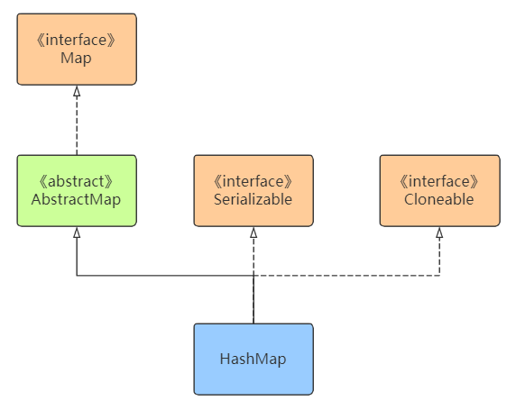

HashMap 并不是全能的，对于一些特俗的情况下的需求，官方拓展了一些其他的类来满足，如线程安全的 ConcurrentHashMap、记录插入顺序的 LinkHashMap、给 key 排序的 TreeMap 等。

文章内容主要讲解四大重点：**散列函数、哈希冲突、扩容方法、线程安全**，再补充关键的源码分析和相关的问题。

> 本文讲解基于 JDK1.8版本

## 哈希冲突

哈希函数的目标是计算 key 在数组中的下标。判断一个哈希函数的标准是：散列是否均匀，计算是否简单。

HashMap 哈希函数的步骤：

- 对 key 对象的 **hashcode** 进行扰动
- 通过取模求得数组下标

扰动是为了让 hashcode 的随机性更高，第二部取模就不会让所有的 key 都聚集在一起，提高散列均匀度。扰动可以看到 hash() 方法。

```java
static final int hash(Object key) {
    int h;
    // 获取到key的hashcode，在高低位异或运算
    return (key == null) ? 0 : (h = key.hashCode()) ^ (h >>> 16);
}
```

也就是低16位和高16位进行异或，高16位保持不变。一般的数组长度都会比较短，取模运算中只有低位参与散列；高位和低位异或，让高位也得以参与散列运算，使得散列更加均匀。具体运算如下图：

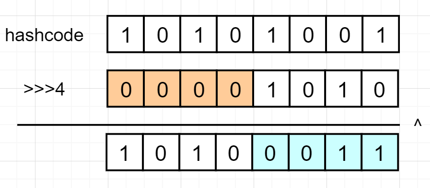

对 hashcode 扰动之后需要对结果进行取模。HashMap 在 jdk1.8 并不是简单的使用 `%` 进行取模，而是采用了另外一种更加高性能的方法。HashMap 控制数组长度为 2 的整数次幂，好处是对 hashcode 进行求余运算和让 hashcode 与数组长度 -1 进行位与运算是相同的效果。如下图：

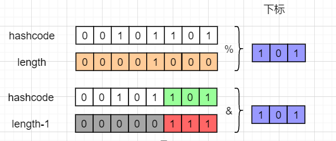

但位与运算的效率却比求余高的多，从而提高了性能。在扩容运算中也利用到了此特性，后面会讲。取模运算的源码看到 `putVal()`方法，该方法在 `put()`方法中被调用：

```java
final V putVal(int hash, K key, V value, boolean onlyIfAbsent,
               boolean evict) {
    ...
	// 与数组长度-1进行位与运算，得到下标
    if ((p = tab[i = (n - 1) & hash]) == null)
        ...
}
```

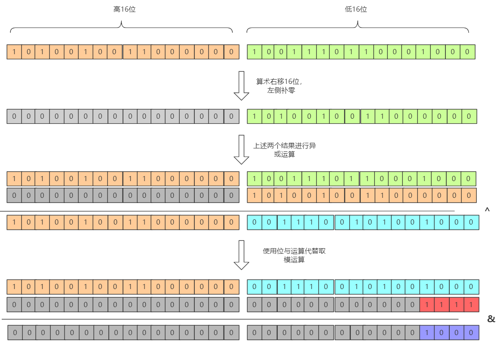

上面我们提到 HashMap 的数组长度为 2 的整数次幂，那么 HashMap 是如何控制数组的长度为 2 的整数次幂的？修改数组长度有两种情况：

- 初始化时指定数组的长度
- 扩容时的长度增量

先看第一种情况。默认情况下，如未在 HashMap 构造器中指定长度，则初始长度为16。16 是一个较为合适的经验值，它是2 的整数次幂，同时太小会频繁触发扩容，太大会良妃控件。如果指定一个非2的整数次幂，会自动转化为大于该指定数的最小2的整数次幂。如指定6则转化为8，指定为11则转换为16。结合源码来分析，当我们初始化指定一个非2 的整数次幂长度时，HashMap 会调用 tableSizeFor() 方法：

```java
public HashMap(int initialCapacity, float loadFactor) {
    ...
    this.loadFactor = loadFactor;
    // 这里调用了tableSizeFor方法
    this.threshold = tableSizeFor(initialCapacity);
}

static final int tableSizeFor(int cap) {
    // 注意这里必须减一
    int n = cap - 1;
    n |= n >>> 1;
    n |= n >>> 2;
    n |= n >>> 4;
    n |= n >>> 8;
    n |= n >>> 16;
    return (n < 0) ? 1 : (n >= MAXIMUM_CAPACITY) ? MAXIMUM_CAPACITY : n + 1;
}
```

`tableSizeFor()` 方法看起来很复杂，作用是使得最高位1后续的所有位都变为1，最后再+1 则得到刚好大于initialCapacity的最小2 的整数次幂数。如下图：

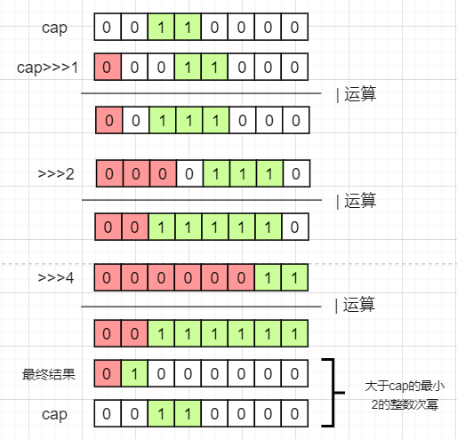

那为什么必须要对 `cap`进行`-1`之后再进行运算呢？如果指定的数刚好为2的整数次幂，如果没有 -1 结果会变成比它大两倍的数，如下：

```java
00100 --高位1之后全变1--> 00111 --加1---> 01000
```

第二种改变数组长度的情况是扩容。HashMap 每次扩容的大小都是原来的两倍，控制了数组大小一定是2 的整数次幂，相关源码如下：

```java
final Node<K,V>[] resize() {
    ...
    if ((newCap = oldCap << 1) < MAXIMUM_CAPACITY &&
                 oldCap >= DEFAULT_INITIAL_CAPACITY)
            // 设置为原来的两倍
            newThr = oldThr << 1;
    ...
}
```

> 小结：
>
> 1. HashMap 通过高16位与低16位进行异或运算来让高位参与散列，提高散列效果
> 2. HashMap 控制数组的长度为2的整数次幂来简化取模运算，提高性能；
> 3. HashMap 通过控制初始化的数组的长度为 2 的整数次幂、扩容为原来的 2 倍来控制数组长度一定为 2 的整数次幂

## 哈希冲突解决方法

再优秀的 hash 算法也无法避免的出现  hash 冲突。hash 冲突指的是两个不同的 key 经过 hash 计算之后得到的数组下标相同。解决 hash 冲突的方法有很多，如开放定址法、再哈希法、公共溢出表法、链地址法。HashMap 采用的是链地址法，jdk1.8 之后还增加了红黑树的优化，如下图：

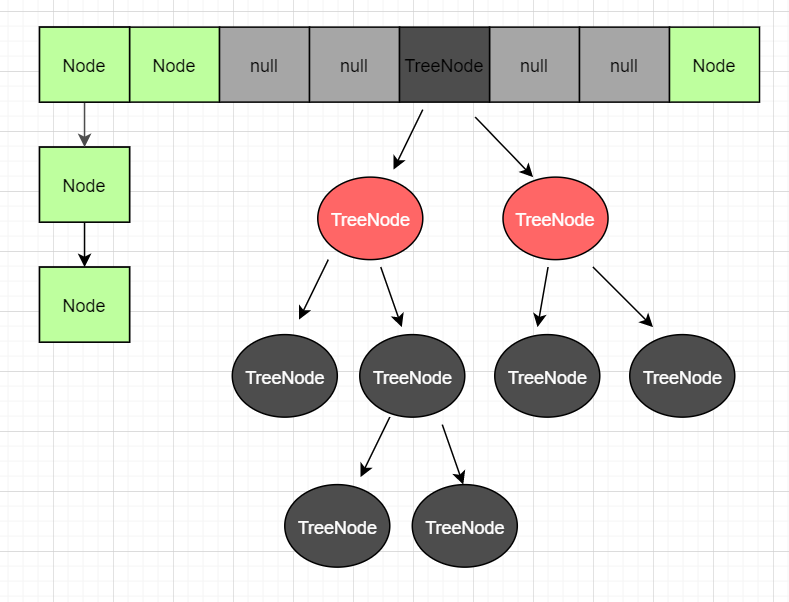

出现冲突之后会在当前形成链表，而当链表过长之后，会自动转换成为红黑树提高查询效率。红黑树是一个查找效率很高的数据结构，事件查找复杂度为 log(n) ,但红黑树只有在数据查询量比较大的时候才能发挥它的优势。关于红黑树的转换，HashMap 做了如下限制

- 当链表的长度 >= 8 且数组长度 >= 64时，会把链表转化成红黑树。
- 当链表长度 >= 8,但数组长度 <64 时，会优先进行扩容，而不是转化成红黑树
- 当红黑树节点数 <= 6时，自动转换成链表

那就有了以下问题：

- 为什么需要数组长度达到 64 才会转化成红黑树？

​       当数组长度比较短时，如16，链表长度达到8已经是占用了最大限度地 50%，意味着负载已经快到了上限，此时如果转化成红黑树，之后地扩容又会再一次把红黑树拆分平均到新的数组中，这样非但没有带来性能的好处，反而会降低性能。所以数组长度低于64时，优先进行扩容

- 为什么要大于等于8 的时候转换为红黑树，而不是 7 或9？

  树节点比普通节点更大，在链表较短时，红黑树并未能明显的体现性能优势，反而会浪费空间，在链表较短是采用链表而不是红黑树。在理论数学计算中（装载因子 = 0.75），链表的长度达到8的概率是百万分之一；把7当作分水岭，大于7转换未红黑树，小于7转换为链表。红黑树的出现是为了某些极端的情况下，抵抗住大量的  hash 冲突，正常情况下使用链表是更加合适的。

注意，红黑树在 jdk 1.8 之后出现的，jdk1.7采用的是数组 + 链表模式

> 小结：
>
> - HashMap 采用链地址法，当发生冲突时会转化为链表，当链表过长会转换为红黑树提高效率
> - HashMap 对红黑树进行了限制，让红黑树只有在极端的情况下进行抗压

## 扩容方案

当 HashMap 中的数据越来越多，那么发生 hash 冲突的概率也越来越高，通过数组扩容可以利用空间换事件，保持查找效率是常数事件复杂度。那么什么时候进行扩容呢？由HashMap 的一个关键因子：**装载因子**。

装载因子 = HashMap 中节点数/数组长度，它是一个比例值。当 HashMap 中节点数到达装载因子这个比例时，就会触发扩容；也就是说，装载因子控制了当前数组能够承载的节点数的**阈值**。如数组长度为 16，装载因子为0.75，那么容纳的节点数为12.装载因子的数值大小需要仔细衡量。装载因子越大，数组利用率就越高，同时发生哈希冲突的概率也越高；装载因子越小，数组利用率降低，但发生哈希冲突的概率比较小。所以**装载因子的大小需要权衡空间和时间之间的关系**。在理论计算中，0.75是一个比较合适的数值，大于 0.75哈希冲突的概率呈指数级别上升，而小于 0.75 冲突减少并不明显。HashMap 中的装载因子大小默认为 0.75，没有特殊要求的情况下，不建议修改它的值。

那么到达阈值之后，HashMap 是如何进行扩容的呢？HashMap 会把数组长度扩展为原来的两倍，再把旧数组的数据迁移到新的数组，而 HashMap 针对迁移做了优化：**使用 HashMap 数组长度是2的整数次幂的特点，以一种更高效率的方式完成数据迁移**。

JDK1.7之前的数据迁移比较简单，就是编译所有的节点，把所有的节点一次通过hash计算新的下标，再插入到新数组的链表中。这样有两个缺点：

1. 每个节点都需要进行一次求余运算
2. 插入到新数组的时候采用的是头插法，再多线程的环境下会形成链表环

jdk1.8 之后进行了优化，原因在于它控制数组的长度始终是2的整数次幂，每次扩展数组都是原来的两倍，带来的好处是 key 在新的数组的hash结果只有两种：在原来的位置，或者在原来位置 + 原数组长度，具体为什么可以看下图：

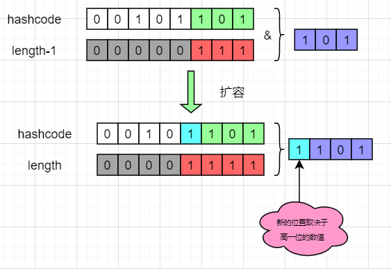

从图中可以得到，在新数组中的 hash 结果，仅仅取决于高一位的数组。如果高一位为0，那么计算结果就是在原位置，而如果是1，则加上原数组的长度即可。这样我们**只需要判断一个节点的高一位是1 or 0 就可以得到它在新数组的位置，而不需要重复计算 hash 即可。HashMap 把每个链表拆分成两个链表，对应原位置或原位置+原数组的长度，再分别插入到新的数组中，保留原来的节点顺序**，如下所示：

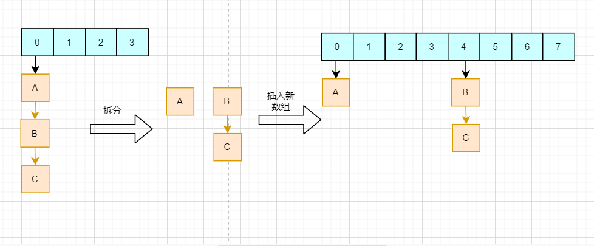

前面还遗留一个问题：头插法会形成链表环。这个问题在线程安全部分讲解

> 小结：
>
> 1、装载因子决定了 HashMap 扩容的阈值，需要权衡时间和空间，一般情况下保持0.75不做改动
>
> 2、HashMap 扩容机制结合了数组长度为2 的整数次幂的特点 ，以一种更高的效率完成数据迁移，同时避免头插法造成链表环

## 线程安全

HashMap 作为一个集合，主要功能为 CURD，也就是增删改查数据，那么就肯定设计到多线程并发访问数据的情况。并发产生的问题，需要特别关注。

HashMap 并不是线程安全的，在多线程的情况下无法保证数据的一致性。举个例子：HashMap 下标2的位置为 NULL，线程 A 需要将节点 X 插入下标2 的位置，在判断是否为 NULL 之后，线程被挂起；此时线程B 把新的节点 Y插入到下标为 2 的位置；恢复线程 A，节点X 会直接插入到下标2，覆盖节点 Y，导致数据丢失，如下图：

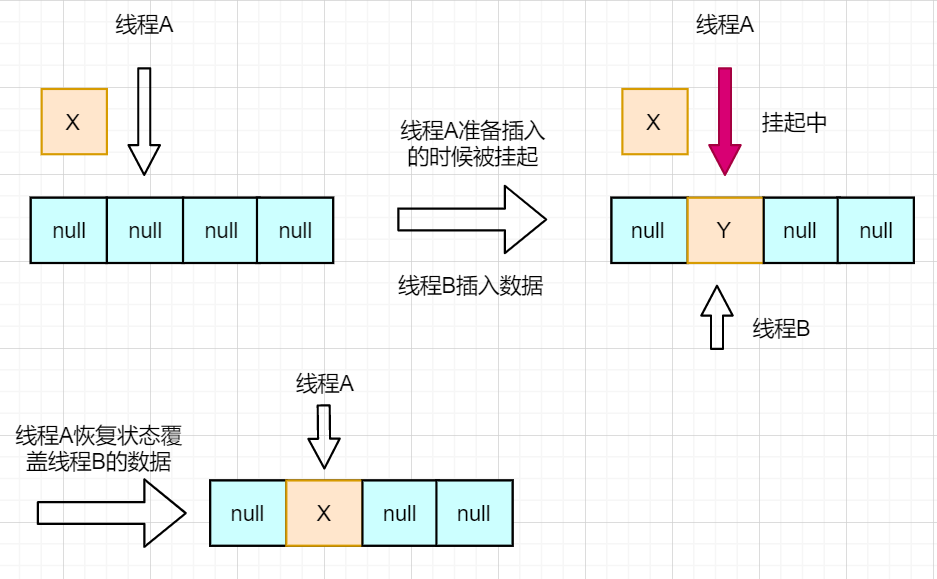

jdk 1.7 及以前扩容时采用的是头插法，这种方法插入速度很快，但是在多线程的环境下会造成链表环，而链表环会在下一次插入时找不到链表尾而发生死循环。限于篇幅，关于这个问题可以参考。jdk1.8 之后采用了尾插法，解决了这个问题，但并没有解决数据的一致性问题。

那如何保证数据的一致性问题呢？解决方案有三个：

- 采用 HashTable
- 调用 Collections.synchronizedMap() 方法来让 hashmap 具有多线程的能力
- 采用 ConcurrentHashMap

前两个方案的思路时相似的，均是在每个方法中，对整个对象进行上锁。HashTable 是老一代的集合框架，很多的设计均比较落后，它在每一个方法中均加上了 synchronize 关键字保证线程安全

```java
// Hashtable
public synchronized V get(Object key) {...}
public synchronized V put(K key, V value) {...}
public synchronized V remove(Object key) {...}
public synchronized V replace(K key, V value) {...}
...
```

第二种方法是返回一个 SynchronizedMap 对象，这个对象默认每个方法会锁住整个对象。如下源码：

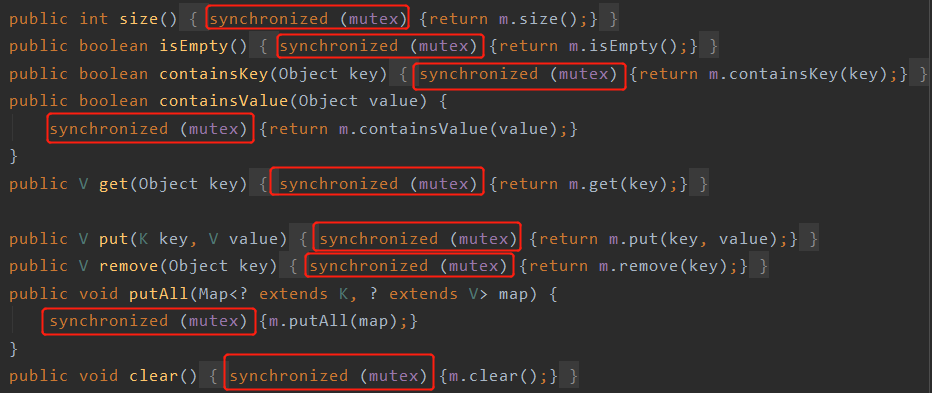

这里的 mutex 是什么呢？直接看到构造器：

```java
final Object      mutex;        // Object on which to synchronize
SynchronizedMap(Map<K,V> m) {
    this.m = Objects.requireNonNull(m);
    // 默认为本对象
    mutex = this;
}
SynchronizedMap(Map<K,V> m, Object mutex) {
    this.m = m;
    this.mutex = mutex;
}
```

可以看到默认的锁就是本身，效果 和 Hashmap 其实是一样的。这种简单粗暴锁整个对象的方式造成的后果是：

- 锁是重量级的，会严重影响性能
- 同一时间只有一个线程进行读写，限制了并发效率

ConcurrentHashMap 的设计就是为了解决这个问题，它通过降低锁的粒度 + CAS 的方式来提高效率。简单来说，Concurrenthashmap 锁的并不是整个对象，而是一个数组的一个节点，那么其他线程访问数组其他节点是不会相互影响的，极大的提高了并发效率；同时 ConcurrentHashMap 读操作并不需要获取锁，如下图：

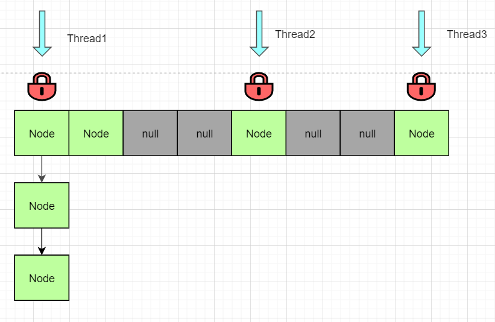

那么，使用了上述的三种解决方案是不是绝对线程安全？先观察下面的代码：

```java
ConcurrentHashMap<String, String> map = new ConcurrentHashMap<>();
map.put("abc","123");

Thread1:
if (map.containsKey("abc")){
    String s = map.get("abc");
}

Thread2:
map.remove("abc");
```

当 Thread1 调用 containskey 之后释放锁，Thread2 获得锁并把 “abc" 移除在释放锁，这个时候Thread1 读取到的s 就是一个NULL了，也就出现问题了。所以 ConcurrenthashMap 类 或者 Collections。synchronizeMap()  方法或者HashTable都只能在一定程度上保证线程安全，而无法保证绝对线程安全。

关于线程安全，还有一个 fast-fail 问题，即快速失败。当使用HashMap 的迭代器遍历 HashMap 时，如果此时 HashMap 发生了结构性的改变，即插入新数据、移除数据、扩容等，那么 Iterator 会抛出 fast-fail 异常，防止出现并发异常，在一定限度上保证了线程安全。如下源码：

```java
final Node<K,V> nextNode() {
    ...
    if (modCount != expectedModCount)
        throw new ConcurrentModificationException();
   ...
}
```

创建 Iterator 对象的时候会记录 hashMap 的 modCount 变量，每当 hashmap 发生结构性改变的时候，modCount 会加1.在迭代时判断 hashMap 的 modCOunt 和自己保存的 exceptedModCount 是否一致，即可判断是否发生了结构上的改变。

fast-fail 异常只能当作遍历时的一种安全保证，而不能当作多线程并发访问 HashMap 的手段，若有并发需求，还是需要使用上述的三种办法。

> 小结
>
> 1. HashMap 并不能保证线程安全，在多线程并发访问下会出现意想不到的结果，如数据丢失
> 2. Hash'Map 1.8 采用尾插法进行扩容，防止出现链表环导致的死循环问题
> 3. 解决并发问题的方案有 HashTable、Collections.synchronizeMap()、ConcurrentHashMap。其中最佳解决方案时 ConcurrentHashMap
> 4. 上述解决方案并不能完全保证线程安全
> 5. 快速失败是HashMap 迭代机制中的一种并发安全保证

## 源码解析

#### 关键变量的理解

HashMap 中有很多的内部变量，这些变量会在下面源码分析中经常出现，首先需要理解这些变量的意义。

```java
// 存放数据的数组
transient Node<K,V>[] table;
// 存储的键值对数目
transient int size;
// HashMap结构修改的次数，主要用于判断fast-fail
transient int modCount;
// 最大限度存储键值对的数目(threshodl=table.length*loadFactor)，也称为阈值
int threshold;
// 装载因子，表示可最大容纳数据数量的比例
final float loadFactor;
// 静态内部类，HashMap存储的节点类型；可存储键值对，本身是个链表结构。
static class Node<K,V> implements Map.Entry<K,V> {...}
```

#### 扩容

HashMap 源码中把初始化操作也放到了扩容方法中，因而扩容方法主要分为两部分：确定新的数组大小、迁移数据。详细的源码分析如下。

```java
final Node<K,V>[] resize() {
    // 变量分别是原数组、原数组大小、原阈值；新数组大小、新阈值
    Node<K,V>[] oldTab = table;
    int oldCap = (oldTab == null) ? 0 : oldTab.length;
    int oldThr = threshold;
    int newCap, newThr = 0;
    
    // 如果原数组长度大于0
    if (oldCap > 0) {
        // 如果已经超过了设置的最大长度(1<<30,也就是最大整型正数)
        if (oldCap >= MAXIMUM_CAPACITY) {
            // 直接把阈值设置为最大正数
            threshold = Integer.MAX_VALUE;
            return oldTab;
        }
        else if ((newCap = oldCap << 1) < MAXIMUM_CAPACITY &&
                 oldCap >= DEFAULT_INITIAL_CAPACITY)
            // 设置为原来的两倍
            newThr = oldThr << 1; 
    }
    
    // 原数组长度为0，但最大限度不是0，把长度设置为阈值
    // 对应的情况就是新建HashMap的时候指定了数组长度
    else if (oldThr > 0) 
        newCap = oldThr;
    // 第一次初始化，默认16和0.75
    // 对应使用默认构造器新建HashMap对象
    else {               
        newCap = DEFAULT_INITIAL_CAPACITY;
        newThr = (int)(DEFAULT_LOAD_FACTOR * DEFAULT_INITIAL_CAPACITY);
    }
    // 如果原数组长度小于16或者翻倍之后超过了最大限制长度，则重新计算阈值
    if (newThr == 0) {
        float ft = (float)newCap * loadFactor;
        newThr = (newCap < MAXIMUM_CAPACITY && ft < (float)MAXIMUM_CAPACITY ?
                  (int)ft : Integer.MAX_VALUE);
    }
    threshold = newThr;
    
    @SuppressWarnings({"rawtypes","unchecked"})
    // 建立新的数组
    Node<K,V>[] newTab = (Node<K,V>[])new Node[newCap];
    table = newTab;
    if (oldTab != null) {
        // 循环遍历原数组，并给每个节点计算新的位置
        for (int j = 0; j < oldCap; ++j) {
            Node<K,V> e;
            if ((e = oldTab[j]) != null) {
                oldTab[j] = null;
                // 如果他没有后继节点，那么直接使用新的数组长度取模得到新下标
                if (e.next == null)
                    newTab[e.hash & (newCap - 1)] = e;
                // 如果是红黑树，调用红黑树的拆解方法
                else if (e instanceof TreeNode)
                    ((TreeNode<K,V>)e).split(this, newTab, j, oldCap);
                // 新的位置只有两种可能：原位置，原位置+老数组长度
                // 把原链表拆成两个链表，然后再分别插入到新数组的两个位置上
                // 不用多次调用put方法
                else { 
                    // 分别是原位置不变的链表和原位置+原数组长度位置的链表
                    Node<K,V> loHead = null, loTail = null;
                    Node<K,V> hiHead = null, hiTail = null;
                    Node<K,V> next;
                    // 遍历老链表，判断新增判定位是1or0进行分类
                    do {
                        next = e.next;
                        if ((e.hash & oldCap) == 0) {
                            if (loTail == null)
                                loHead = e;
                            else
                                loTail.next = e;
                            loTail = e;
                        }
                        else {
                            if (hiTail == null)
                                hiHead = e;
                            else
                                hiTail.next = e;
                            hiTail = e;
                        }
                    } while ((e = next) != null);
                    // 最后赋值给新的数组
                    if (loTail != null) {
                        loTail.next = null;
                        newTab[j] = loHead;
                    }
                    if (hiTail != null) {
                        hiTail.next = null;
                        newTab[j + oldCap] = hiHead;
                    }
                }
            }
        }
    }
    // 返回新数组
    return newTab;
}
```

#### 添加数值

调用 put() 方法添加键值对，最终会调用 putVal() 来真正实现添加逻辑，代码解析如下：

```java
public V put(K key, V value) {
    // 获取hash值，再调用putVal方法插入数据
    return putVal(hash(key), key, value, false, true);
}

// onlyIfAbsent表示是否覆盖旧值，true表示不覆盖，false表示覆盖，默认为false
// evict和LinkHashMap的回调方法有关，不在本文讨论范围
final V putVal(int hash, K key, V value, boolean onlyIfAbsent,
               boolean evict) {
    
    // tab是HashMap内部数组，n是数组的长度，i是要插入的下标，p是该下标对应的节点
    Node<K,V>[] tab; Node<K,V> p; int n, i;
    
    // 判断数组是否是null或者是否是空，若是，则调用resize()方法进行扩容
    if ((tab = table) == null || (n = tab.length) == 0)
        n = (tab = resize()).length;
    
    // 使用位与运算代替取模得到下标
    // 判断当前下标是否是null，若是则创建节点直接插入，若不是，进入下面else逻辑
    if ((p = tab[i = (n - 1) & hash]) == null)
        tab[i] = newNode(hash, key, value, null);
    else {
        
        // e表示和当前key相同的节点，若不存在该节点则为null
        // k是当前数组下标节点的key
        Node<K,V> e; K k;
        
        // 判断当前节点与要插入的key是否相同，是则表示找到了已经存在的key
        if (p.hash == hash &&
            ((k = p.key) == key || (key != null && key.equals(k))))
            e = p;
        // 判断该节点是否是树节点，如果是调用红黑树的方法进行插入
        else if (p instanceof TreeNode)
            e = ((TreeNode<K,V>)p).putTreeVal(this, tab, hash, key, value);
        // 最后一种情况是直接链表插入
        else {
            for (int binCount = 0; ; ++binCount) {
                if ((e = p.next) == null) {
                    p.next = newNode(hash, key, value, null);
                    // 长度大于等于8时转化为红黑树
                    // 注意，treeifyBin方法中会进行数组长度判断，
                    // 若小于64，则优先进行数组扩容而不是转化为树
                    if (binCount >= TREEIFY_THRESHOLD - 1) 
                        treeifyBin(tab, hash);
                    break;
                }
                // 找到相同的直接跳出循环
                if (e.hash == hash &&
                    ((k = e.key) == key || (key != null && key.equals(k))))
                    break;
                p = e;
            }
        }
        
        // 如果找到相同的key节点，则判断onlyIfAbsent和旧值是否为null
        // 执行更新或者不操作，最后返回旧值
        if (e != null) { 
            V oldValue = e.value;
            if (!onlyIfAbsent || oldValue == null)
                e.value = value;
            afterNodeAccess(e);
            return oldValue;
        }
    }
    
    // 如果不是更新旧值，说明HashMap中键值对数量发生变化
    // modCount数值+1表示结构改变
    ++modCount;
    // 判断长度是否达到最大限度，如果是则进行扩容
    if (++size > threshold)
        resize();
    // 最后返回null（afterNodeInsertion是LinkHashMap的回调）
    afterNodeInsertion(evict);
    return null;
}
```

总结一下：

1. 总体上分为两种情况：找到相同的key 和找不到相同的 key。找到了需要判断是否更新并返回旧值value，没找到需要插入新的 Node、更新节点数并判断是否需要扩容。
2. 查找分为三种情况：数组、链表、红黑树。数组下标i位置不为空且不等于key，那么就需要判断是否树节点还是链表节点并进行查找
3. 链表到达一定长度之后需要扩展为红黑树，当且仅当链表长度 >= 8且数组长度 >= 64。

最后画一张总体再加深一下整个流程的印象：

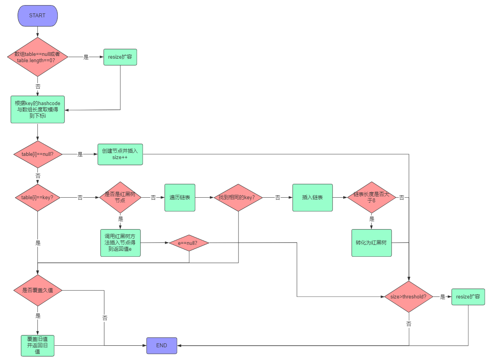

## 其他问题

#### 为什么 jdk 1.7 以前控制数组的长度为素数，而 jdk1.8 之后却采用的是2 的整数次幂？

答：素数长度可以有效的减少 hash 冲突；JDK1.8之后采用2 的整数次幂是为了提高求余和扩容的效率，同时结合高低位异或的方法使得哈希散列更加均匀。

为何素数可以减少哈希冲突？若能保证key 的hashcode 在每个数字之间都是均匀分布，那么无论是素数还是合数都是相同的效果。例如 hashcode 在 1-20之间是均匀分布的，那么无论长度是5还是4，分布都是均匀的。而如果 hashcode 之间的间隔是2，如1 3 5，那么长度为4的数组，位置2 和 4 两个下标无法放下数据，而长度为5 的数组则没有这个问题。**长度为合数的数组会使得间隔为其因子的hashcode 聚集出现，从而使得散列效果降低**。

#### 为什么插入 hashmap 的数据需要实现 hashcode 和 equals 方法？对着两个方法有什么要求？

答：通过hashcode 来确定插入下标，通过 equals 比较来寻找数据；两个相等的 key 的hashcode一定相同，但是拥有相同的 hashcode 的对象不一定相等。

equals 比较内容是否相同，一般由对象进行覆盖重写，默认情况下比较的是引用地址；“==”引用比较的是引用地址使得否相同，值对象比较的是值是否相同。

HashMap 中需要使用 hashcode 来获取 key 的下标，如果两个相同的对象的 hashcode 不同，那么会造成 hashcode 存在相同的 key；所以 equals 返回相同的key他们的 hashcode一定要相同。HashMap 比较两个元素是否相同采用了三种比较方法结合：p.hash == hash && ((k = p.key) == key || (key != null && key.equals(k)))。


